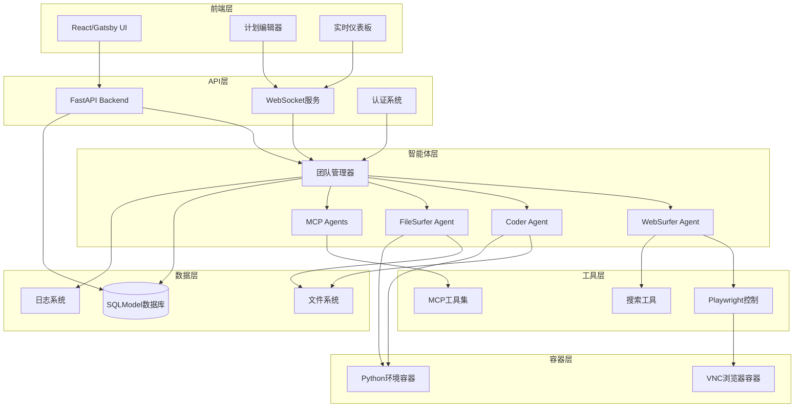
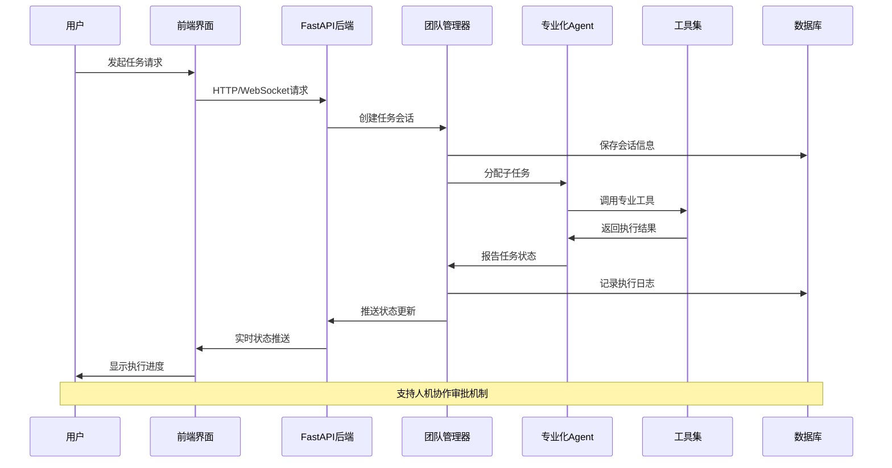
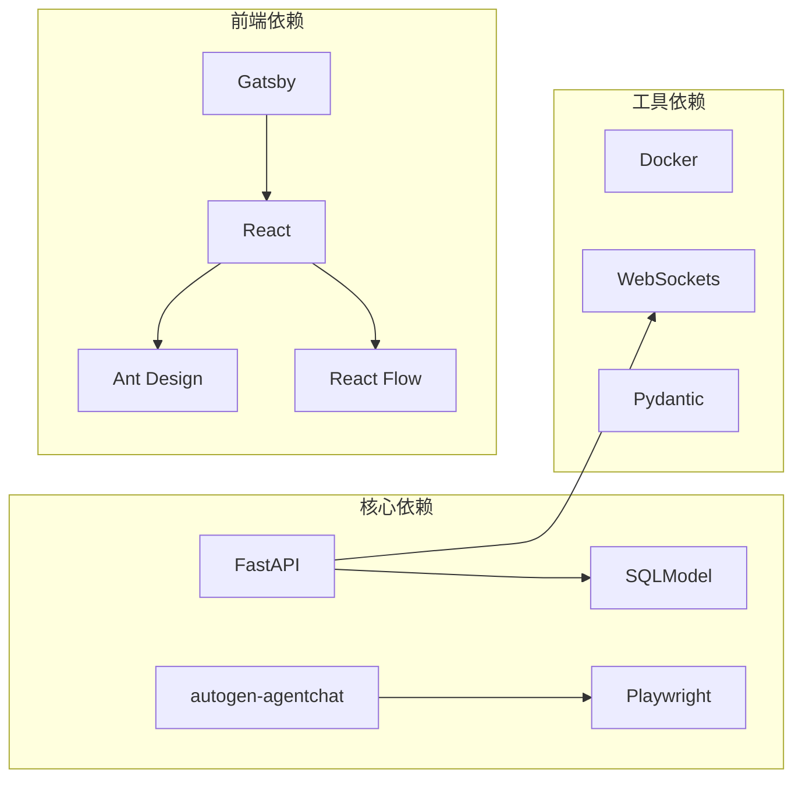

# Magentic-UI 项目文档

**项目类型**: 多智能体人机协作Web自动化平台
**主要语言**: Python + TypeScript/React
**初始化时间**: 2025-10-16 23:59:01
**文档签名**: ssiagu

## 📋 项目概览

Magentic-UI 是一个基于AutoGen框架构建的先进人机协作Web自动化平台，旨在通过多智能体协作系统实现复杂的Web自动化任务。该平台采用前后端分离架构，结合Docker容器化部署，提供强大的人机协作体验。

### 🎯 核心特性

- **多智能体协作**: WebSurfer、Coder、FileSurfer、MCP Agents等专业化智能体
- **人机协作**: 支持共同规划、协同执行、行动审批、计划学习
- **Web自动化**: 基于Playwright的浏览器控制和Web操作
- **实时交互**: WebSocket支持的实时用户界面
- **容器化部署**: Docker环境提供VNC浏览器和Python执行环境
- **MCP扩展**: 通过Model Context Protocol支持自定义工具集成

## 🏗️ 系统架构



## 📁 模块索引

| 模块 | 路径 | 类型 | 描述 |
|------|------|------|------|
| **后端服务** | `src/magentic_ui/backend` | FastAPI服务 | Web API、WebSocket、团队管理、数据库操作 |
| **智能体系统** | `src/magentic_ui/agents` | Agent框架 | Web浏览器、代码执行、文件操作、MCP代理 |
| **数据模型** | `src/magentic_ui/backend/datamodel` | 数据层 | SQLModel数据模型定义 |
| **前端界面** | `frontend` | React/Gatsby | Web前端界面，用户交互体验 |
| **工具集成** | `src/magentic_ui/tools` | 工具集 | Playwright控制、MCP服务器、搜索工具 |
| **容器化** | `docker` | Docker配置 | VNC浏览器环境和Python执行环境 |
| **评估框架** | `src/magentic_ui/eval` | 测试评估 | GAIA、AssistantBench等基准测试 |
| **实验模块** | `experiments` | 实验脚本 | 实验分析和结果处理 |
| **示例代码** | `samples` | 示例教程 | 使用示例和教学代码 |

## 🔄 数据流架构



## 🛠️ 技术栈

### 后端技术
- **FastAPI**: 高性能Web框架
- **SQLModel**: 现代ORM和数据验证
- **AutoGen**: 微软多智能体框架
- **Playwright**: 浏览器自动化
- **WebSockets**: 实时通信
- **Docker**: 容器化部署

### 前端技术
- **Gatsby**: 静态站点生成器
- **React**: 用户界面库
- **Ant Design**: UI组件库
- **React Flow**: 流程图编辑器
- **Monaco Editor**: 代码编辑器
- **Tailwind CSS**: 样式框架

### 开发工具
- **Python 3.12**: 主要编程语言
- **TypeScript**: 类型安全的JavaScript
- **pytest**: 测试框架
- **Black**: 代码格式化
- **Ruff**: 代码检查和格式化

## 📦 依赖关系



## 🚀 快速开始

### 环境要求
- Python 3.12+
- Node.js 18+
- Docker & Docker Compose
- Git

### 安装步骤
```bash
# 克隆仓库
git clone <repository-url>
cd magentic-ui

# 安装后端依赖
pip install -e .

# 安装前端依赖
cd frontend
npm install
cd ..

# 构建前端
npm run build

# 启动服务
docker-compose up -d
magentic-ui start
```

## 🧪 测试与评估

### 测试覆盖
- 单元测试: `pytest tests/`
- 集成测试: `pytest tests/integration/`
- 性能评估: `python -m magentic_ui.eval`

### 支持的基准测试
- **GAIA**: 通用AI助手评估
- **AssistantBench**: 助手能力基准
- **WebVoyager**: Web导航评估

## 📖 开发指南

### 智能体开发
1. 继承 `autogen_agentchat.agents.Agent`
2. 实现必要的方法和接口
3. 注册到团队管理器
4. 添加配置文件

### MCP工具集成
1. 实现MCP服务器接口
2. 配置工具元数据
3. 添加到工具注册表
4. 测试工具功能

### 前端组件开发
1. 使用React + TypeScript
2. 遵循Ant Design规范
3. 添加必要的测试
4. 更新文档

## 🔧 配置说明

主要配置文件：
- `pyproject.toml`: Python项目配置
- `frontend/package.json`: 前端依赖配置
- `docker-compose.yml`: 容器编排配置
- `.env`: 环境变量配置

## 📝 贡献指南

1. Fork 项目
2. 创建特性分支
3. 提交更改
4. 推送到分支
5. 创建 Pull Request

## 📄 许可证

本项目采用 MIT 许可证 - 查看 [LICENSE](LICENSE) 文件了解详情。

## 🔗 相关链接

- [AutoGen 官方文档](https://microsoft.github.io/autogen/)
- [FastAPI 文档](https://fastapi.tiangolo.com/)
- [Playwright 文档](https://playwright.dev/)
- [React Flow 文档](https://reactflow.dev/)

---

**注意**: 这是项目根级文档，提供了系统整体架构和各模块的概览。如需了解特定模块的详细信息，请查看各模块目录下的 `CLAUDE.md` 文件。

**Author**: ssiagu
**Email**: ssiagu@gmail.com
**Document Signature**: ssiagu
**最后更新**: 2025-10-16 23:59:01