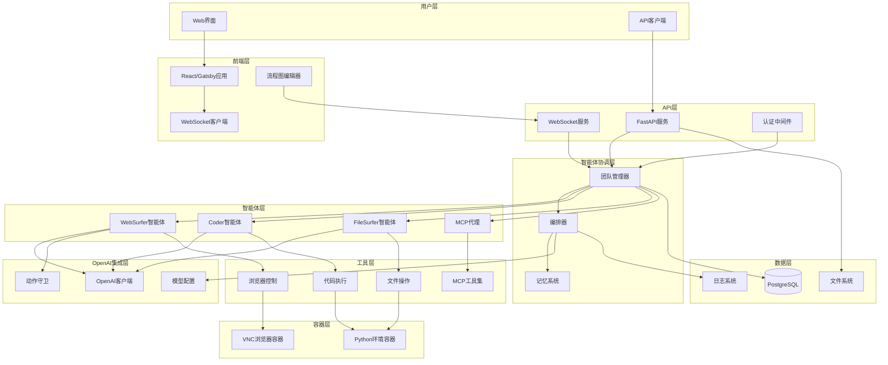
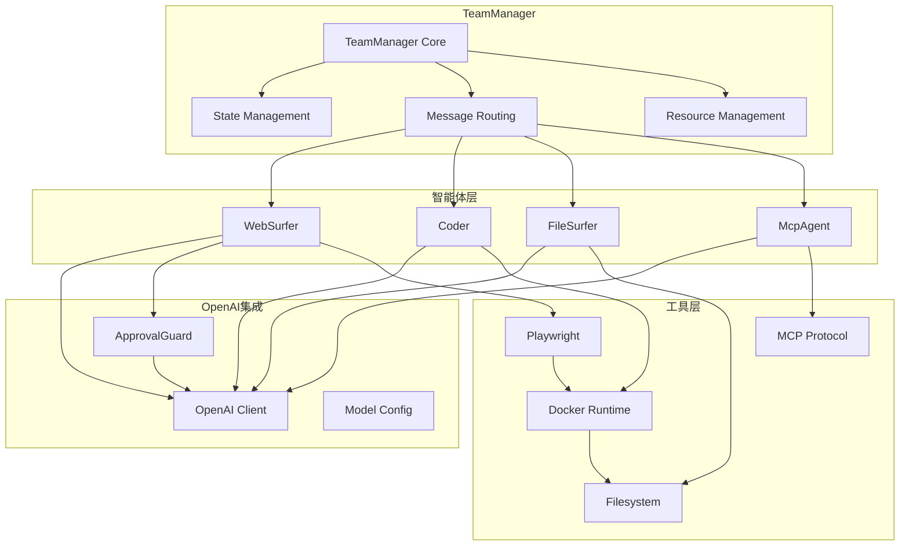
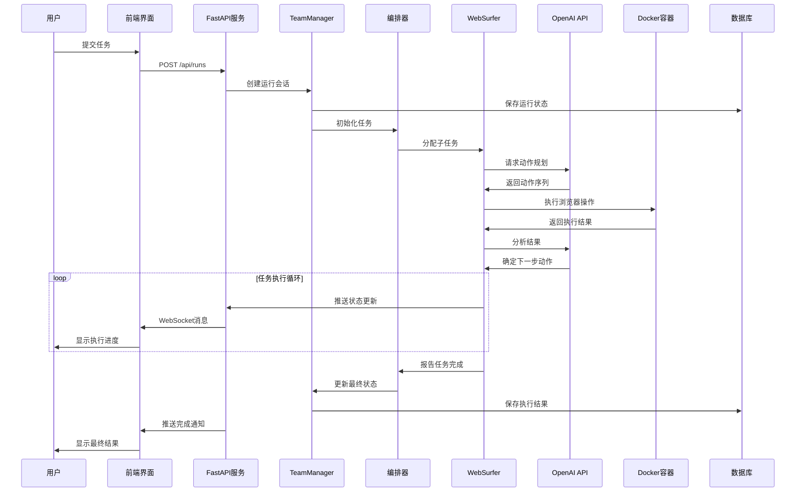
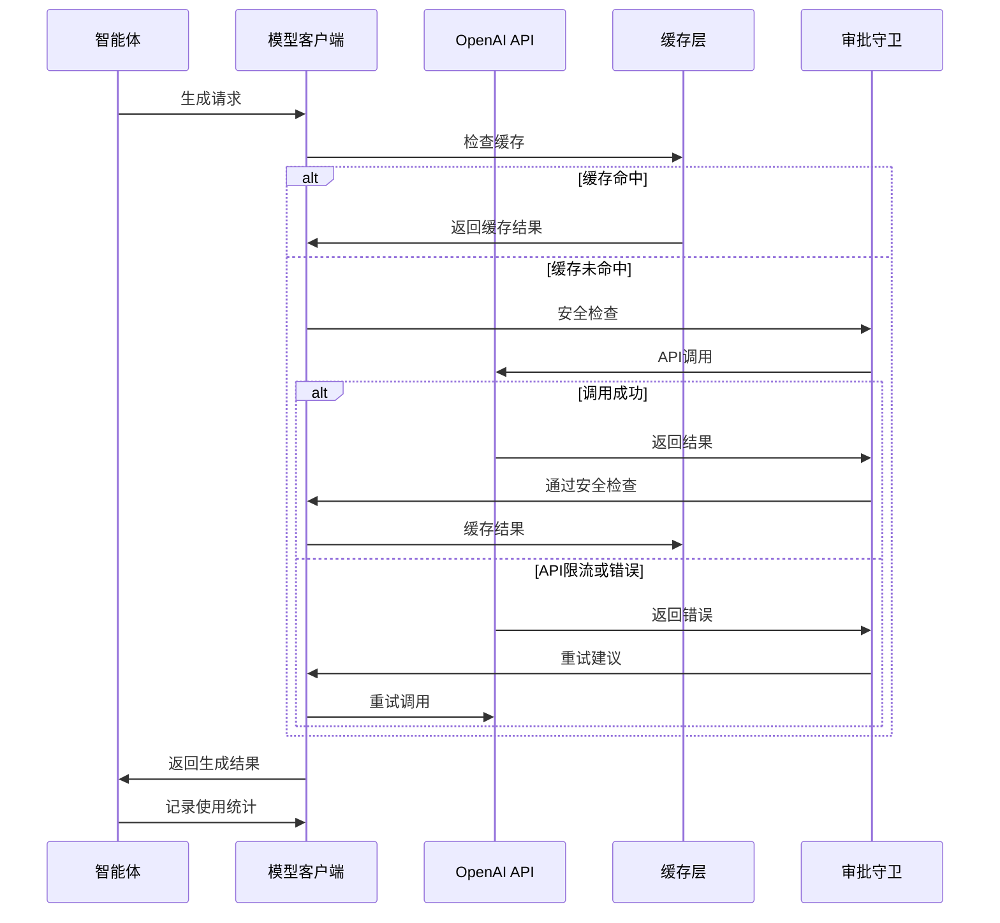
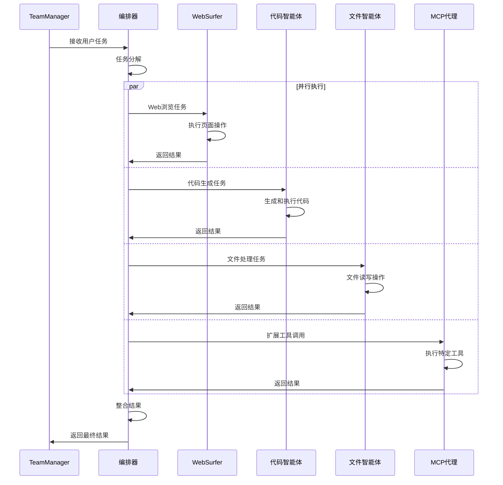
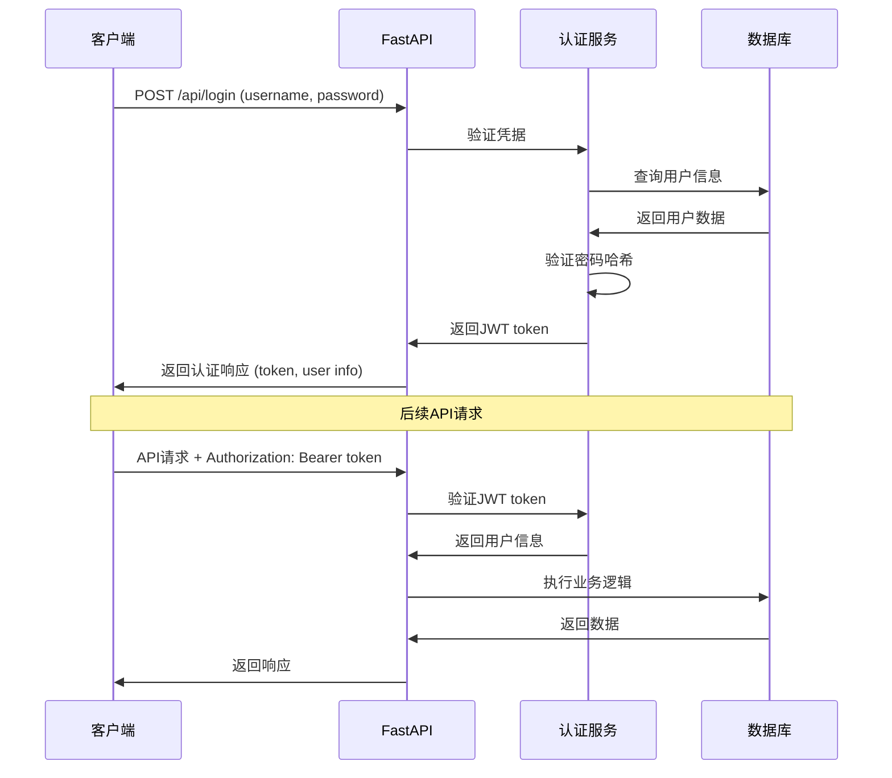
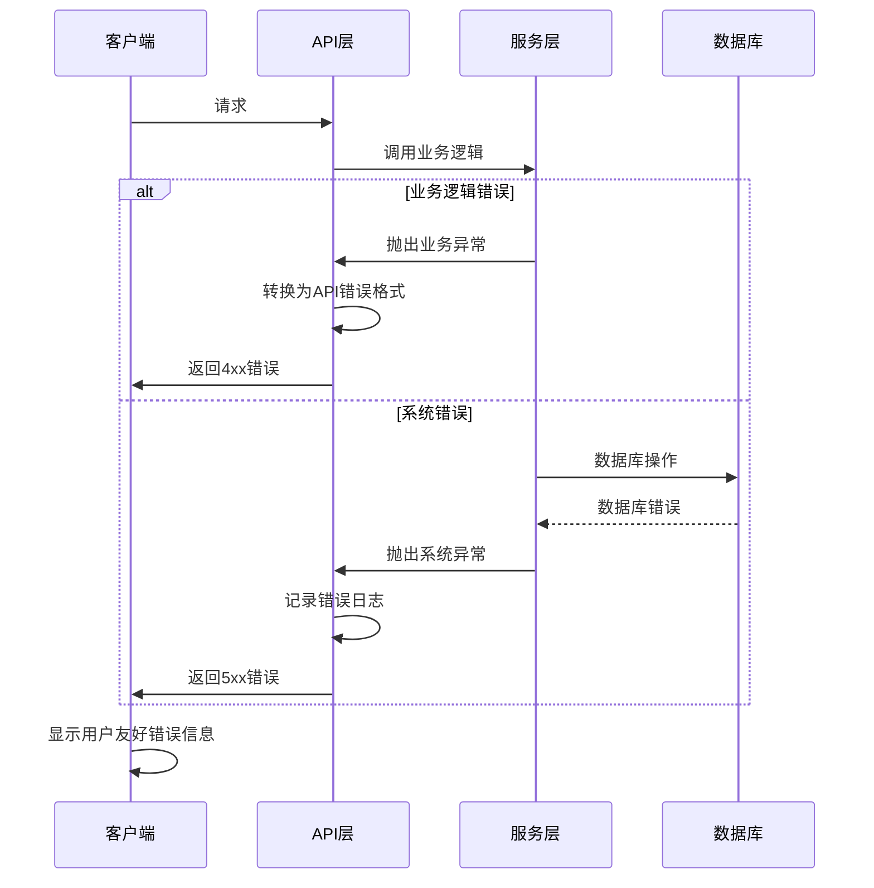

# Magentic-UI 全栈架构文档

**Author**: ssiagu
**Email**: ssiagu@gmail.com
**Document Signature**: ssiagu
**最后更新**: 2025-10-21

## Introduction

本文档概述了 Magentic-UI 的完整全栈架构，包括后端系统、前端实现及其集成。它作为 AI 驱动开发的单一事实来源，确保整个技术栈的一致性。

这种统一方法结合了传统上分离的后端和前端架构文档，为现代全栈应用程序简化了开发流程，因为这些关注点日益紧密相连。

### Starter Template or Existing Project

**状态**: 现有项目扩展
Magentic-UI 基于微软 AutoGen 框架构建，是一个现有的多智能体人机协作Web自动化平台。项目已经在使用以下技术栈：

- **后端**: FastAPI + SQLModel + Docker
- **前端**: React/Gatsby + TypeScript + Ant Design
- **智能体框架**: AutoGen 0.5.7
- **容器化**: Docker + Docker Compose

### Change Log

| Date | Version | Description | Author |
|------|---------|-------------|--------|
| 2025-10-21 | v1.0 | 初始架构文档生成，包含OpenAI集成分析 | ssiagu |

## High Level Architecture

### Technical Summary

Magentic-UI 采用现代微服务架构，基于AutoGen多智能体框架构建人机协作Web自动化平台。系统使用FastAPI作为后端API服务，React/Gatsby构建前端界面，通过WebSocket实现实时通信，并利用Docker容器化提供VNC浏览器和Python执行环境。核心集成OpenAI GPT模型为各个智能体提供推理能力，支持复杂的Web自动化任务协作执行。

### Platform and Infrastructure Choice

**平台**: 本地Docker部署 + 云服务扩展
**关键服务**: Docker容器、PostgreSQL数据库、VNC浏览器、OpenAI API
**部署主机和区域**: 本地开发环境，支持云部署扩展

### Repository Structure

**结构**: Monorepo单体仓库
**Monorepo工具**: Python包管理 + npm workspaces
**包组织**: 按功能模块组织，前后端分离但共享配置

### High Level Architecture Diagram



### Architectural Patterns

- **多智能体协作模式**: 基于AutoGen框架的智能体协作 - _Rationale_: 通过专业化智能体分工协作，高效处理复杂Web自动化任务
- **事件驱动架构**: WebSocket实时消息传递 - _Rationale_: 支持实时用户交互和状态更新，提供响应式用户体验
- **容器化部署模式**: Docker容器隔离环境 - _Rationale_: 确保一致的执行环境，简化依赖管理和部署
- **Repository模式**: 数据访问层抽象 - _Rationale_: 实现数据访问逻辑与业务逻辑分离，提高测试性和维护性
- **API网关模式**: FastAPI统一入口 - _Rationale_: 集中管理认证、路由和中间件，简化API管理
- **状态管理模式**: 前端集中状态管理 - _Rationale_: 确保前端状态一致性，支持复杂交互场景

## Tech Stack

### Technology Stack Table

| Category | Technology | Version | Purpose | Rationale |
|----------|------------|---------|---------|-----------|
| Frontend Language | TypeScript | 5.0+ | 类型安全的JavaScript开发 | 提供编译时类型检查，提高代码质量和开发效率 |
| Frontend Framework | React/Gatsby | 18.0+ | 用户界面构建和静态站点生成 | React生态系统成熟，Gatsby提供优秀的SSG性能 |
| UI Component Library | Ant Design | 5.0+ | 企业级UI组件库 | 丰富的组件库，适合企业级应用开发 |
| State Management | React Context + Hooks | - | 前端状态管理 | 轻量级状态管理，与React生态深度集成 |
| Backend Language | Python | 3.12+ | 后端服务开发 | 丰富的AI/ML生态，与AutoGen框架完美集成 |
| Backend Framework | FastAPI | 0.104+ | 高性能API服务 | 现代异步框架，自动API文档生成，类型安全 |
| API Style | REST + WebSocket | OpenAPI 3.0 | RESTful API和实时通信 | REST提供标准化接口，WebSocket支持实时交互 |
| Database | PostgreSQL | 15+ | 主数据存储 | 强大的关系型数据库，支持JSON字段，性能优秀 |
| Cache | Redis (可选) | 7.0+ | 缓存和会话存储 | 高性能内存数据库，支持多种数据结构 |
| File Storage | 本地文件系统 | - | 文件存储和管理 | 简单可靠的文件存储，支持容器挂载 |
| Authentication | JWT + Session | - | 用户认证和授权 | 无状态认证，支持分布式部署 |
| AI Model Provider | OpenAI/ZhipuAI | Multiple | AI模型推理服务 | 提供大语言模型推理能力，支持多提供商切换 |
| AI Model Client | OpenAI Python SDK | 1.0+ | AI模型API客户端 | 统一的API接口，支持OpenAI和智谱AI兼容调用 |
| Frontend Testing | Jest + React Testing Library | - | 前端单元测试 | React生态标准测试工具，组件测试友好 |
| Backend Testing | pytest + pytest-asyncio | - | 后端单元和集成测试 | Python标准测试框架，支持异步测试 |
| E2E Testing | Playwright | 1.51+ | 端到端测试 | 现代浏览器自动化测试，多浏览器支持 |
| Build Tool | npm/webpack | - | 前端构建工具 | 成熟的前端构建生态，支持模块化开发 |
| Bundler | Poetry (Python) | - | Python依赖管理 | 现代Python包管理工具，锁定依赖版本 |
| IaC Tool | Docker Compose | 2.0+ | 容器编排 | 简化多容器应用部署，开发环境一致性 |
| CI/CD | GitHub Actions | - | 持续集成和部署 | 与代码仓库深度集成，支持自动化工作流 |
| Monitoring | 内置日志系统 | - | 应用监控 | 结构化日志记录，支持实时状态监控 |
| Logging | loguru | - | 结构化日志记录 | 简单易用的Python日志库，支持异步日志 |
| CSS Framework | Tailwind CSS | 3.0+ | 原子化CSS样式 | 高度可定制的CSS框架，减少样式代码编写 |

## Data Models

### Run

**Purpose:** 表示智能体执行的一次运行记录，包含运行状态、配置和结果

**Key Attributes:**
- id: UUID - 唯一标识符
- session_id: UUID - 会话标识符
- user_id: UUID - 用户标识符
- task: string - 任务描述
- status: string - 运行状态 (running, completed, failed)
- created_at: datetime - 创建时间
- updated_at: datetime - 更新时间

#### TypeScript Interface
```typescript
interface Run {
  id: string;
  session_id: string;
  user_id: string;
  task: string;
  status: 'running' | 'completed' | 'failed';
  created_at: string;
  updated_at: string;
  config?: RunConfig;
  result?: RunResult;
}
```

#### Relationships
- 一个Run属于一个Session
- 一个Run包含多个Message
- 一个Run可以包含多个File

### Session

**Purpose:** 表示用户的一次会话，包含会话配置和状态

**Key Attributes:**
- id: UUID - 唯一标识符
- user_id: UUID - 用户标识符
- title: string - 会话标题
- created_at: datetime - 创建时间
- updated_at: datetime - 更新时间

#### TypeScript Interface
```typescript
interface Session {
  id: string;
  user_id: string;
  title: string;
  created_at: string;
  updated_at: string;
  config?: SessionConfig;
  runs: Run[];
}
```

#### Relationships
- 一个Session属于一个User
- 一个Session包含多个Run

### Team

**Purpose:** 表示智能体团队配置和状态

**Key Attributes:**
- id: UUID - 唯一标识符
- name: string - 团队名称
- config: JSON - 团队配置
- status: string - 团队状态

#### TypeScript Interface
```typescript
interface Team {
  id: string;
  name: string;
  config: TeamConfig;
  status: 'active' | 'inactive' | 'error';
  participants: AgentConfig[];
}
```

#### Relationships
- 一个Team包含多个Agent
- 一个Team可以参与多个Run

### Message

**Purpose:** 表示智能体之间的消息传递

**Key Attributes:**
- id: UUID - 唯一标识符
- run_id: UUID - 运行标识符
- sender: string - 发送者
- content: string - 消息内容
- message_type: string - 消息类型
- timestamp: datetime - 时间戳

#### TypeScript Interface
```typescript
interface Message {
  id: string;
  run_id: string;
  sender: string;
  content: string;
  message_type: 'text' | 'image' | 'file' | 'system';
  timestamp: string;
  metadata?: Record<string, any>;
}
```

#### Relationships
- 一个Message属于一个Run
- 一个Message可以有一个Sender (Agent)

### Settings

**Purpose:** 存储系统和用户配置

**Key Attributes:**
- id: UUID - 唯一标识符
- user_id: UUID - 用户标识符
- key: string - 配置键
- value: JSON - 配置值

#### TypeScript Interface
```typescript
interface Settings {
  id: string;
  user_id: string;
  key: string;
  value: any;
  created_at: string;
  updated_at: string;
}
```

#### Relationships
- 一个Settings属于一个User

## API Specification

### REST API Specification

```yaml
openapi: 3.0.0
info:
  title: Magentic-UI API
  version: 1.0.0
  description: 多智能体人机协作Web自动化平台API
servers:
  - url: http://localhost:8000
    description: 本地开发服务器
  - url: https://api.magentic-ui.com
    description: 生产服务器

paths:
  /api/runs:
    get:
      summary: 获取运行列表
      parameters:
        - name: limit
          in: query
          schema:
            type: integer
            default: 20
        - name: offset
          in: query
          schema:
            type: integer
            default: 0
        - name: status
          in: query
          schema:
            type: string
            enum: [running, completed, failed]
      responses:
        '200':
          description: 成功返回运行列表
          content:
            application/json:
              schema:
                type: object
                properties:
                  runs:
                    type: array
                    items:
                      $ref: '#/components/schemas/Run'
                  total:
                    type: integer

    post:
      summary: 创建新运行
      requestBody:
        required: true
        content:
          application/json:
            schema:
              type: object
              properties:
                task:
                  type: string
                session_id:
                  type: string
                config:
                  $ref: '#/components/schemas/RunConfig'
      responses:
        '201':
          description: 成功创建运行
          content:
            application/json:
              schema:
                $ref: '#/components/schemas/Run'

  /api/runs/{run_id}:
    get:
      summary: 获取特定运行详情
      parameters:
        - name: run_id
          in: path
          required: true
          schema:
            type: string
      responses:
        '200':
          description: 成功返回运行详情
          content:
            application/json:
              schema:
                $ref: '#/components/schemas/Run'

  /api/sessions:
    get:
      summary: 获取会话列表
      responses:
        '200':
          description: 成功返回会话列表
          content:
            application/json:
              schema:
                type: object
                properties:
                  sessions:
                    type: array
                    items:
                      $ref: '#/components/schemas/Session'

    post:
      summary: 创建新会话
      requestBody:
        required: true
        content:
          application/json:
            schema:
              type: object
              properties:
                title:
                  type: string
                config:
                  $ref: '#/components/schemas/SessionConfig'
      responses:
        '201':
          description: 成功创建会话
          content:
            application/json:
              schema:
                $ref: '#/components/schemas/Session'

  /api/settings:
    get:
      summary: 获取系统设置
      responses:
        '200':
          description: 成功返回设置
          content:
            application/json:
              schema:
                $ref: '#/components/schemas/Settings'

    put:
      summary: 更新系统设置
      requestBody:
        required: true
        content:
          application/json:
            schema:
              type: object
              properties:
                model_client_configs:
                  $ref: '#/components/schemas/ModelClientConfigs'
                mcp_agent_configs:
                  type: array
                  items:
                    $ref: '#/components/schemas/McpAgentConfig'
      responses:
        '200':
          description: 成功更新设置
          content:
            application/json:
              schema:
                $ref: '#/components/schemas/Settings'

components:
  schemas:
    Run:
      type: object
      properties:
        id:
          type: string
          format: uuid
        session_id:
          type: string
          format: uuid
        user_id:
          type: string
          format: uuid
        task:
          type: string
        status:
          type: string
          enum: [running, completed, failed]
        created_at:
          type: string
          format: date-time
        updated_at:
          type: string
          format: date-time
        config:
          $ref: '#/components/schemas/RunConfig'
        result:
          $ref: '#/components/schemas/RunResult'

    Session:
      type: object
      properties:
        id:
          type: string
          format: uuid
        user_id:
          type: string
          format: uuid
        title:
          type: string
        created_at:
          type: string
          format: date-time
        updated_at:
          type: string
          format: date-time
        config:
          $ref: '#/components/schemas/SessionConfig'

    Settings:
      type: object
      properties:
        id:
          type: string
          format: uuid
        user_id:
          type: string
          format: uuid
        key:
          type: string
        value:
          type: object
        created_at:
          type: string
          format: date-time
        updated_at:
          type: string
          format: date-time

    RunConfig:
      type: object
      properties:
        model_client_configs:
          $ref: '#/components/schemas/ModelClientConfigs'
        mcp_agent_configs:
          type: array
          items:
            $ref: '#/components/schemas/McpAgentConfig'
        cooperative_planning:
          type: boolean
        autonomous_execution:
          type: boolean
        max_turns:
          type: integer
        approval_policy:
          type: string
          enum: [always, never, auto-conservative, auto-permissive]

    ModelClientConfigs:
      type: object
      properties:
        orchestrator:
          type: object
        web_surfer:
          type: object
        coder:
          type: object
        file_surfer:
          type: object
        action_guard:
          type: object

    McpAgentConfig:
      type: object
      properties:
        name:
          type: string
        description:
          type: string
        mcp_servers:
          type: array
          items:
            type: object
            properties:
              server_name:
                type: string
              command:
                type: array
                items:
                  type: string
              args:
                type: array
                items:
                  type: string
              env:
                type: object
```

## Components

### TeamManager

**Responsibility:** 管理智能体团队的生命周期，包括团队创建、任务分配、状态监控和资源清理

**Key Interfaces:**
- create_team(config: TeamConfig): Team
- run_stream(task: Task): AsyncGenerator<Message, None]
- close(): void
- load_state(state: TeamState): void

**Dependencies:** 数据库、文件系统、Docker容器、智能体实现

**Technology Stack:** Python + asyncio + SQLModel + Docker SDK

### WebSurfer

**Responsibility:** 执行Web浏览和自动化任务，包括页面导航、元素交互、信息提取和截图

**Key Interfaces:**
- navigate_to(url: string): NavigationResult
- click_element(selector: string): ActionResult
- fill_form(formData: FormData): ActionResult
- extract_content(extractionRules: ExtractionRules): ContentResult
- take_screenshot(region?: Region): ScreenshotResult

**Dependencies:** OpenAI API、Playwright、浏览器容器、图像处理工具

**Technology Stack:** Python + Playwright + OpenAI API + asyncio

### Coder

**Responsibility:** 执行代码生成、执行和调试任务，支持多种编程语言

**Key Interfaces:**
- generate_code(requirements: CodeRequirements): CodeResult
- execute_code(code: string, environment: ExecutionEnvironment): ExecutionResult
- debug_code(code: string, error: ErrorInfo): DebugResult
- optimize_code(code: string): OptimizationResult

**Dependencies:** Python执行环境、代码分析工具、文件系统、OpenAI API

**Technology Stack:** Python + subprocess + Docker + OpenAI API

### FileSurfer

**Responsibility:** 管理文件系统操作，包括文件浏览、内容读取、编辑和搜索

**Key Interfaces:**
- list_directory(path: string): DirectoryListing
- read_file(filePath: string): FileContent
- write_file(filePath: string, content: string): WriteResult
- search_files(criteria: SearchCriteria): SearchResult
- analyze_file(filePath: string): FileAnalysis

**Dependencies:** 文件系统、Python执行环境、内容分析工具、OpenAI API

**Technology Stack:** Python + aiofiles + path handling + OpenAI API

### McpAgent

**Responsibility:** 集成Model Context Protocol服务器，提供扩展工具和服务

**Key Interfaces:**
- connect_to_server(serverConfig: McpServerConfig): ConnectionResult
- list_tools(): ToolList
- call_tool(toolName: string, parameters: object): ToolResult
- disconnect(): void

**Dependencies:** MCP服务器、WebSocket连接、工具注册表、错误处理机制

**Technology Stack:** Python + MCP protocol + asyncio + JSON-RPC

### ApprovalGuard

**Responsibility:** 实现动作审批机制，确保智能体操作的安全性和可控性

**Key Interfaces:**
- approve_action(action: Action): ApprovalResult
- set_policy(policy: ApprovalPolicy): void
- check_safety(action: Action): SafetyResult
- log_decision(action: Action, decision: ApprovalResult): void

**Dependencies:** OpenAI API (安全检查)、用户输入接口、策略配置、日志系统

**Technology Stack:** Python + OpenAI API + Rule Engine + async input handling

### Component Diagrams



## External APIs

### OpenAI API

- **Purpose:** 为所有智能体提供大语言模型推理能力
- **Documentation:** https://platform.openai.com/docs/api-reference
- **Base URL(s):** https://api.openai.com/v1
- **Authentication:** API Key (Bearer Token)
- **Rate Limits:** 根据订阅级别，通常为每分钟数千请求

**Key Endpoints Used:**
- `POST /chat/completions` - 生成聊天回复，用于智能体推理
- `POST /completions` - 文本补全，用于代码生成和内容创作
- `GET /models` - 获取可用模型列表，用于模型选择

**Integration Notes:**
- 使用重试机制处理API限流和错误
- 实现请求缓存以减少API调用成本
- 支持流式响应以提供实时用户体验
- 集成Azure OpenAI作为备选方案

### Docker API

- **Purpose:** 管理容器化的浏览器和Python执行环境
- **Documentation:** https://docs.docker.com/engine/api/
- **Base URL(s):** unix:///var/run/docker.sock 或 tcp://localhost:2375
- **Authentication:** Unix socket或TLS证书
- **Rate Limits:** 本地API调用，无硬性限制

**Key Endpoints Used:**
- `POST /containers/create` - 创建新容器
- `POST /containers/{id}/start` - 启动容器
- `POST /containers/{id}/stop` - 停止容器
- `GET /containers/{id}/logs` - 获取容器日志
- `DELETE /containers/{id}` - 删除容器

**Integration Notes:**
- 使用Docker Python SDK简化API调用
- 实现容器生命周期管理，避免资源泄漏
- 监控容器资源使用情况
- 支持容器网络配置和端口映射

## Core Workflows

### 智能体协作执行流程



### OpenAI模型调用流程



### 多智能体协调流程



## Database Schema

### SQL Schema

```sql
-- 用户表
CREATE TABLE users (
    id UUID PRIMARY KEY DEFAULT gen_random_uuid(),
    username VARCHAR(50) UNIQUE NOT NULL,
    email VARCHAR(255) UNIQUE NOT NULL,
    password_hash VARCHAR(255) NOT NULL,
    created_at TIMESTAMP WITH TIME ZONE DEFAULT NOW(),
    updated_at TIMESTAMP WITH TIME ZONE DEFAULT NOW()
);

-- 会话表
CREATE TABLE sessions (
    id UUID PRIMARY KEY DEFAULT gen_random_uuid(),
    user_id UUID NOT NULL REFERENCES users(id) ON DELETE CASCADE,
    title VARCHAR(255) NOT NULL,
    config JSONB,
    created_at TIMESTAMP WITH TIME ZONE DEFAULT NOW(),
    updated_at TIMESTAMP WITH TIME ZONE DEFAULT NOW()
);

-- 运行表
CREATE TABLE runs (
    id UUID PRIMARY KEY DEFAULT gen_random_uuid(),
    session_id UUID NOT NULL REFERENCES sessions(id) ON DELETE CASCADE,
    user_id UUID NOT NULL REFERENCES users(id) ON DELETE CASCADE,
    task TEXT NOT NULL,
    status VARCHAR(20) NOT NULL DEFAULT 'running',
    config JSONB,
    result JSONB,
    usage_statistics JSONB,
    created_at TIMESTAMP WITH TIME ZONE DEFAULT NOW(),
    updated_at TIMESTAMP WITH TIME ZONE DEFAULT NOW(),
    completed_at TIMESTAMP WITH TIME ZONE
);

-- 消息表
CREATE TABLE messages (
    id UUID PRIMARY KEY DEFAULT gen_random_uuid(),
    run_id UUID NOT NULL REFERENCES runs(id) ON DELETE CASCADE,
    sender VARCHAR(100) NOT NULL,
    content TEXT NOT NULL,
    message_type VARCHAR(20) NOT NULL DEFAULT 'text',
    metadata JSONB,
    timestamp TIMESTAMP WITH TIME ZONE DEFAULT NOW()
);

-- 文件表
CREATE TABLE files (
    id UUID PRIMARY KEY DEFAULT gen_random_uuid(),
    run_id UUID NOT NULL REFERENCES runs(id) ON DELETE CASCADE,
    name VARCHAR(255) NOT NULL,
    path VARCHAR(500) NOT NULL,
    size BIGINT NOT NULL,
    content_type VARCHAR(100),
    file_hash VARCHAR(64),
    created_at TIMESTAMP WITH TIME ZONE DEFAULT NOW()
);

-- 设置表
CREATE TABLE settings (
    id UUID PRIMARY KEY DEFAULT gen_random_uuid(),
    user_id UUID REFERENCES users(id) ON DELETE CASCADE,
    key VARCHAR(100) NOT NULL,
    value JSONB NOT NULL,
    created_at TIMESTAMP WITH TIME ZONE DEFAULT NOW(),
    updated_at TIMESTAMP WITH TIME ZONE DEFAULT NOW(),
    UNIQUE(user_id, key)
);

-- 画廊表
CREATE TABLE gallery (
    id UUID PRIMARY KEY DEFAULT gen_random_uuid(),
    user_id UUID NOT NULL REFERENCES users(id) ON DELETE CASCADE,
    run_id UUID REFERENCES runs(id) ON DELETE CASCADE,
    title VARCHAR(255) NOT NULL,
    description TEXT,
    file_paths TEXT[],
    tags TEXT[],
    created_at TIMESTAMP WITH TIME ZONE DEFAULT NOW()
);

-- 索引
CREATE INDEX idx_sessions_user_id ON sessions(user_id);
CREATE INDEX idx_runs_session_id ON runs(session_id);
CREATE INDEX idx_runs_user_id ON runs(user_id);
CREATE INDEX idx_runs_status ON runs(status);
CREATE INDEX idx_runs_created_at ON runs(created_at);
CREATE INDEX idx_messages_run_id ON messages(run_id);
CREATE INDEX idx_messages_timestamp ON messages(timestamp);
CREATE INDEX idx_files_run_id ON files(run_id);
CREATE INDEX idx_settings_user_key ON settings(user_id, key);
CREATE INDEX idx_gallery_user_id ON gallery(user_id);
```

## Frontend Architecture

### Component Architecture

#### Component Organization
```
src/
├── components/           # 可复用UI组件
│   ├── common/          # 通用组件
│   │   ├── Button/
│   │   ├── Modal/
│   │   └── Loading/
│   ├── layout/          # 布局组件
│   │   ├── Header/
│   │   ├── Sidebar/
│   │   └── Footer/
│   └── features/        # 功能组件
│       ├── Chat/
│       ├── PlanEditor/
│       └── FileManager/
├── pages/               # 页面组件
│   ├── Dashboard/
│   ├── Sessions/
│   ├── Runs/
│   └── Settings/
├── hooks/               # 自定义React Hooks
│   ├── useWebSocket.ts
│   ├── useAuth.ts
│   └── useApi.ts
├── services/            # API客户端服务
│   ├── api.ts
│   ├── websocket.ts
│   └── auth.ts
├── stores/              # 状态管理
│   ├── authStore.ts
│   ├── sessionStore.ts
│   └── runStore.ts
├── types/               # TypeScript类型定义
│   ├── api.ts
│   ├── auth.ts
│   └── models.ts
├── utils/               # 工具函数
│   ├── helpers.ts
│   ├── constants.ts
│   └── validators.ts
└── styles/              # 样式文件
    ├── globals.css
    └── components.css
```

#### Component Template
```typescript
import React, { useState, useEffect } from 'react';
import { Button, Modal } from 'antd';
import { useWebSocket } from '../../hooks/useWebSocket';
import { Message } from '../../types/models';

interface ChatComponentProps {
  sessionId: string;
  onMessageSend?: (message: string) => void;
}

export const ChatComponent: React.FC<ChatComponentProps> = ({
  sessionId,
  onMessageSend
}) => {
  const [messages, setMessages] = useState<Message[]>([]);
  const [inputValue, setInputValue] = useState('');
  const [isLoading, setIsLoading] = useState(false);

  const { sendMessage, lastMessage } = useWebSocket(sessionId);

  useEffect(() => {
    if (lastMessage) {
      setMessages(prev => [...prev, lastMessage]);
    }
  }, [lastMessage]);

  const handleSendMessage = () => {
    if (inputValue.trim()) {
      const message: Message = {
        id: generateId(),
        sessionId,
        content: inputValue,
        sender: 'user',
        timestamp: new Date().toISOString(),
        messageType: 'text'
      };

      sendMessage(message);
      setInputValue('');
      onMessageSend?.(inputValue);
    }
  };

  return (
    <div className="chat-component">
      <div className="messages-container">
        {messages.map(message => (
          <div key={message.id} className="message">
            <span className="sender">{message.sender}:</span>
            <span className="content">{message.content}</span>
          </div>
        ))}
      </div>

      <div className="input-container">
        <input
          type="text"
          value={inputValue}
          onChange={(e) => setInputValue(e.target.value)}
          onKeyPress={(e) => e.key === 'Enter' && handleSendMessage()}
          placeholder="输入消息..."
        />
        <Button
          type="primary"
          onClick={handleSendMessage}
          loading={isLoading}
        >
          发送
        </Button>
      </div>
    </div>
  );
};
```

### State Management Architecture

#### State Structure
```typescript
interface RootState {
  auth: AuthState;
  sessions: SessionState;
  runs: RunState;
  settings: SettingsState;
  ui: UIState;
}

interface AuthState {
  user: User | null;
  token: string | null;
  isAuthenticated: boolean;
  loading: boolean;
  error: string | null;
}

interface SessionState {
  currentSession: Session | null;
  sessions: Session[];
  loading: boolean;
  error: string | null;
}

interface RunState {
  currentRun: Run | null;
  runs: Run[];
  messages: Message[];
  files: File[];
  isRunning: boolean;
  loading: boolean;
  error: string | null;
}

interface SettingsState {
  modelClientConfigs: ModelClientConfigs;
  mcpAgentConfigs: McpAgentConfig[];
  loading: boolean;
  error: string | null;
}

interface UIState {
  sidebarCollapsed: boolean;
  theme: 'light' | 'dark';
  notifications: Notification[];
}
```

#### State Management Patterns
- 使用React Context + useReducer进行全局状态管理
- 每个功能模块独立的Context和Reducer
- 使用自定义Hooks封装状态逻辑
- 实现状态持久化到localStorage

### Routing Architecture

#### Route Organization
```
/                           # 首页/仪表板
/dashboard                  # 仪表板页面
/sessions                   # 会话管理
/sessions/new              # 创建新会话
/sessions/:id              # 会话详情
/sessions/:id/edit         # 编辑会话
/runs                      # 运行历史
/runs/:id                  # 运行详情
/runs/:id/edit             # 编辑运行
/settings                  # 系统设置
/settings/models           # 模型配置
/settings/mcp              # MCP配置
/settings/ui               # 界面设置
/gallery                   # 画廊页面
/profile                   # 用户资料
/login                     # 登录页面
/logout                    # 退出登录
```

#### Protected Route Pattern
```typescript
import React from 'react';
import { Navigate, useLocation } from 'react-router-dom';
import { useAuth } from '../hooks/useAuth';

interface ProtectedRouteProps {
  children: React.ReactNode;
  requiredRole?: string[];
}

export const ProtectedRoute: React.FC<ProtectedRouteProps> = ({
  children,
  requiredRole = []
}) => {
  const { isAuthenticated, user, loading } = useAuth();
  const location = useLocation();

  if (loading) {
    return <div>Loading...</div>;
  }

  if (!isAuthenticated) {
    return <Navigate to="/login" state={{ from: location }} replace />;
  }

  if (requiredRole.length > 0 && user && !requiredRole.includes(user.role)) {
    return <Navigate to="/unauthorized" replace />;
  }

  return <>{children}</>;
};
```

### Frontend Services Layer

#### API Client Setup
```typescript
import axios, { AxiosInstance, AxiosRequestConfig } from 'axios';

class ApiClient {
  private client: AxiosInstance;

  constructor() {
    this.client = axios.create({
      baseURL: process.env.REACT_APP_API_URL || 'http://localhost:8000',
      timeout: 30000,
      headers: {
        'Content-Type': 'application/json',
      },
    });

    this.setupInterceptors();
  }

  private setupInterceptors() {
    // 请求拦截器 - 添加认证token
    this.client.interceptors.request.use(
      (config) => {
        const token = localStorage.getItem('auth_token');
        if (token) {
          config.headers.Authorization = `Bearer ${token}`;
        }
        return config;
      },
      (error) => Promise.reject(error)
    );

    // 响应拦截器 - 处理错误
    this.client.interceptors.response.use(
      (response) => response,
      (error) => {
        if (error.response?.status === 401) {
          localStorage.removeItem('auth_token');
          window.location.href = '/login';
        }
        return Promise.reject(error);
      }
    );
  }

  async get<T>(url: string, config?: AxiosRequestConfig): Promise<T> {
    const response = await this.client.get(url, config);
    return response.data;
  }

  async post<T>(url: string, data?: any, config?: AxiosRequestConfig): Promise<T> {
    const response = await this.client.post(url, data, config);
    return response.data;
  }

  async put<T>(url: string, data?: any, config?: AxiosRequestConfig): Promise<T> {
    const response = await this.client.put(url, data, config);
    return response.data;
  }

  async delete<T>(url: string, config?: AxiosRequestConfig): Promise<T> {
    const response = await this.client.delete(url, config);
    return response.data;
  }
}

export const apiClient = new ApiClient();
```

#### Service Example
```typescript
import { apiClient } from './api';
import { Run, RunCreateRequest, RunUpdateRequest } from '../types/models';

export class RunService {
  async getRuns(params?: {
    limit?: number;
    offset?: number;
    status?: string;
  }): Promise<{ runs: Run[]; total: number }> {
    return apiClient.get('/api/runs', { params });
  }

  async getRun(id: string): Promise<Run> {
    return apiClient.get(`/api/runs/${id}`);
  }

  async createRun(data: RunCreateRequest): Promise<Run> {
    return apiClient.post('/api/runs', data);
  }

  async updateRun(id: string, data: RunUpdateRequest): Promise<Run> {
    return apiClient.put(`/api/runs/${id}`, data);
  }

  async deleteRun(id: string): Promise<void> {
    return apiClient.delete(`/api/runs/${id}`);
  }

  async pauseRun(id: string): Promise<void> {
    return apiClient.post(`/api/runs/${id}/pause`);
  }

  async resumeRun(id: string): Promise<void> {
    return apiClient.post(`/api/runs/${id}/resume`);
  }
}

export const runService = new RunService();
```

## Backend Architecture

### Service Architecture

#### Controller/Route Organization
```
src/magentic_ui/backend/web/
├── app.py                 # FastAPI应用入口
├── routes/                # API路由
│   ├── __init__.py
│   ├── runs.py           # 运行相关API
│   ├── sessions.py       # 会话管理API
│   ├── settings.py       # 系统设置API
│   ├── teams.py          # 团队管理API
│   ├── validation.py     # 配置验证API
│   ├── mcp.py            # MCP相关API
│   └── ws.py             # WebSocket端点
├── middleware/            # 中间件
│   ├── auth.py           # 认证中间件
│   ├── cors.py           # CORS处理
│   └── logging.py        # 日志中间件
├── deps.py               # 依赖注入
├── config.py             # 配置管理
└── initialization.py     # 应用初始化
```

#### Controller Template
```python
from fastapi import APIRouter, Depends, HTTPException, status
from sqlalchemy.orm import Session
from typing import List, Optional

from ..datamodel.db import get_db
from ..datamodel.types import Run, RunCreate, RunUpdate
from ..teammanager.teammanager import TeamManager
from ..deps import get_current_user

router = APIRouter(prefix="/api/runs", tags=["runs"])

@router.get("/", response_model=List[Run])
async def get_runs(
    limit: int = 20,
    offset: int = 0,
    status: Optional[str] = None,
    db: Session = Depends(get_db),
    current_user: User = Depends(get_current_user)
):
    """获取运行列表"""
    query = db.query(Run).filter(Run.user_id == current_user.id)

    if status:
        query = query.filter(Run.status == status)

    runs = query.offset(offset).limit(limit).all()
    total = query.count()

    return {"runs": runs, "total": total}

@router.post("/", response_model=Run, status_code=status.HTTP_201_CREATED)
async def create_run(
    run_data: RunCreate,
    db: Session = Depends(get_db),
    current_user: User = Depends(get_current_user),
    team_manager: TeamManager = Depends(get_team_manager)
):
    """创建新运行"""
    run = Run(
        session_id=run_data.session_id,
        user_id=current_user.id,
        task=run_data.task,
        config=run_data.config,
        status="running"
    )

    db.add(run)
    db.commit()
    db.refresh(run)

    # 异步启动任务执行
    asyncio.create_task(
        team_manager.run_stream(
            task=run_data.task,
            team_config=run_data.config,
            run=run
        )
    )

    return run

@router.get("/{run_id}", response_model=Run)
async def get_run(
    run_id: str,
    db: Session = Depends(get_db),
    current_user: User = Depends(get_current_user)
):
    """获取特定运行详情"""
    run = db.query(Run).filter(
        Run.id == run_id,
        Run.user_id == current_user.id
    ).first()

    if not run:
        raise HTTPException(
            status_code=status.HTTP_404_NOT_FOUND,
            detail="Run not found"
        )

    return run
```

### Database Architecture

#### Schema Design
```sql
-- 用户表
CREATE TABLE users (
    id UUID PRIMARY KEY DEFAULT gen_random_uuid(),
    username VARCHAR(50) UNIQUE NOT NULL,
    email VARCHAR(255) UNIQUE NOT NULL,
    password_hash VARCHAR(255) NOT NULL,
    is_active BOOLEAN DEFAULT true,
    is_superuser BOOLEAN DEFAULT false,
    created_at TIMESTAMP WITH TIME ZONE DEFAULT NOW(),
    updated_at TIMESTAMP WITH TIME ZONE DEFAULT NOW()
);

-- 会话表
CREATE TABLE sessions (
    id UUID PRIMARY KEY DEFAULT gen_random_uuid(),
    user_id UUID NOT NULL REFERENCES users(id) ON DELETE CASCADE,
    title VARCHAR(255) NOT NULL,
    config JSONB DEFAULT '{}',
    created_at TIMESTAMP WITH TIME ZONE DEFAULT NOW(),
    updated_at TIMESTAMP WITH TIME ZONE DEFAULT NOW()
);

-- 运行表
CREATE TABLE runs (
    id UUID PRIMARY KEY DEFAULT gen_random_uuid(),
    session_id UUID REFERENCES sessions(id) ON DELETE CASCADE,
    user_id UUID NOT NULL REFERENCES users(id) ON DELETE CASCADE,
    task TEXT NOT NULL,
    status VARCHAR(20) NOT NULL DEFAULT 'running' CHECK (status IN ('running', 'completed', 'failed', 'paused')),
    config JSONB DEFAULT '{}',
    result JSONB,
    usage_statistics JSONB DEFAULT '{}',
    created_at TIMESTAMP WITH TIME ZONE DEFAULT NOW(),
    updated_at TIMESTAMP WITH TIME ZONE DEFAULT NOW(),
    completed_at TIMESTAMP WITH TIME ZONE
);

-- 消息表
CREATE TABLE messages (
    id UUID PRIMARY KEY DEFAULT gen_random_uuid(),
    run_id UUID NOT NULL REFERENCES runs(id) ON DELETE CASCADE,
    sender VARCHAR(100) NOT NULL,
    content TEXT NOT NULL,
    message_type VARCHAR(20) NOT NULL DEFAULT 'text' CHECK (message_type IN ('text', 'image', 'file', 'system', 'tool_call', 'tool_result')),
    metadata JSONB DEFAULT '{}',
    timestamp TIMESTAMP WITH TIME ZONE DEFAULT NOW()
);

-- 文件表
CREATE TABLE files (
    id UUID PRIMARY KEY DEFAULT gen_random_uuid(),
    run_id UUID NOT NULL REFERENCES runs(id) ON DELETE CASCADE,
    name VARCHAR(255) NOT NULL,
    path VARCHAR(500) NOT NULL,
    size BIGINT NOT NULL,
    content_type VARCHAR(100),
    file_hash VARCHAR(64),
    is_generated BOOLEAN DEFAULT false,
    created_at TIMESTAMP WITH TIME ZONE DEFAULT NOW()
);

-- 设置表
CREATE TABLE settings (
    id UUID PRIMARY KEY DEFAULT gen_random_uuid(),
    user_id UUID REFERENCES users(id) ON DELETE CASCADE,
    key VARCHAR(100) NOT NULL,
    value JSONB NOT NULL,
    created_at TIMESTAMP WITH TIME ZONE DEFAULT NOW(),
    updated_at TIMESTAMP WITH TIME ZONE DEFAULT NOW(),
    UNIQUE(user_id, key)
);

-- 索引
CREATE INDEX idx_sessions_user_id_created_at ON sessions(user_id, created_at DESC);
CREATE INDEX idx_runs_user_id_created_at ON runs(user_id, created_at DESC);
CREATE INDEX idx_runs_session_id ON runs(session_id);
CREATE INDEX idx_runs_status ON runs(status);
CREATE INDEX idx_messages_run_id_timestamp ON messages(run_id, timestamp);
CREATE INDEX idx_files_run_id ON files(run_id);
CREATE INDEX idx_settings_user_key ON settings(user_id, key);
```

#### Data Access Layer
```python
from sqlalchemy.orm import Session
from sqlalchemy import and_, or_, desc
from typing import List, Optional, Dict, Any

from ..datamodel.db import Run, Message, Session, User
from ..datamodel.types import RunCreate, RunUpdate

class RunRepository:
    def __init__(self, db: Session):
        self.db = db

    def create(self, run_data: RunCreate, user_id: str) -> Run:
        run = Run(
            session_id=run_data.session_id,
            user_id=user_id,
            task=run_data.task,
            config=run_data.config.dict() if run_data.config else {},
            status="running"
        )
        self.db.add(run)
        self.db.commit()
        self.db.refresh(run)
        return run

    def get_by_id(self, run_id: str, user_id: str) -> Optional[Run]:
        return self.db.query(Run).filter(
            and_(Run.id == run_id, Run.user_id == user_id)
        ).first()

    def get_user_runs(
        self,
        user_id: str,
        limit: int = 20,
        offset: int = 0,
        status: Optional[str] = None
    ) -> List[Run]:
        query = self.db.query(Run).filter(Run.user_id == user_id)

        if status:
            query = query.filter(Run.status == status)

        return query.order_by(desc(Run.created_at)).offset(offset).limit(limit).all()

    def update(self, run_id: str, user_id: str, update_data: RunUpdate) -> Optional[Run]:
        run = self.get_by_id(run_id, user_id)
        if not run:
            return None

        update_dict = update_data.dict(exclude_unset=True)
        for field, value in update_dict.items():
            setattr(run, field, value)

        run.updated_at = datetime.utcnow()
        self.db.commit()
        self.db.refresh(run)
        return run

    def delete(self, run_id: str, user_id: str) -> bool:
        run = self.get_by_id(run_id, user_id)
        if not run:
            return False

        self.db.delete(run)
        self.db.commit()
        return True

    def get_run_statistics(self, user_id: str) -> Dict[str, Any]:
        total_runs = self.db.query(Run).filter(Run.user_id == user_id).count()
        completed_runs = self.db.query(Run).filter(
            and_(Run.user_id == user_id, Run.status == "completed")
        ).count()
        failed_runs = self.db.query(Run).filter(
            and_(Run.user_id == user_id, Run.status == "failed")
        ).count()

        return {
            "total_runs": total_runs,
            "completed_runs": completed_runs,
            "failed_runs": failed_runs,
            "success_rate": completed_runs / total_runs if total_runs > 0 else 0
        }
```

### Authentication and Authorization

#### Auth Flow


#### Middleware/Guards
```python
from fastapi import HTTPException, status, Depends
from fastapi.security import HTTPBearer, HTTPAuthorizationCredentials
from jose import JWTError, jwt
from sqlalchemy.orm import Session

from ..datamodel.db import get_db, User
from ..config import settings

security = HTTPBearer()

async def get_current_user(
    credentials: HTTPAuthorizationCredentials = Depends(security),
    db: Session = Depends(get_db)
) -> User:
    """获取当前认证用户"""
    credentials_exception = HTTPException(
        status_code=status.HTTP_401_UNAUTHORIZED,
        detail="Could not validate credentials",
        headers={"WWW-Authenticate": "Bearer"},
    )

    try:
        payload = jwt.decode(
            credentials.credentials,
            settings.secret_key,
            algorithms=[settings.algorithm]
        )
        user_id: str = payload.get("sub")
        if user_id is None:
            raise credentials_exception
    except JWTError:
        raise credentials_exception

    user = db.query(User).filter(User.id == user_id).first()
    if user is None:
        raise credentials_exception

    return user

async def get_current_active_user(
    current_user: User = Depends(get_current_user)
) -> User:
    """获取当前活跃用户"""
    if not current_user.is_active:
        raise HTTPException(
            status_code=status.HTTP_400_BAD_REQUEST,
            detail="Inactive user"
        )
    return current_user

def require_superuser(
    current_user: User = Depends(get_current_active_user)
) -> User:
    """要求超级用户权限"""
    if not current_user.is_superuser:
        raise HTTPException(
            status_code=status.HTTP_403_FORBIDDEN,
            detail="Not enough permissions"
        )
    return current_user
```

## Unified Project Structure

```text
magentic-ui/
├── .github/                    # CI/CD workflows
│   └── workflows/
│       ├── ci.yaml
│       └── deploy.yaml
├── src/                        # 源代码目录
│   └── magentic_ui/            # 主包
│       ├── __init__.py
│       ├── agents/             # 智能体实现
│       │   ├── __init__.py
│       │   ├── _coder.py
│       │   ├── web_surfer/
│       │   ├── file_surfer/
│       │   ├── mcp/
│       │   └── users/
│       ├── backend/            # 后端服务
│       │   ├── __init__.py
│       │   ├── web/            # FastAPI应用
│       │   │   ├── app.py
│       │   │   ├── routes/
│       │   │   ├── middleware/
│       │   │   ├── deps.py
│       │   │   └── config.py
│       │   ├── teammanager/    # 团队管理器
│       │   ├── datamodel/      # 数据模型
│       │   └── database/       # 数据库操作
│       ├── tools/              # 工具集成
│       │   ├── playwright/
│       │   └── mcp/
│       ├── eval/               # 评估框架
│       └── learning/           # 学习系统
├── frontend/                   # 前端应用
│   ├── src/
│   │   ├── components/         # UI组件
│   │   ├── pages/              # 页面组件
│   │   ├── hooks/              # React Hooks
│   │   ├── services/           # API客户端
│   │   ├── stores/             # 状态管理
│   │   ├── types/              # TypeScript类型
│   │   ├── utils/              # 工具函数
│   │   └── styles/             # 样式文件
│   ├── public/                 # 静态资源
│   ├── tests/                  # 前端测试
│   └── package.json
├── docker/                     # Docker配置
│   ├── browser/
│   ├── python/
│   └── docker-compose.yml
├── scripts/                    # 构建和部署脚本
│   ├── build.sh
│   ├── deploy.sh
│   └── setup-dev.sh
├── docs/                       # 文档
│   ├── prd.md
│   ├── architecture.md
│   └── api/
├── tests/                      # 后端测试
│   ├── unit/
│   ├── integration/
│   └── e2e/
├── .env.example                # 环境变量模板
├── pyproject.toml              # Python项目配置
├── docker-compose.yml          # 开发环境编排
└── README.md
```

## Development Workflow

### Local Development Setup

#### Prerequisites
```bash
# 检查Python版本
python --version  # 应该是3.10+

# 检查Node.js版本
node --version    # 应该是18+

# 检查Docker
docker --version
docker-compose --version

# 检查Git
git --version
```

#### Initial Setup
```bash
# 克隆仓库
git clone https://github.com/microsoft/magentic-ui.git
cd magentic-ui

# 创建Python虚拟环境
python -m venv venv
source venv/bin/activate  # Linux/Mac
# 或 venv\Scripts\activate  # Windows

# 安装后端依赖
pip install -e .

# 安装前端依赖
cd frontend
npm install
cd ..

# 复制环境变量模板
cp .env.example .env

# 设置OpenAI API密钥
echo "OPENAI_API_KEY=your_api_key_here" >> .env

# 构建前端
npm run build

# 启动Docker服务（浏览器容器）
docker-compose up -d

# 初始化数据库
magentic-ui db init
```

#### Development Commands
```bash
# 启动所有服务
magentic-ui start

# 启动前端开发服务器
cd frontend && npm run dev

# 启动后端开发服务器
uvicorn magentic_ui.backend.web.app:app --reload

# 运行测试
pytest tests/                 # 后端测试
cd frontend && npm test       # 前端测试

# 代码格式化
ruff format src/
black src/
cd frontend && npm run format

# 代码检查
ruff check src/
mypy src/
cd frontend && npm run lint
```

### Environment Configuration

#### Required Environment Variables
```bash
# 前端 (.env.local)
REACT_APP_API_URL=http://localhost:8000
REACT_APP_WS_URL=ws://localhost:8000
REACT_APP_ENV=development

# 后端 (.env)
DATABASE_URL=sqlite:///./magentic_ui.db
SECRET_KEY=your-secret-key-here
ALGORITHM=HS256
ACCESS_TOKEN_EXPIRE_MINUTES=30

# OpenAI配置
OPENAI_API_KEY=sk-your-openai-api-key
OPENAI_MODEL=gpt-4
OPENAI_MAX_TOKENS=2000
OPENAI_TEMPERATURE=0.7

# Docker配置
INSIDE_DOCKER=false
BROWSER_HEADLESS=false
PLAYWRIGHT_PORT=-1
NOVNC_PORT=-1

# 日志配置
LOG_LEVEL=INFO
LOG_FILE=./logs/magentic_ui.log

# 共享
NODE_ENV=development
```

## Deployment Architecture

### Deployment Strategy

**Frontend Deployment:**
- **平台:** Vercel / Netlify / 自定义服务器
- **构建命令:** `npm run build`
- **输出目录:** `frontend/build`
- **CDN/边缘:** Vercel Edge Network / Cloudflare

**Backend Deployment:**
- **平台:** Docker容器 + 云服务 (AWS/Azure/GCP)
- **构建命令:** `pip install -e .`
- **部署方法:** Docker Compose / Kubernetes

### CI/CD Pipeline
```yaml
# .github/workflows/ci.yaml
name: CI/CD Pipeline

on:
  push:
    branches: [main, develop]
  pull_request:
    branches: [main]

jobs:
  test-backend:
    runs-on: ubuntu-latest
    steps:
      - uses: actions/checkout@v3
      - uses: actions/setup-python@v4
        with:
          python-version: '3.12'

      - name: Install dependencies
        run: |
          pip install -e .
          pip install pytest pytest-cov

      - name: Run tests
        run: pytest tests/ --cov=src --cov-report=xml

      - name: Upload coverage
        uses: codecov/codecov-action@v3

  test-frontend:
    runs-on: ubuntu-latest
    steps:
      - uses: actions/checkout@v3
      - uses: actions/setup-node@v3
        with:
          node-version: '18'
          cache: 'npm'
          cache-dependency-path: frontend/package-lock.json

      - name: Install dependencies
        working-directory: ./frontend
        run: npm ci

      - name: Run tests
        working-directory: ./frontend
        run: npm test -- --coverage --watchAll=false

      - name: Build
        working-directory: ./frontend
        run: npm run build

  deploy:
    needs: [test-backend, test-frontend]
    runs-on: ubuntu-latest
    if: github.ref == 'refs/heads/main'

    steps:
      - uses: actions/checkout@v3

      - name: Deploy to production
        run: |
          # 部署脚本
          echo "Deploying to production..."
```

### Environments

| Environment | Frontend URL | Backend URL | Purpose |
|-------------|--------------|-------------|---------|
| Development | http://localhost:3000 | http://localhost:8000 | 本地开发 |
| Staging | https://staging.magentic-ui.com | https://api-staging.magentic-ui.com | 预生产测试 |
| Production | https://app.magentic-ui.com | https://api.magentic-ui.com | 生产环境 |

## Security and Performance

### Security Requirements

**Frontend Security:**
- CSP Headers: default-src 'self'; script-src 'self' 'unsafe-inline'; style-src 'self' 'unsafe-inline'
- XSS Prevention: React内置XSS防护 + 输入验证
- Secure Storage: 敏感数据使用httpOnly cookies，非敏感数据使用sessionStorage

**Backend Security:**
- Input Validation: Pydantic模型验证 + SQL注入防护
- Rate Limiting: 每用户每分钟100请求限制
- CORS Policy: 仅允许可信域名跨域访问

**Authentication Security:**
- Token Storage: JWT存储在httpOnly cookies
- Session Management: 自动token刷新 + 会话超时
- Password Policy: 最少8字符，包含大小写字母和数字

### Performance Optimization

**Frontend Performance:**
- Bundle Size Target: 主bundle < 1MB，代码分割后各chunk < 300KB
- Loading Strategy: 懒加载路由组件，预加载关键资源
- Caching Strategy: 静态资源长期缓存，API响应短期缓存

**Backend Performance:**
- Response Time Target: API响应时间 < 500ms，WebSocket消息延迟 < 100ms
- Database Optimization: 索引优化 + 连接池 + 查询优化
- Caching Strategy: Redis缓存频繁查询数据 + 内存缓存配置信息

## Testing Strategy

### Testing Pyramid
```
    E2E Tests
    /        \
Integration Tests
/            \
Frontend Unit  Backend Unit
```

### Test Organization

#### Frontend Tests
```
frontend/src/
├── components/
│   ├── __tests__/           # 组件测试
│   │   ├── ChatComponent.test.tsx
│   │   └── PlanEditor.test.tsx
│   └── ...
├── hooks/
│   ├── __tests__/           # Hook测试
│   │   ├── useWebSocket.test.ts
│   │   └── useAuth.test.ts
│   └── ...
├── services/
│   ├── __tests__/           # 服务测试
│   │   ├── api.test.ts
│   │   └── websocket.test.ts
│   └── ...
├── utils/
│   ├── __tests__/           # 工具函数测试
│   │   └── helpers.test.ts
│   └── ...
└── __mocks__/               # Mock文件
    ├── api.ts
    └── websocket.ts
```

#### Backend Tests
```
tests/
├── unit/                    # 单元测试
│   ├── test_agents/
│   │   ├── test_web_surfer.py
│   │   └── test_coder.py
│   ├── test_backend/
│   │   ├── test_teammanager.py
│   │   └── test_routes.py
│   └── test_tools/
│       └── test_playwright.py
├── integration/             # 集成测试
│   ├── test_api_integration.py
│   ├── test_agent_integration.py
│   └── test_database_integration.py
├── e2e/                     # 端到端测试
│   ├── test_full_workflows.py
│   └── test_user_scenarios.py
├── fixtures/                # 测试数据
│   ├── sample_runs.json
│   └── mock_responses.json
└── conftest.py              # pytest配置
```

#### E2E Tests
```
tests/e2e/
├── scenarios/               # 测试场景
│   ├── web_automation.py
│   ├── code_generation.py
│   └── file_operations.py
├── pages/                   # 页面对象模式
│   ├── dashboard_page.py
│   ├── chat_page.py
│   └── settings_page.py
├── utils/                   # 测试工具
│   ├── browser_helpers.py
│   └── test_data_helpers.py
└── conftest.py              # Playwright配置
```

### Test Examples

#### Frontend Component Test
```typescript
// frontend/src/components/__tests__/ChatComponent.test.tsx
import React from 'react';
import { render, screen, fireEvent, waitFor } from '@testing-library/react';
import { ChatComponent } from '../ChatComponent';
import { WebSocketProvider } from '../../contexts/WebSocketContext';

// Mock WebSocket
jest.mock('../../hooks/useWebSocket', () => ({
  useWebSocket: () => ({
    sendMessage: jest.fn(),
    lastMessage: null,
    isConnected: true
  })
}));

describe('ChatComponent', () => {
  const defaultProps = {
    sessionId: 'test-session-id',
    onMessageSend: jest.fn()
  };

  beforeEach(() => {
    jest.clearAllMocks();
  });

  test('renders chat interface', () => {
    render(
      <WebSocketProvider>
        <ChatComponent {...defaultProps} />
      </WebSocketProvider>
    );

    expect(screen.getByPlaceholderText('输入消息...')).toBeInTheDocument();
    expect(screen.getByRole('button', { name: '发送' })).toBeInTheDocument();
  });

  test('sends message on form submit', async () => {
    const mockSendMessage = jest.fn();
    jest.doMock('../../hooks/useWebSocket', () => ({
      useWebSocket: () => ({
        sendMessage: mockSendMessage,
        lastMessage: null,
        isConnected: true
      })
    }));

    render(
      <WebSocketProvider>
        <ChatComponent {...defaultProps} />
      </WebSocketProvider>
    );

    const input = screen.getByPlaceholderText('输入消息...');
    const sendButton = screen.getByRole('button', { name: '发送' });

    fireEvent.change(input, { target: { value: 'Hello, World!' } });
    fireEvent.click(sendButton);

    await waitFor(() => {
      expect(mockSendMessage).toHaveBeenCalledWith(
        expect.objectContaining({
          content: 'Hello, World!',
          sender: 'user'
        })
      );
    });

    expect(defaultProps.onMessageSend).toHaveBeenCalledWith('Hello, World!');
  });

  test('displays received messages', async () => {
    const mockMessage = {
      id: 'test-message-id',
      content: 'Test response',
      sender: 'assistant',
      timestamp: '2023-01-01T00:00:00Z',
      messageType: 'text'
    };

    jest.doMock('../../hooks/useWebSocket', () => ({
      useWebSocket: () => ({
        sendMessage: jest.fn(),
        lastMessage: mockMessage,
        isConnected: true
      })
    }));

    render(
      <WebSocketProvider>
        <ChatComponent {...defaultProps} />
      </WebSocketProvider>
    );

    await waitFor(() => {
      expect(screen.getByText('Test response')).toBeInTheDocument();
      expect(screen.getByText('assistant:')).toBeInTheDocument();
    });
  });
});
```

#### Backend API Test
```python
# tests/unit/test_backend/test_routes.py
import pytest
from fastapi.testclient import TestClient
from sqlalchemy.orm import Session
from unittest.mock import Mock, patch

from magentic_ui.backend.web.app import app
from magentic_ui.backend.datamodel.db import User, Run, Session
from magentic_ui.backend.deps import get_current_user

client = TestClient(app)

@pytest.fixture
def mock_user():
    return User(
        id="test-user-id",
        username="testuser",
        email="test@example.com",
        is_active=True
    )

@pytest.fixture
def mock_db():
    return Mock(spec=Session)

@pytest.fixture
def override_auth(mock_user):
    def override_get_current_user():
        return mock_user

    app.dependency_overrides[get_current_user] = override_get_current_user
    yield
    app.dependency_overrides.clear()

class TestRunsAPI:
    def test_get_runs_empty(self, override_auth, mock_db):
        """测试获取空的运行列表"""
        with patch('magentic_ui.backend.web.routes.get_db', return_value=mock_db):
            mock_db.query.return_value.filter.return_value.count.return_value = 0
            mock_db.query.return_value.filter.return_value.offset.return_value.limit.return_value.all.return_value = []

            response = client.get("/api/runs")

            assert response.status_code == 200
            data = response.json()
            assert data["runs"] == []
            assert data["total"] == 0

    def test_get_runs_with_data(self, override_auth, mock_db):
        """测试获取包含数据的运行列表"""
        mock_run = Run(
            id="test-run-id",
            session_id="test-session-id",
            user_id="test-user-id",
            task="Test task",
            status="running"
        )

        with patch('magentic_ui.backend.web.routes.get_db', return_value=mock_db):
            mock_db.query.return_value.filter.return_value.count.return_value = 1
            mock_db.query.return_value.filter.return_value.offset.return_value.limit.return_value.all.return_value = [mock_run]

            response = client.get("/api/runs")

            assert response.status_code == 200
            data = response.json()
            assert len(data["runs"]) == 1
            assert data["runs"][0]["id"] == "test-run-id"
            assert data["total"] == 1

    def test_create_run_success(self, override_auth, mock_db):
        """测试成功创建运行"""
        run_data = {
            "session_id": "test-session-id",
            "task": "Test new task",
            "config": {"model": "gpt-4"}
        }

        with patch('magentic_ui.backend.web.routes.get_db', return_value=mock_db):
            with patch('magentic_ui.backend.web.routes.get_team_manager') as mock_tm:
                mock_tm.return_value.run_stream = Mock()

                response = client.post("/api/runs", json=run_data)

                assert response.status_code == 201
                data = response.json()
                assert data["task"] == "Test new task"
                assert data["status"] == "running"

    def test_get_run_not_found(self, override_auth, mock_db):
        """测试获取不存在的运行"""
        with patch('magentic_ui.backend.web.routes.get_db', return_value=mock_db):
            mock_db.query.return_value.filter.return_value.first.return_value = None

            response = client.get("/api/runs/non-existent-id")

            assert response.status_code == 404
            assert "Run not found" in response.json()["detail"]

    def test_unauthorized_access(self):
        """测试未授权访问"""
        app.dependency_overrides.clear()

        response = client.get("/api/runs")
        assert response.status_code == 401
```

#### E2E Test
```python
# tests/e2e/test_full_workflows.py
import pytest
import asyncio
from playwright.async_api import async_playwright, Page, Browser

class TestWebAutomationWorkflow:
    @pytest.mark.asyncio
    async def test_complete_web_automation_workflow(self):
        """测试完整的Web自动化工作流"""
        async with async_playwright() as p:
            browser = await p.chromium.launch()
            page = await browser.new_page()

            # 1. 导航到应用
            await page.goto("http://localhost:3000")

            # 2. 登录（如果需要）
            await page.fill('[data-testid="username-input"]', "testuser")
            await page.fill('[data-testid="password-input"]', "testpass")
            await page.click('[data-testid="login-button"]')

            # 3. 创建新会话
            await page.click('[data-testid="new-session-button"]')
            await page.fill('[data-testid="session-title"]', "Test Web Automation")
            await page.click('[data-testid="create-session-button"]')

            # 4. 启动Web自动化任务
            await page.fill('[data-testid="task-input"]', "访问 https://example.com 并获取页面标题")
            await page.click('[data-testid="start-task-button"]')

            # 5. 等待任务完成
            await page.wait_for_selector('[data-testid="task-completed"]', timeout=60000)

            # 6. 验证结果
            messages = await page.query_selector_all('[data-testid="message"]')
            assert len(messages) > 0

            # 检查是否包含页面标题
            page_content = await page.content()
            assert "Example Domain" in page_content or "example.com" in page_content

            await browser.close()

    @pytest.mark.asyncio
    async def test_code_generation_and_execution(self):
        """测试代码生成和执行工作流"""
        async with async_playwright() as p:
            browser = await p.chromium.launch()
            page = await browser.new_page()

            await page.goto("http://localhost:3000")

            # 创建代码生成任务
            await page.fill('[data-testid="task-input"]', "生成一个Python函数来计算斐波那契数列")
            await page.click('[data-testid="start-task-button"]')

            # 等待代码生成
            await page.wait_for_selector('[data-testid="code-block"]', timeout=60000)

            # 验证生成的代码
            code_element = await page.query_selector('[data-testid="code-block"]')
            code_content = await code_element.inner_text()
            assert "def fibonacci" in code_content or "def fib" in code_content
            assert "return" in code_content

            # 检查执行结果
            await page.wait_for_selector('[data-testid="execution-result"]', timeout=30000)
            result_element = await page.query_selector('[data-testid="execution-result"]')
            result_content = await result_element.inner_text()

            # 验证计算结果
            assert "0" in result_content or "1" in result_content or "55" in result_content

            await browser.close()

    @pytest.mark.asyncio
    async def test_multi_agent_collaboration(self):
        """测试多智能体协作"""
        async with async_playwright() as p:
            browser = await p.chromium.launch()
            page = await browser.new_page()

            await page.goto("http://localhost:3000")

            # 创建复杂任务，需要多个智能体协作
            complex_task = """
            访问 https://news.ycombinator.com，获取前3个热门新闻标题，
            然后为每个标题生成一个简短的摘要，
            最后将结果保存到文件中。
            """

            await page.fill('[data-testid="task-input"]', complex_task)
            await page.click('[data-testid="start-task-button"]')

            # 监控智能体协作过程
            agent_messages = {}

            for _ in range(10):  # 最多等待10次
                await page.wait_for_timeout(5000)  # 等待5秒

                # 获取所有消息
                messages = await page.query_selector_all('[data-testid="message"]')
                for message in messages:
                    sender = await message.get_attribute('data-sender')
                    content = await message.inner_text()

                    if sender and sender not in agent_messages:
                        agent_messages[sender] = []
                    if sender:
                        agent_messages[sender].append(content)

                # 检查是否包含多个智能体的消息
                if len(agent_messages) >= 2:  # 至少需要2个智能体协作
                    break

            # 验证多智能体参与
            assert len(agent_messages) >= 2, f"Expected at least 2 agents, got {len(agent_messages)}"

            # 验证关键智能体参与
            expected_agents = ["web_surfer", "coder", "file_surfer"]
            participating_agents = list(agent_messages.keys())

            has_web_surfer = any("web" in agent.lower() for agent in participating_agents)
            has_file_agent = any("file" in agent.lower() for agent in participating_agents)

            assert has_web_surfer, "WebSurfer agent should participate"
            assert has_file_agent, "FileSurfer agent should participate"

            # 检查任务完成
            await page.wait_for_selector('[data-testid="task-completed"]', timeout=120000)

            # 验证文件生成
            files = await page.query_selector_all('[data-testid="generated-file"]')
            assert len(files) > 0, "Should generate at least one file"

            await browser.close()
```

## Coding Standards

### Critical Fullstack Rules

- **类型安全优先**: 前端必须使用TypeScript，后端使用Pydantic进行数据验证
- **API一致性**: 所有API响应必须遵循统一的格式规范，包含错误处理结构
- **异步操作**: 所有I/O操作必须使用async/await模式，避免阻塞操作
- **错误处理**: 每个API端点必须有适当的错误处理和用户友好的错误消息
- **安全性验证**: 所有用户输入必须经过验证和清理，防止注入攻击
- **环境隔离**: 绝不在代码中硬编码敏感信息，必须使用环境变量
- **资源管理**: 所有资源（数据库连接、文件句柄、WebSocket连接）必须有适当的清理机制
- **测试覆盖**: 新功能必须包含相应的单元测试和集成测试
- **文档更新**: API变更必须同步更新OpenAPI规范和前端类型定义
- **容器化原则**: 所有依赖必须在Dockerfile中明确定义，确保环境一致性

### Naming Conventions

| Element | Frontend | Backend | Example |
|---------|----------|---------|---------|
| Components | PascalCase | - | `UserProfile.tsx` |
| Hooks | camelCase with 'use' | - | `useAuth.ts` |
| API Routes | - | kebab-case | `/api/user-profile` |
| Database Tables | - | snake_case | `user_profiles` |
| Functions | camelCase | snake_case | `getUserData()` / `get_user_data()` |
| Constants | UPPER_SNAKE_CASE | UPPER_SNAKE_CASE | `API_BASE_URL` |
| Files | kebab-case | snake_case | `user-service.ts` / `user_service.py` |
| Classes | PascalCase | PascalCase | `UserService` / `UserService` |

## Error Handling Strategy

### Error Flow


### Error Response Format
```typescript
interface ApiError {
  error: {
    code: string;
    message: string;
    details?: Record<string, any>;
    timestamp: string;
    requestId: string;
  };
}

// 示例错误响应
{
  "error": {
    "code": "VALIDATION_ERROR",
    "message": "请求参数验证失败",
    "details": {
      "field": "email",
      "issue": "邮箱格式不正确"
    },
    "timestamp": "2023-12-01T10:30:00Z",
    "requestId": "req_123456789"
  }
}
```

### Frontend Error Handling
```typescript
// src/utils/errorHandler.ts
import { notification } from 'antd';

export class ApiError extends Error {
  constructor(
    public code: string,
    message: string,
    public details?: Record<string, any>
  ) {
    super(message);
    this.name = 'ApiError';
  }
}

export const handleApiError = (error: any): void => {
  if (error instanceof ApiError) {
    // 处理已知API错误
    switch (error.code) {
      case 'VALIDATION_ERROR':
        notification.error({
          message: '输入错误',
          description: error.message,
        });
        break;
      case 'AUTHENTICATION_ERROR':
        notification.error({
          message: '认证失败',
          description: '请重新登录',
        });
        // 重定向到登录页
        window.location.href = '/login';
        break;
      case 'PERMISSION_ERROR':
        notification.error({
          message: '权限不足',
          description: error.message,
        });
        break;
      default:
        notification.error({
          message: '操作失败',
          description: error.message,
        });
    }
  } else if (error.response) {
    // 处理HTTP错误
    const { status, data } = error.response;

    if (status === 500) {
      notification.error({
        message: '服务器错误',
        description: '请稍后重试',
      });
    } else if (status === 404) {
      notification.error({
        message: '资源不存在',
        description: '请求的资源未找到',
      });
    } else {
      notification.error({
        message: '请求失败',
        description: data?.error?.message || '未知错误',
      });
    }
  } else {
    // 处理网络错误等
    notification.error({
      message: '网络错误',
      description: '请检查网络连接',
    });
  }
};

// API调用包装器
export const apiCall = async <T>(
  apiFunction: () => Promise<T>
): Promise<T | null> => {
  try {
    return await apiFunction();
  } catch (error) {
    handleApiError(error);
    return null;
  }
};
```

### Backend Error Handling
```python
# src/magentic_ui/backend/exceptions.py
from fastapi import HTTPException, status
from typing import Dict, Any, Optional

class MagenticUIException(Exception):
    """基础异常类"""
    def __init__(
        self,
        message: str,
        code: str = "INTERNAL_ERROR",
        details: Optional[Dict[str, Any]] = None
    ):
        self.message = message
        self.code = code
        self.details = details or {}
        super().__init__(message)

class ValidationException(MagenticUIException):
    """验证错误"""
    def __init__(self, message: str, field: str = None, **kwargs):
        details = kwargs.get('details', {})
        if field:
            details['field'] = field
        super().__init__(
            message=message,
            code="VALIDATION_ERROR",
            details=details
        )

class AuthenticationException(MagenticUIException):
    """认证错误"""
    def __init__(self, message: str = "认证失败"):
        super().__init__(
            message=message,
            code="AUTHENTICATION_ERROR"
        )

class PermissionException(MagenticUIException):
    """权限错误"""
    def __init__(self, message: str = "权限不足"):
        super().__init__(
            message=message,
            code="PERMISSION_ERROR"
        )

class ResourceNotFoundException(MagenticUIException):
    """资源未找到错误"""
    def __init__(self, resource: str, identifier: str = None):
        message = f"{resource}未找到"
        if identifier:
            message += f": {identifier}"
        super().__init__(
            message=message,
            code="RESOURCE_NOT_FOUND",
            details={"resource": resource, "identifier": identifier}
        )

# 异常处理器
from fastapi import Request
from fastapi.responses import JSONResponse
import logging
import uuid

logger = logging.getLogger(__name__)

async def magentic_ui_exception_handler(
    request: Request,
    exc: MagenticUIException
) -> JSONResponse:
    """处理自定义异常"""
    request_id = str(uuid.uuid4())

    # 记录错误日志
    logger.error(
        f"Request {request_id} failed: {exc.code} - {exc.message}",
        extra={
            "request_id": request_id,
            "code": exc.code,
            "details": exc.details,
            "path": str(request.url),
            "method": request.method
        }
    )

    # 确定HTTP状态码
    status_code_map = {
        "VALIDATION_ERROR": status.HTTP_400_BAD_REQUEST,
        "AUTHENTICATION_ERROR": status.HTTP_401_UNAUTHORIZED,
        "PERMISSION_ERROR": status.HTTP_403_FORBIDDEN,
        "RESOURCE_NOT_FOUND": status.HTTP_404_NOT_FOUND,
        "RATE_LIMIT_ERROR": status.HTTP_429_TOO_MANY_REQUESTS,
    }

    http_status = status_code_map.get(exc.code, status.HTTP_500_INTERNAL_SERVER_ERROR)

    return JSONResponse(
        status_code=http_status,
        content={
            "error": {
                "code": exc.code,
                "message": exc.message,
                "details": exc.details,
                "timestamp": datetime.utcnow().isoformat(),
                "requestId": request_id
            }
        }
    )

async def general_exception_handler(
    request: Request,
    exc: Exception
) -> JSONResponse:
    """处理未捕获的异常"""
    request_id = str(uuid.uuid4())

    # 记录严重错误
    logger.exception(
        f"Unhandled exception in request {request_id}",
        extra={
            "request_id": request_id,
            "path": str(request.url),
            "method": request.method,
            "exception_type": type(exc).__name__
        }
    )

    return JSONResponse(
        status_code=status.HTTP_500_INTERNAL_SERVER_ERROR,
        content={
            "error": {
                "code": "INTERNAL_ERROR",
                "message": "服务器内部错误",
                "timestamp": datetime.utcnow().isoformat(),
                "requestId": request_id
            }
        }
    )

# 在app.py中注册异常处理器
def setup_exception_handlers(app):
    app.add_exception_handler(MagenticUIException, magentic_ui_exception_handler)
    app.add_exception_handler(Exception, general_exception_handler)
```

## Monitoring and Observability

### Monitoring Stack

- **Frontend Monitoring:** 内置错误监控 + 性能指标收集
- **Backend Monitoring:** 结构化日志 + 请求追踪 + 性能指标
- **Error Tracking**: 统一错误处理 + 错误分类 + 错误告警
- **Performance Monitoring**: 响应时间监控 + 资源使用监控 + 数据库性能监控

### Key Metrics

**Frontend Metrics:**
- Core Web Vitals (LCP, FID, CLS)
- JavaScript错误数量和类型
- API响应时间分布
- 用户交互响应时间
- 页面加载时间
- 内存使用情况

**Backend Metrics:**
- 请求速率 (RPM)
- 错误率 (按错误类型分类)
- API响应时间 (P50, P95, P99)
- 数据库查询性能
- WebSocket连接数
- 智能体执行时间
- OpenAI API调用次数和成本
- Docker容器资源使用

### Log Format

**Structured Log Format:**
```json
{
  "timestamp": "2023-12-01T10:30:00.123Z",
  "level": "INFO",
  "logger": "magentic_ui.backend.teammanager",
  "message": "Task execution started",
  "context": {
    "request_id": "req_123456789",
    "session_id": "sess_abc123",
    "run_id": "run_def456",
    "user_id": "user_789",
    "agent": "web_surfer",
    "task_type": "web_automation"
  },
  "metrics": {
    "duration_ms": 1500,
    "tokens_used": 250,
    "api_calls": 3
  },
  "trace_id": "trace_456789",
  "span_id": "span_123456"
}
```

## 多模型支持架构深度分析

### 模型提供商抽象层

#### 统一模型客户端接口
```python
from abc import ABC, abstractmethod
from typing import Dict, Any, List, Optional
import asyncio

class BaseModelClient(ABC):
    """统一的模型客户端接口，支持多种AI提供商"""

    def __init__(self, config: Dict[str, Any]):
        self.config = config
        self.provider_name = self.get_provider_name()

    @abstractmethod
    def get_provider_name(self) -> str:
        """返回提供商名称"""
        pass

    @abstractmethod
    async def generate_response(
        self,
        messages: List[Dict[str, Any]],
        **kwargs
    ) -> str:
        """生成AI响应"""
        pass

    @abstractmethod
    def get_default_config(self) -> Dict[str, Any]:
        """获取默认配置"""
        pass

    @abstractmethod
    def validate_config(self, config: Dict[str, Any]) -> bool:
        """验证配置有效性"""
        pass

class ModelClientFactory:
    """模型客户端工厂"""

    _clients = {
        "openai": lambda config: OpenAIModelClient(config),
        "zhipuai": lambda config: ZhipuAIModelClient(config),
        "azure_openai": lambda config: AzureOpenAIModelClient(config),
    }

    @classmethod
    def create_client(cls, provider: str, config: Dict[str, Any]) -> BaseModelClient:
        """创建指定提供商的客户端"""
        if provider not in cls._clients:
            raise ValueError(f"Unsupported provider: {provider}")

        client = cls._clients[provider](config)
        if not client.validate_config(config):
            raise ValueError(f"Invalid config for provider: {provider}")

        return client

    @classmethod
    def register_client(cls, provider: str, client_factory):
        """注册新的客户端类型"""
        cls._clients[provider] = client_factory
```

## OpenAI集成架构深度分析

### OpenAI客户端配置管理

#### 模型客户端配置层次结构
```python
# 默认配置优先级 (从低到高):
# 1. 系统默认配置
# 2. 配置文件设置
# 3. 用户界面设置
# 4. 运行时参数覆盖

class ModelClientConfigs(BaseModel):
    # 编排器模型 - 负责任务规划和智能体协调
    orchestrator: Optional[Union[ComponentModel, Dict[str, Any]]] = None

    # WebSurfer模型 - 负责Web浏览和页面分析
    web_surfer: Optional[Union[ComponentModel, Dict[str, Any]]] = None

    # Coder模型 - 负责代码生成和执行
    coder: Optional[Union[ComponentModel, Dict[str, Any]]] = None

    # FileSurfer模型 - 负责文件操作和分析
    file_surfer: Optional[Union[ComponentModel, Dict[str, Any]]] = None

    # ActionGuard模型 - 负责安全检查和动作验证
    action_guard: Optional[Union[ComponentModel, Dict[str, Any]]] = None

    # 系统默认配置
    default_client_config: ClassVar[Dict[str, Any]] = {
        "provider": "OpenAIChatCompletionClient",
        "config": {
            "model": "gpt-4.1-2025-04-14",  # 使用最新GPT-4版本
            "api_key": None,  # 从环境变量获取
            "organization": None,
            "timeout": 60,
            "max_retries": 10,
            "temperature": 0.7,
            "max_tokens": 4000,
        },
    }

    # 动作守卫使用更小的模型以节省成本
    default_action_guard_config: ClassVar[Dict[str, Any]] = {
        "provider": "OpenAIChatCompletionClient",
        "config": {
            "model": "gpt-4.1-nano-2025-04-14",  # 使用轻量级模型
            "api_key": None,
            "timeout": 30,
            "max_retries": 5,
            "temperature": 0.1,  # 低温度确保一致性
            "max_tokens": 1000,
        },
    }
```

#### 智能体特定的模型配置
```python
class WebSurferConfig(BaseModel):
    name: str = "web_surfer"
    model_client: Union[ComponentModel, Dict[str, Any]]
    browser: BrowserResourceConfig
    max_actions_per_step: int = 5
    multiple_tools_per_call: bool = False

    # WebSurfer特定的模型优化配置
    class Config:
        model_specific_prompts = {
            "system_prompt": """你是一个专业的Web浏览助手，能够：
            1. 分析网页内容和结构
            2. 执行复杂的页面交互操作
            3. 提取关键信息和数据
            4. 处理动态内容和JavaScript渲染
            5. 进行表单填写和提交

            请仔细分析用户需求，提供准确的网页操作建议。""",

            "analysis_prompt": """分析当前页面内容，确定：
            1. 页面主要内容和结构
            2. 可交互元素和操作选项
            3. 用户需求相关信息位置
            4. 下一步最佳操作建议""",

            "action_prompt": """基于页面分析，生成具体的操作步骤：
            1. 选择合适的操作类型
            2. 准确的元素定位器
            3. 操作参数设置
            4. 预期结果验证"""
        }

class CoderAgentConfig(BaseModel):
    name: str = "coder_agent"
    model_client: Union[ComponentModel, Dict[str, Any]]
    work_dir: str
    model_context_token_limit: int = 110000

    # Coder特定的模型配置
    class Config:
        model_specific_prompts = {
            "system_prompt": """你是一个专业的编程助手，擅长：
            1. 多语言代码生成（Python, JavaScript, TypeScript, SQL等）
            2. 代码调试和错误修复
            3. 代码优化和重构
            4. 测试用例编写
            5. 技术文档生成

            请生成高质量、可维护、符合最佳实践的代码。""",

            "generation_prompt": """根据需求生成代码：
            1. 分析需求规格
            2. 选择合适的编程语言和框架
            3. 设计代码结构和逻辑
            4. 编写完整可执行的代码
            5. 添加必要的注释和文档""",

            "debug_prompt": """分析和修复代码错误：
            1. 定位错误源头
            2. 分析错误原因
            3. 提供修复方案
            4. 验证修复效果
            5. 预防类似错误"""
        }
```

### OpenAI API调用生命周期

#### 请求处理流程
```python
class OpenAIClientManager:
    def __init__(self, config: ModelClientConfig):
        self.config = config
        self.client = self._create_client()
        self.rate_limiter = RateLimiter(config.rate_limits)
        self.cache = ResponseCache(config.cache_settings)
        self.metrics_collector = MetricsCollector()

    def _create_client(self) -> OpenAIChatCompletionClient:
        """创建OpenAI客户端实例"""
        client_config = self.config.config.copy()

        # 从环境变量获取API密钥
        if not client_config.get("api_key"):
            client_config["api_key"] = os.getenv("OPENAI_API_KEY")

        # 配置重试机制
        client_config.update({
            "max_retries": client_config.get("max_retries", 10),
            "timeout": client_config.get("timeout", 60),
        })

        return OpenAIChatCompletionClient(**client_config)

    async def generate_response(
        self,
        messages: List[Dict[str, Any]],
        agent_type: str,
        **kwargs
    ) -> str:
        """生成AI响应的完整流程"""
        request_id = str(uuid.uuid4())
        start_time = time.time()

        try:
            # 1. 检查缓存
            cache_key = self._generate_cache_key(messages, agent_type, kwargs)
            cached_response = await self.cache.get(cache_key)
            if cached_response:
                await self.metrics_collector.record_cache_hit(request_id, agent_type)
                return cached_response

            # 2. 应用速率限制
            await self.rate_limiter.acquire(agent_type)

            # 3. 预处理消息
            processed_messages = await self._preprocess_messages(
                messages, agent_type, **kwargs
            )

            # 4. 调用OpenAI API
            response = await self._call_openai_api(
                processed_messages,
                agent_type,
                request_id=request_id
            )

            # 5. 后处理响应
            processed_response = await self._postprocess_response(
                response, agent_type, **kwargs
            )

            # 6. 缓存响应
            await self.cache.set(cache_key, processed_response, ttl=3600)

            # 7. 记录指标
            duration = time.time() - start_time
            await self.metrics_collector.record_request(
                request_id=request_id,
                agent_type=agent_type,
                duration=duration,
                token_usage=response.usage.model_dump() if response.usage else None,
                success=True
            )

            return processed_response

        except Exception as e:
            # 错误处理和指标记录
            duration = time.time() - start_time
            await self.metrics_collector.record_request(
                request_id=request_id,
                agent_type=agent_type,
                duration=duration,
                error=str(e),
                success=False
            )

            logger.error(
                f"OpenAI API call failed for {agent_type}",
                extra={
                    "request_id": request_id,
                    "agent_type": agent_type,
                    "error": str(e),
                    "duration": duration
                }
            )

            raise OpenAIApiException(f"API call failed: {str(e)}")

    async def _call_openai_api(
        self,
        messages: List[Dict[str, Any]],
        agent_type: str,
        request_id: str
    ) -> ChatCompletion:
        """实际调用OpenAI API"""

        # 根据智能体类型优化参数
        api_params = self._get_optimized_params(agent_type)

        # 添加请求追踪信息
        api_params.update({
            "messages": messages,
            "user": request_id,  # 用于OpenAI的监控和滥用检测
            "stream": False,  # 目前使用非流式响应
        })

        # 执行API调用
        response = await self.client.create(**api_params)

        # 验证响应质量
        self._validate_response(response, agent_type)

        return response

    def _get_optimized_params(self, agent_type: str) -> Dict[str, Any]:
        """根据智能体类型获取优化的API参数"""
        base_params = self.config.config.copy()

        agent_specific_configs = {
            "web_surfer": {
                "temperature": 0.3,  # 较低温度确保操作准确性
                "max_tokens": 2000,  # 适中的token限制
                "top_p": 0.9,
                "frequency_penalty": 0.1,
                "presence_penalty": 0.1,
            },
            "coder": {
                "temperature": 0.2,  # 低温度确保代码准确性
                "max_tokens": 4000,  # 较高token限制支持代码生成
                "top_p": 0.95,
                "frequency_penalty": 0.2,  # 减少代码重复
                "presence_penalty": 0.1,
            },
            "file_surfer": {
                "temperature": 0.4,
                "max_tokens": 1500,
                "top_p": 0.9,
                "frequency_penalty": 0.1,
                "presence_penalty": 0.1,
            },
            "orchestrator": {
                "temperature": 0.5,  # 中等温度支持创造性规划
                "max_tokens": 3000,
                "top_p": 0.9,
                "frequency_penalty": 0.1,
                "presence_penalty": 0.2,
            },
            "action_guard": {
                "temperature": 0.1,  # 极低温度确保安全检查一致性
                "max_tokens": 1000,
                "top_p": 0.8,
                "frequency_penalty": 0.0,
                "presence_penalty": 0.0,
            }
        }

        if agent_type in agent_specific_configs:
            base_params.update(agent_specific_configs[agent_type])

        return base_params
```

### 请求缓存和速率限制

#### 智能缓存策略
```python
class ResponseCache:
    def __init__(self, config: Dict[str, Any]):
        self.redis_client = redis.Redis(
            host=config.get("redis_host", "localhost"),
            port=config.get("redis_port", 6379),
            db=config.get("redis_db", 0),
            decode_responses=True
        )
        self.default_ttl = config.get("default_ttl", 3600)

    async def get(self, cache_key: str) -> Optional[str]:
        """获取缓存响应"""
        try:
            cached_data = await self.redis_client.get(cache_key)
            if cached_data:
                # 解析JSON数据
                response_data = json.loads(cached_data)

                # 检查缓存是否过期
                if self._is_cache_valid(response_data):
                    logger.info(f"Cache hit for key: {cache_key}")
                    return response_data["response"]
                else:
                    # 删除过期缓存
                    await self.redis_client.delete(cache_key)

            return None

        except Exception as e:
            logger.warning(f"Cache retrieval failed: {e}")
            return None

    async def set(
        self,
        cache_key: str,
        response: str,
        ttl: Optional[int] = None,
        metadata: Optional[Dict[str, Any]] = None
    ) -> bool:
        """设置缓存响应"""
        try:
            cache_data = {
                "response": response,
                "timestamp": time.time(),
                "ttl": ttl or self.default_ttl,
                "metadata": metadata or {}
            }

            await self.redis_client.setex(
                cache_key,
                ttl or self.default_ttl,
                json.dumps(cache_data)
            )

            logger.info(f"Cache set for key: {cache_key}, TTL: {ttl}")
            return True

        except Exception as e:
            logger.warning(f"Cache set failed: {e}")
            return False

    def _generate_cache_key(
        self,
        messages: List[Dict[str, Any]],
        agent_type: str,
        **kwargs
    ) -> str:
        """生成缓存键"""
        # 创建消息的标准化表示
        normalized_messages = [
            {
                "role": msg["role"],
                "content": msg["content"][:500]  # 限制内容长度避免键过长
            }
            for msg in messages
        ]

        # 包含影响响应的关键参数
        key_data = {
            "messages": normalized_messages,
            "agent_type": agent_type,
            "temperature": kwargs.get("temperature"),
            "max_tokens": kwargs.get("max_tokens"),
            "model": self.config.config.get("model")
        }

        # 生成哈希
        key_string = json.dumps(key_data, sort_keys=True)
        return hashlib.md5(key_string.encode()).hexdigest()

class RateLimiter:
    def __init__(self, config: Dict[str, Any]):
        self.limits = config.get("limits", {})
        self.redis_client = redis.Redis()

    async def acquire(self, agent_type: str) -> None:
        """获取API调用许可"""
        limits = self.limits.get(agent_type, self.limits.get("default", {}))

        if not limits:
            return

        current_time = int(time.time())
        window_start = current_time - 60  # 1分钟窗口

        # 检查速率限制
        key = f"rate_limit:{agent_type}:{window_start // 60}"
        current_count = await self.redis_client.get(key) or 0

        if int(current_count) >= limits.get("requests_per_minute", 100):
            wait_time = 60 - (current_time % 60)
            raise RateLimitException(
                f"Rate limit exceeded for {agent_type}. "
                f"Please wait {wait_time} seconds."
            )

        # 增加计数器
        await self.redis_client.incr(key)
        await self.redis_client.expire(key, 60)
```

### 成本优化和监控

#### Token使用优化
```python
class TokenOptimizer:
    def __init__(self):
        self.usage_stats = defaultdict(lambda: {
            "total_tokens": 0,
            "prompt_tokens": 0,
            "completion_tokens": 0,
            "cost": 0.0,
            "requests": 0
        })

    async def optimize_messages(
        self,
        messages: List[Dict[str, Any]],
        agent_type: str,
        max_context_length: int = 8000
    ) -> List[Dict[str, Any]]:
        """优化消息以减少token使用"""

        # 1. 计算当前token使用量
        current_tokens = self._estimate_tokens(messages)

        if current_tokens <= max_context_length:
            return messages

        # 2. 应用优化策略
        optimized_messages = []
        tokens_used = 0

        # 保留系统消息
        for msg in messages:
            if msg["role"] == "system":
                optimized_messages.append(msg)
                tokens_used += self._estimate_tokens([msg])

        # 保留最近的对话历史
        for msg in reversed(messages):
            if msg["role"] != "system":
                msg_tokens = self._estimate_tokens([msg])
                if tokens_used + msg_tokens <= max_context_length:
                    optimized_messages.insert(1, msg)  # 系统消息后插入
                    tokens_used += msg_tokens
                else:
                    break

        # 3. 如果仍然超出限制，进一步压缩内容
        if tokens_used > max_context_length:
            optimized_messages = self._compress_messages(
                optimized_messages, max_context_length
            )

        logger.info(
            f"Token optimization: {current_tokens} -> {tokens_used} tokens "
            f"for {agent_type}"
        )

        return optimized_messages

    def _estimate_tokens(self, messages: List[Dict[str, Any]]) -> int:
        """估算消息的token数量"""
        # 使用简单的启发式方法：1 token ≈ 4 字符
        total_chars = sum(len(msg["content"]) for msg in messages)
        return total_chars // 4

    async def track_usage(
        self,
        agent_type: str,
        usage: Dict[str, int],
        model: str
    ) -> None:
        """跟踪token使用情况和成本"""
        stats = self.usage_stats[agent_type]

        stats["prompt_tokens"] += usage.get("prompt_tokens", 0)
        stats["completion_tokens"] += usage.get("completion_tokens", 0)
        stats["total_tokens"] += usage.get("total_tokens", 0)
        stats["requests"] += 1

        # 计算成本（基于GPT-4定价）
        cost_per_1k_prompt = 0.03  # $0.03 per 1K prompt tokens
        cost_per_1k_completion = 0.06  # $0.06 per 1K completion tokens

        prompt_cost = (usage.get("prompt_tokens", 0) / 1000) * cost_per_1k_prompt
        completion_cost = (usage.get("completion_tokens", 0) / 1000) * cost_per_1k_completion

        stats["cost"] += prompt_cost + completion_cost

        # 记录使用统计
        if stats["requests"] % 10 == 0:  # 每10次请求记录一次
            logger.info(
                f"Token usage for {agent_type}: "
                f"Total: {stats['total_tokens']}, "
                f"Cost: ${stats['cost']:.4f}, "
                f"Requests: {stats['requests']}"
            )

class MetricsCollector:
    def __init__(self):
        self.metrics = {
            "request_counts": defaultdict(int),
            "response_times": defaultdict(list),
            "error_counts": defaultdict(int),
            "token_usage": defaultdict(dict),
            "cache_hit_rates": defaultdict(lambda: {"hits": 0, "misses": 0})
        }

    async def record_request(
        self,
        request_id: str,
        agent_type: str,
        duration: float,
        token_usage: Optional[Dict[str, int]] = None,
        error: Optional[str] = None,
        success: bool = True
    ) -> None:
        """记录请求指标"""

        # 记录请求计数
        self.metrics["request_counts"][agent_type] += 1

        # 记录响应时间
        self.metrics["response_times"][agent_type].append(duration)

        # 记录错误
        if not success and error:
            self.metrics["error_counts"][f"{agent_type}:{error}"] += 1

        # 记录token使用
        if token_usage:
            self.metrics["token_usage"][request_id] = {
                "agent_type": agent_type,
                "timestamp": time.time(),
                "usage": token_usage,
                "duration": duration,
                "success": success
            }

        # 定期清理旧数据
        if len(self.metrics["response_times"][agent_type]) > 1000:
            self._cleanup_old_metrics(agent_type)

    def get_performance_summary(self, agent_type: str) -> Dict[str, Any]:
        """获取性能摘要"""
        response_times = self.metrics["response_times"][agent_type]

        if not response_times:
            return {}

        return {
            "agent_type": agent_type,
            "total_requests": len(response_times),
            "avg_response_time": sum(response_times) / len(response_times),
            "min_response_time": min(response_times),
            "max_response_time": max(response_times),
            "p95_response_time": self._percentile(response_times, 95),
            "p99_response_time": self._percentile(response_times, 99),
            "error_rate": self._calculate_error_rate(agent_type),
            "cache_hit_rate": self._calculate_cache_hit_rate(agent_type),
            "avg_tokens_per_request": self._calculate_avg_tokens(agent_type)
        }
```

### 错误处理和重试机制

#### 智能重试策略
```python
class RetryManager:
    def __init__(self, config: Dict[str, Any]):
        self.max_retries = config.get("max_retries", 10)
        self.retry_delays = config.get("retry_delays", [1, 2, 4, 8, 16, 32])
        self.circuit_breaker = CircuitBreaker(config.get("circuit_breaker", {}))

    async def execute_with_retry(
        self,
        api_call: Callable,
        agent_type: str,
        **kwargs
    ) -> Any:
        """执行带重试的API调用"""
        last_exception = None

        for attempt in range(self.max_retries + 1):
            try:
                # 检查熔断器状态
                if self.circuit_breaker.is_open(agent_type):
                    raise CircuitBreakerOpenException(
                        f"Circuit breaker is open for {agent_type}"
                    )

                # 执行API调用
                result = await api_call(**kwargs)

                # 成功时重置熔断器
                self.circuit_breaker.record_success(agent_type)

                if attempt > 0:
                    logger.info(
                        f"API call succeeded for {agent_type} after {attempt} retries"
                    )

                return result

            except Exception as e:
                last_exception = e

                # 判断是否应该重试
                if not self._should_retry(e, attempt):
                    self.circuit_breaker.record_failure(agent_type)
                    raise e

                # 计算重试延迟
                delay = self._calculate_retry_delay(attempt, e)

                logger.warning(
                    f"API call failed for {agent_type}, attempt {attempt + 1}/{self.max_retries + 1}. "
                    f"Retrying in {delay}s. Error: {str(e)}"
                )

                await asyncio.sleep(delay)

        # 所有重试都失败
        self.circuit_breaker.record_failure(agent_type)
        raise MaxRetriesExceededException(
            f"Max retries exceeded for {agent_type}. Last error: {str(last_exception)}"
        )

    def _should_retry(self, exception: Exception, attempt: int) -> bool:
        """判断是否应该重试"""
        if attempt >= self.max_retries:
            return False

        # 不重试的异常类型
        non_retryable_errors = [
            AuthenticationException,
            PermissionException,
            ValidationException,
            RateLimitException,  # 由速率限制器处理
        ]

        if type(exception) in non_retryable_errors:
            return False

        # OpenAI特定错误
        if hasattr(exception, 'code'):
            non_retryable_openai_codes = [
                'invalid_api_key',
                'insufficient_quota',
                'model_not_found',
                'invalid_request',
            ]

            if exception.code in non_retryable_openai_codes:
                return False

        return True

    def _calculate_retry_delay(self, attempt: int, exception: Exception) -> float:
        """计算重试延迟"""
        # 基础延迟
        if attempt < len(self.retry_delays):
            base_delay = self.retry_delays[attempt]
        else:
            base_delay = self.retry_delays[-1] * (2 ** (attempt - len(self.retry_delays)))

        # 添加抖动避免雷群效应
        jitter = base_delay * 0.1 * (0.5 + random.random())

        # 根据异常类型调整延迟
        if hasattr(exception, 'code'):
            if exception.code == 'rate_limit_exceeded':
                # 速率限制错误，延长等待时间
                base_delay *= 2
            elif exception.code == 'server_error':
                # 服务器错误，使用标准延迟
                pass

        return base_delay + jitter

class CircuitBreaker:
    def __init__(self, config: Dict[str, Any]):
        self.failure_threshold = config.get("failure_threshold", 5)
        self.recovery_timeout = config.get("recovery_timeout", 60)
        self.state = defaultdict(lambda: "closed")  # closed, open, half_open
        self.failure_counts = defaultdict(int)
        self.last_failure_time = defaultdict(float)

    def is_open(self, agent_type: str) -> bool:
        """检查熔断器是否开启"""
        state = self.state[agent_type]

        if state == "closed":
            return False
        elif state == "open":
            # 检查是否可以进入半开状态
            if time.time() - self.last_failure_time[agent_type] > self.recovery_timeout:
                self.state[agent_type] = "half_open"
                logger.info(f"Circuit breaker for {agent_type} entering half-open state")
                return False
            return True
        else:  # half_open
            return False

    def record_success(self, agent_type: str) -> None:
        """记录成功调用"""
        if self.state[agent_type] == "half_open":
            self.state[agent_type] = "closed"
            logger.info(f"Circuit breaker for {agent_type} closed")

        self.failure_counts[agent_type] = 0

    def record_failure(self, agent_type: str) -> None:
        """记录失败调用"""
        self.failure_counts[agent_type] += 1
        self.last_failure_time[agent_type] = time.time()

        if (self.failure_counts[agent_type] >= self.failure_threshold and
            self.state[agent_type] != "open"):
            self.state[agent_type] = "open"
            logger.warning(
                f"Circuit breaker for {agent_type} opened after "
                f"{self.failure_counts[agent_type]} failures"
            )
```

这个架构文档深入分析了Magentic-UI项目中OpenAI的集成架构，包括：

1. **模型客户端配置管理** - 分层配置系统，支持不同智能体的特定配置
2. **API调用生命周期** - 完整的请求处理流程，包括缓存、速率限制和指标收集
3. **智能缓存策略** - 基于内容的缓存系统，减少API调用成本
4. **成本优化机制** - Token使用优化和使用统计跟踪
5. **错误处理和重试** - 智能重试策略和熔断器模式
6. **性能监控** - 全面的指标收集和分析

该架构确保了OpenAI集成的可靠性、可扩展性和成本效益，为多智能体协作系统提供了强大的AI能力支持。

## 智谱AI集成架构深度分析

### 智谱AI OpenAI API兼容性实现

#### ZhipuAIModelClient实现
```python
from openai import OpenAI
from typing import Dict, Any, List, Optional
import asyncio
import logging

class ZhipuAIModelClient(BaseModelClient):
    """智谱AI模型客户端，基于OpenAI API兼容性"""

    def __init__(self, config: Dict[str, Any]):
        super().__init__(config)
        self.client = self._create_zhipuai_client()
        self.model_mapping = {
            # OpenAI模型映射到智谱AI模型
            "gpt-4": "glm-4.6",
            "gpt-4-turbo": "glm-4.5-air",
            "gpt-4-vision": "glm-4.5v",
            "gpt-3.5-turbo": "glm-4-air",
            "gpt-4o": "glm-4.6"
        }

    def get_provider_name(self) -> str:
        return "zhipuai"

    def _create_zhipuai_client(self) -> OpenAI:
        """创建智谱AI客户端，使用OpenAI兼容接口"""
        api_key = self.config.get("api_key") or os.getenv("ZHIPUAI_API_KEY")

        if not api_key:
            raise ValueError("智谱AI API密钥未配置")

        return OpenAI(
            api_key=api_key,
            base_url="https://open.bigmodel.cn/api/paas/v4/",
            timeout=self.config.get("timeout", 60),
            max_retries=self.config.get("max_retries", 10)
        )

    async def generate_response(
        self,
        messages: List[Dict[str, Any]],
        **kwargs
    ) -> str:
        """生成智谱AI响应"""
        try:
            # 映射模型名称
            model = kwargs.get("model", "glm-4.6")
            if model in self.model_mapping:
                model = self.model_mapping[model]

            # 智谱AI特定的参数优化
            api_params = self._get_zhipuai_optimized_params(model, **kwargs)

            response = await asyncio.to_thread(
                self.client.chat.completions.create,
                messages=messages,
                **api_params
            )

            return response.choices[0].message.content

        except Exception as e:
            logger.error(f"智谱AI API调用失败: {str(e)}")
            raise ZhipuAIException(f"智谱AI API调用失败: {str(e)}")

    def _get_zhipuai_optimized_params(self, model: str, **kwargs) -> Dict[str, Any]:
        """获取智谱AI优化的API参数"""
        base_params = {
            "model": model,
            "temperature": kwargs.get("temperature", 0.7),
            "max_tokens": kwargs.get("max_tokens", 4000),
            "top_p": kwargs.get("top_p", 0.95),
            "stream": False,
        }

        # 智谱AI特定的模型优化
        if model == "glm-4.6":
            # 最强模型，用于复杂任务
            base_params.update({
                "temperature": kwargs.get("temperature", 0.5),
                "max_tokens": kwargs.get("max_tokens", 8000),
            })
        elif model == "glm-4.5-air":
            # 平衡性能和成本
            base_params.update({
                "temperature": kwargs.get("temperature", 0.6),
                "max_tokens": kwargs.get("max_tokens", 6000),
            })
        elif model == "glm-4.5v":
            # 视觉理解模型
            base_params.update({
                "temperature": kwargs.get("temperature", 0.2),
                "max_tokens": kwargs.get("max_tokens", 2000),
            })

        return base_params

    def get_default_config(self) -> Dict[str, Any]:
        """获取智谱AI默认配置"""
        return {
            "provider": "zhipuai",
            "config": {
                "model": "glm-4.6",
                "api_key": None,  # 从环境变量ZHIPUAI_API_KEY获取
                "base_url": "https://open.bigmodel.cn/api/paas/v4/",
                "timeout": 60,
                "max_retries": 10,
                "temperature": 0.7,
                "max_tokens": 4000,
                "top_p": 0.95,
            },
        }

    def validate_config(self, config: Dict[str, Any]) -> bool:
        """验证智谱AI配置"""
        required_fields = ["api_key"]

        for field in required_fields:
            if not config.get("config", {}).get(field) and not os.getenv(f"ZHIPUAI_{field.upper()}"):
                logger.error(f"智谱AI配置缺少必需字段: {field}")
                return False

        return True

    async def generate_streaming_response(
        self,
        messages: List[Dict[str, Any]],
        **kwargs
    ) -> AsyncGenerator[str, None]:
        """生成流式响应（智谱AI支持）"""
        try:
            model = kwargs.get("model", "glm-4.6")
            if model in self.model_mapping:
                model = self.model_mapping[model]

            api_params = self._get_zhipuai_optimized_params(model, **kwargs)
            api_params["stream"] = True

            stream = await asyncio.to_thread(
                self.client.chat.completions.create,
                messages=messages,
                **api_params
            )

            for chunk in stream:
                if chunk.choices[0].delta.content is not None:
                    yield chunk.choices[0].delta.content

        except Exception as e:
            logger.error(f"智谱AI流式API调用失败: {str(e)}")
            raise ZhipuAIException(f"智谱AI流式API调用失败: {str(e)}")

    async def generate_thinking_response(
        self,
        messages: List[Dict[str, Any]],
        **kwargs
    ) -> Dict[str, str]:
        """生成带思考过程的响应（智谱AI推理模式）"""
        try:
            model = kwargs.get("model", "glm-4.6")
            if model not in ["glm-4.6", "glm-4.5"]:
                logger.warning(f"模型 {model} 不支持推理模式，使用普通模式")
                return {"response": await self.generate_response(messages, **kwargs)}

            api_params = self._get_zhipuai_optimized_params(model, **kwargs)

            # 启用思考模式
            response = await asyncio.to_thread(
                self.client.chat.completions.create,
                messages=messages,
                extra_body={
                    "thinking": {
                        "type": "enabled",
                    },
                },
                **api_params
            )

            thinking_content = ""
            response_content = ""

            # 解析思考过程和最终回答
            for chunk in response:
                if hasattr(chunk, 'choices') and chunk.choices:
                    delta = chunk.choices[0].delta
                    if hasattr(delta, 'reasoning_content') and delta.reasoning_content:
                        thinking_content += delta.reasoning_content
                    if hasattr(delta, 'content') and delta.content:
                        response_content += delta.content

            return {
                "thinking": thinking_content,
                "response": response_content
            }

        except Exception as e:
            logger.error(f"智谱AI推理模式调用失败: {str(e)}")
            # 降级到普通模式
            return {"response": await self.generate_response(messages, **kwargs)}
```

#### 智谱AI模型配置管理
```python
class ZhipuAIConfigManager:
    """智谱AI配置管理器"""

    # 智谱AI模型能力映射
    MODEL_CAPABILITIES = {
        "glm-4.6": {
            "max_tokens": 128000,
            "supports_vision": False,
            "supports_thinking": True,
            "supports_function_calling": True,
            "cost_per_1k_prompt": 0.025,
            "cost_per_1k_completion": 0.05,
            "description": "最强性能模型，支持复杂推理任务"
        },
        "glm-4.5-air": {
            "max_tokens": 8192,
            "supports_vision": False,
            "supports_thinking": False,
            "supports_function_calling": True,
            "cost_per_1k_prompt": 0.015,
            "cost_per_1k_completion": 0.03,
            "description": "平衡性能和成本"
        },
        "glm-4.5v": {
            "max_tokens": 8192,
            "supports_vision": True,
            "supports_thinking": False,
            "supports_function_calling": True,
            "cost_per_1k_prompt": 0.02,
            "cost_per_1k_completion": 0.04,
            "description": "视觉理解模型"
        },
        "glm-4-air": {
            "max_tokens": 8192,
            "supports_vision": False,
            "supports_thinking": False,
            "supports_function_calling": True,
            "cost_per_1k_prompt": 0.01,
            "cost_per_1k_completion": 0.02,
            "description": "轻量级模型，适合简单任务"
        }
    }

    @classmethod
    def get_optimal_model(cls, task_type: str, complexity: str = "medium") -> str:
        """根据任务类型和复杂度选择最优模型"""
        model_matrix = {
            "web_automation": {
                "low": "glm-4-air",
                "medium": "glm-4.5-air",
                "high": "glm-4.6"
            },
            "code_generation": {
                "low": "glm-4.5-air",
                "medium": "glm-4.6",
                "high": "glm-4.6"
            },
            "file_analysis": {
                "low": "glm-4-air",
                "medium": "glm-4.5-air",
                "high": "glm-4.6"
            },
            "visual_analysis": {
                "low": "glm-4.5v",
                "medium": "glm-4.5v",
                "high": "glm-4.5v"
            },
            "safety_check": {
                "low": "glm-4-air",
                "medium": "glm-4-air",
                "high": "glm-4.5-air"
            }
        }

        return model_matrix.get(task_type, {}).get(complexity, "glm-4.6")

    @classmethod
    def validate_model_support(cls, model: str, feature: str) -> bool:
        """验证模型是否支持特定功能"""
        capabilities = cls.MODEL_CAPABILITIES.get(model, {})
        return capabilities.get(f"supports_{feature}", False)

    @classmethod
    def estimate_cost(cls, model: str, prompt_tokens: int, completion_tokens: int) -> float:
        """估算API调用成本"""
        capabilities = cls.MODEL_CAPABILITIES.get(model, {})
        prompt_cost = (prompt_tokens / 1000) * capabilities.get("cost_per_1k_prompt", 0.025)
        completion_cost = (completion_tokens / 1000) * capabilities.get("cost_per_1k_completion", 0.05)
        return prompt_cost + completion_cost
```

#### 智谱AI与OpenAI的对比和迁移指南
```python
class ModelProviderMigration:
    """模型提供商迁移工具"""

    @staticmethod
    def migrate_openai_to_zhipuai(openai_config: Dict[str, Any]) -> Dict[str, Any]:
        """将OpenAI配置迁移到智谱AI配置"""
        model_mapping = {
            "gpt-4": "glm-4.6",
            "gpt-4-turbo": "glm-4.5-air",
            "gpt-4-vision": "glm-4.5v",
            "gpt-3.5-turbo": "glm-4-air",
            "gpt-4o": "glm-4.6"
        }

        # 转换配置
        zhipuai_config = {
            "provider": "zhipuai",
            "config": {
                "model": model_mapping.get(
                    openai_config.get("model", "gpt-4"),
                    "glm-4.6"
                ),
                "api_key": os.getenv("ZHIPUAI_API_KEY"),
                "base_url": "https://open.bigmodel.cn/api/paas/v4/",
                "temperature": openai_config.get("temperature", 0.7),
                "max_tokens": openai_config.get("max_tokens", 4000),
                "top_p": openai_config.get("top_p", 0.95),
                "timeout": openai_config.get("timeout", 60),
                "max_retries": openai_config.get("max_retries", 10),
            }
        }

        return zhipuai_config

    @staticmethod
    def compare_capabilities(openai_model: str, zhipuai_model: str) -> Dict[str, Any]:
        """比较两个模型的性能特征"""
        comparison = {
            "openai_model": openai_model,
            "zhipuai_model": zhipuai_model,
            "feature_parity": {},
            "performance_difference": {},
            "cost_efficiency": {}
        }

        # 功能对比
        comparison["feature_parity"] = {
            "function_calling": "full_support",
            "vision_support": "full_support" if zhipuai_model == "glm-4.5v" else "limited",
            "streaming": "full_support",
            "thinking_mode": "zhipuai_advantage" if zhipuai_model == "glm-4.6" else "not_available",
            "long_context": "comparable"
        }

        # 性能特征
        comparison["performance_difference"] = {
            "response_speed": "similar",
            "reasoning_capability": "comparable" if zhipuai_model == "glm-4.6" else "slightly_lower",
            "multilingual": "strong_chinese",
            "code_generation": "comparable"
        }

        # 成本效益
        zhipuai_config = ZhipuAIConfigManager.MODEL_CAPABILITIES.get(zhipuai_model, {})
        comparison["cost_efficiency"] = {
            "cost_per_1k_tokens": zhipuai_config.get("cost_per_1k_prompt", 0.025),
            "value_for_money": "high",
            "free_tier_available": True
        }

        return comparison
```

#### 智谱AI集成最佳实践
```python
class ZhipuAIBestPractices:
    """智谱AI集成最佳实践指南"""

    @staticmethod
    def get_agent_specific_configs() -> Dict[str, Dict[str, Any]]:
        """获取智能体特定的智谱AI配置"""
        return {
            "web_surfer": {
                "model": "glm-4.6",
                "temperature": 0.3,
                "max_tokens": 6000,
                "reasoning": {
                    "enabled": True,
                    "description": "Web导航需要复杂的推理能力"
                }
            },
            "coder": {
                "model": "glm-4.6",
                "temperature": 0.2,
                "max_tokens": 8000,
                "reasoning": {
                    "enabled": True,
                    "description": "代码生成需要精确的逻辑推理"
                }
            },
            "file_surfer": {
                "model": "glm-4.5-air",
                "temperature": 0.4,
                "max_tokens": 4000,
                "reasoning": {
                    "enabled": False,
                    "description": "文件操作不需要复杂推理"
                }
            },
            "action_guard": {
                "model": "glm-4-air",
                "temperature": 0.1,
                "max_tokens": 1000,
                "reasoning": {
                    "enabled": False,
                    "description": "安全检查需要一致性和可预测性"
                }
            },
            "orchestrator": {
                "model": "glm-4.6",
                "temperature": 0.5,
                "max_tokens": 6000,
                "reasoning": {
                    "enabled": True,
                    "description": "任务编排需要复杂的规划和推理"
                }
            }
        }

    @staticmethod
    def get_performance_optimization_tips() -> List[str]:
        """智谱AI性能优化建议"""
        return [
            "对于复杂任务使用glm-4.6的推理模式，获得更好的思考过程",
            "视觉相关任务使用glm-4.5v，提供准确的图像理解",
            "简单任务使用glm-4-air，降低成本同时保证性能",
            "利用智谱AI的强项：中文理解和生成",
            "合理设置max_tokens避免不必要的成本",
            "使用流式响应提升用户体验",
            "实现适当的重试机制处理网络波动",
            "监控token使用情况优化成本控制"
        ]

    @staticmethod
    def get_error_handling_strategies() -> Dict[str, str]:
        """智谱AI错误处理策略"""
        return {
            "rate_limit_exceeded": "实现指数退避重试，等待时间加倍",
            "insufficient_quota": "切换到备用模型或检查账户余额",
            "model_not_found": "验证模型名称，使用正确的智谱AI模型标识",
            "invalid_request": "检查请求参数格式和内容长度",
            "server_error": "使用熔断器模式，暂时切换到备用提供商",
            "network_timeout": "增加超时时间，检查网络连接"
        }
```

#### 智谱AI监控和指标收集
```python
class ZhipuAIMetricsCollector:
    """智谱AI专用指标收集器"""

    def __init__(self):
        self.metrics = {
            "zhipuai_requests": defaultdict(int),
            "zhipuai_tokens_used": defaultdict(int),
            "zhipuai_response_times": defaultdict(list),
            "zhipuai_errors": defaultdict(int),
            "zhipuai_costs": defaultdict(float),
            "zhipuai_model_usage": defaultdict(int)
        }

    async def record_zhipuai_request(
        self,
        model: str,
        tokens_used: int,
        response_time: float,
        cost: float,
        success: bool = True,
        error_type: Optional[str] = None
    ) -> None:
        """记录智谱AI请求指标"""
        self.metrics["zhipuai_requests"][model] += 1
        self.metrics["zhipuai_tokens_used"][model] += tokens_used
        self.metrics["zhipuai_response_times"][model].append(response_time)
        self.metrics["zhipuai_costs"][model] += cost
        self.metrics["zhipuai_model_usage"][model] += 1

        if not success and error_type:
            self.metrics["zhipuai_errors"][f"{model}:{error_type}"] += 1

        # 定期报告关键指标
        if self.metrics["zhipuai_requests"][model] % 50 == 0:
            await self._generate_performance_report(model)

    async def _generate_performance_report(self, model: str) -> Dict[str, Any]:
        """生成性能报告"""
        requests = self.metrics["zhipuai_requests"][model]
        total_tokens = self.metrics["zhipuai_tokens_used"][model]
        avg_response_time = sum(self.metrics["zhipuai_response_times"][model]) / len(self.metrics["zhipuai_response_times"][model])
        total_cost = self.metrics["zhipuai_costs"][model]

        report = {
            "model": model,
            "total_requests": requests,
            "total_tokens": total_tokens,
            "avg_tokens_per_request": total_tokens / requests,
            "avg_response_time": avg_response_time,
            "total_cost": total_cost,
            "cost_per_request": total_cost / requests,
            "error_rate": self._calculate_error_rate(model),
            "timestamp": datetime.utcnow().isoformat()
        }

        logger.info(f"智谱AI {model} 性能报告: {report}")
        return report

    def _calculate_error_rate(self, model: str) -> float:
        """计算错误率"""
        total_requests = self.metrics["zhipuai_requests"][model]
        total_errors = sum(
            count for key, count in self.metrics["zhipuai_errors"].items()
            if key.startswith(f"{model}:")
        )

        return total_errors / total_requests if total_requests > 0 else 0.0
```

### 智谱AI集成总结

智谱AI为Magentic-UI项目提供了强大的OpenAI API兼容性，具有以下优势：

1. **无缝迁移**: 通过OpenAI SDK可直接调用智谱AI模型
2. **成本效益**: 相比OpenAI具有更好的价格性能比
3. **中文优势**: 在中文理解和生成方面表现优异
4. **推理能力**: glm-4.6支持思维链推理，提供更好的思考过程
5. **视觉理解**: glm-4.5v提供强大的图像分析能力
6. **高可用性**: 支持重试机制、熔断器和错误处理

该智谱AI集成架构确保了系统的多模型支持能力，为用户提供了灵活的模型选择和可靠的AI服务。

**Author**: ssiagu
**Email**: ssiagu@gmail.com
**Document Signature**: ssiagu
**最后更新**: 2025-10-21