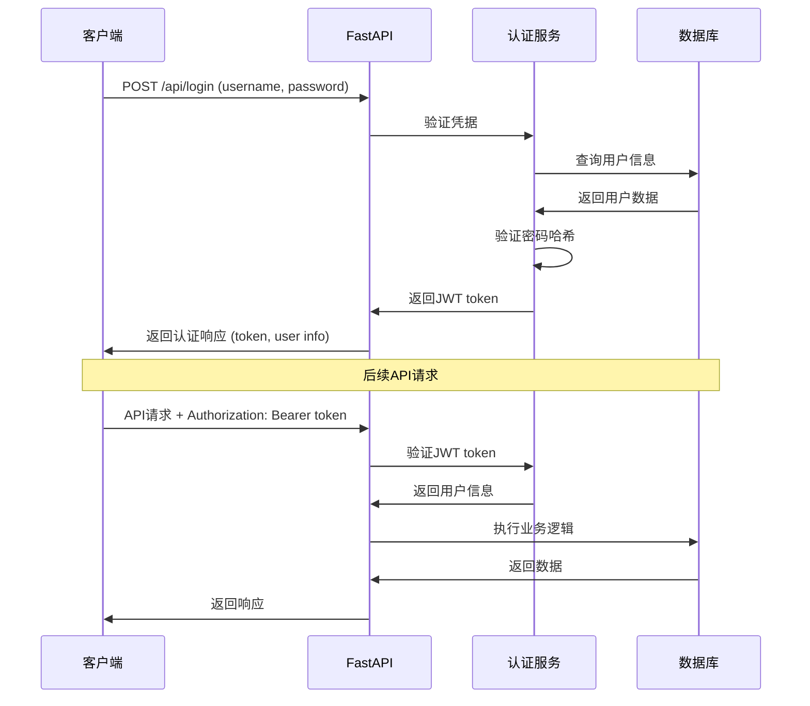

# Backend Architecture

### Service Architecture

#### Controller/Route Organization
```
src/magentic_ui/backend/web/
├── app.py                 # FastAPI应用入口
├── routes/                # API路由
│   ├── __init__.py
│   ├── runs.py           # 运行相关API
│   ├── sessions.py       # 会话管理API
│   ├── settings.py       # 系统设置API
│   ├── teams.py          # 团队管理API
│   ├── validation.py     # 配置验证API
│   ├── mcp.py            # MCP相关API
│   └── ws.py             # WebSocket端点
├── middleware/            # 中间件
│   ├── auth.py           # 认证中间件
│   ├── cors.py           # CORS处理
│   └── logging.py        # 日志中间件
├── deps.py               # 依赖注入
├── config.py             # 配置管理
└── initialization.py     # 应用初始化
```

#### Controller Template
```python
from fastapi import APIRouter, Depends, HTTPException, status
from sqlalchemy.orm import Session
from typing import List, Optional

from ..datamodel.db import get_db
from ..datamodel.types import Run, RunCreate, RunUpdate
from ..teammanager.teammanager import TeamManager
from ..deps import get_current_user

router = APIRouter(prefix="/api/runs", tags=["runs"])

@router.get("/", response_model=List[Run])
async def get_runs(
    limit: int = 20,
    offset: int = 0,
    status: Optional[str] = None,
    db: Session = Depends(get_db),
    current_user: User = Depends(get_current_user)
):
    """获取运行列表"""
    query = db.query(Run).filter(Run.user_id == current_user.id)

    if status:
        query = query.filter(Run.status == status)

    runs = query.offset(offset).limit(limit).all()
    total = query.count()

    return {"runs": runs, "total": total}

@router.post("/", response_model=Run, status_code=status.HTTP_201_CREATED)
async def create_run(
    run_data: RunCreate,
    db: Session = Depends(get_db),
    current_user: User = Depends(get_current_user),
    team_manager: TeamManager = Depends(get_team_manager)
):
    """创建新运行"""
    run = Run(
        session_id=run_data.session_id,
        user_id=current_user.id,
        task=run_data.task,
        config=run_data.config,
        status="running"
    )

    db.add(run)
    db.commit()
    db.refresh(run)

    # 异步启动任务执行
    asyncio.create_task(
        team_manager.run_stream(
            task=run_data.task,
            team_config=run_data.config,
            run=run
        )
    )

    return run

@router.get("/{run_id}", response_model=Run)
async def get_run(
    run_id: str,
    db: Session = Depends(get_db),
    current_user: User = Depends(get_current_user)
):
    """获取特定运行详情"""
    run = db.query(Run).filter(
        Run.id == run_id,
        Run.user_id == current_user.id
    ).first()

    if not run:
        raise HTTPException(
            status_code=status.HTTP_404_NOT_FOUND,
            detail="Run not found"
        )

    return run
```

### Database Architecture

#### Schema Design
```sql
-- 用户表
CREATE TABLE users (
    id UUID PRIMARY KEY DEFAULT gen_random_uuid(),
    username VARCHAR(50) UNIQUE NOT NULL,
    email VARCHAR(255) UNIQUE NOT NULL,
    password_hash VARCHAR(255) NOT NULL,
    is_active BOOLEAN DEFAULT true,
    is_superuser BOOLEAN DEFAULT false,
    created_at TIMESTAMP WITH TIME ZONE DEFAULT NOW(),
    updated_at TIMESTAMP WITH TIME ZONE DEFAULT NOW()
);

-- 会话表
CREATE TABLE sessions (
    id UUID PRIMARY KEY DEFAULT gen_random_uuid(),
    user_id UUID NOT NULL REFERENCES users(id) ON DELETE CASCADE,
    title VARCHAR(255) NOT NULL,
    config JSONB DEFAULT '{}',
    created_at TIMESTAMP WITH TIME ZONE DEFAULT NOW(),
    updated_at TIMESTAMP WITH TIME ZONE DEFAULT NOW()
);

-- 运行表
CREATE TABLE runs (
    id UUID PRIMARY KEY DEFAULT gen_random_uuid(),
    session_id UUID REFERENCES sessions(id) ON DELETE CASCADE,
    user_id UUID NOT NULL REFERENCES users(id) ON DELETE CASCADE,
    task TEXT NOT NULL,
    status VARCHAR(20) NOT NULL DEFAULT 'running' CHECK (status IN ('running', 'completed', 'failed', 'paused')),
    config JSONB DEFAULT '{}',
    result JSONB,
    usage_statistics JSONB DEFAULT '{}',
    created_at TIMESTAMP WITH TIME ZONE DEFAULT NOW(),
    updated_at TIMESTAMP WITH TIME ZONE DEFAULT NOW(),
    completed_at TIMESTAMP WITH TIME ZONE
);

-- 消息表
CREATE TABLE messages (
    id UUID PRIMARY KEY DEFAULT gen_random_uuid(),
    run_id UUID NOT NULL REFERENCES runs(id) ON DELETE CASCADE,
    sender VARCHAR(100) NOT NULL,
    content TEXT NOT NULL,
    message_type VARCHAR(20) NOT NULL DEFAULT 'text' CHECK (message_type IN ('text', 'image', 'file', 'system', 'tool_call', 'tool_result')),
    metadata JSONB DEFAULT '{}',
    timestamp TIMESTAMP WITH TIME ZONE DEFAULT NOW()
);

-- 文件表
CREATE TABLE files (
    id UUID PRIMARY KEY DEFAULT gen_random_uuid(),
    run_id UUID NOT NULL REFERENCES runs(id) ON DELETE CASCADE,
    name VARCHAR(255) NOT NULL,
    path VARCHAR(500) NOT NULL,
    size BIGINT NOT NULL,
    content_type VARCHAR(100),
    file_hash VARCHAR(64),
    is_generated BOOLEAN DEFAULT false,
    created_at TIMESTAMP WITH TIME ZONE DEFAULT NOW()
);

-- 设置表
CREATE TABLE settings (
    id UUID PRIMARY KEY DEFAULT gen_random_uuid(),
    user_id UUID REFERENCES users(id) ON DELETE CASCADE,
    key VARCHAR(100) NOT NULL,
    value JSONB NOT NULL,
    created_at TIMESTAMP WITH TIME ZONE DEFAULT NOW(),
    updated_at TIMESTAMP WITH TIME ZONE DEFAULT NOW(),
    UNIQUE(user_id, key)
);

-- 索引
CREATE INDEX idx_sessions_user_id_created_at ON sessions(user_id, created_at DESC);
CREATE INDEX idx_runs_user_id_created_at ON runs(user_id, created_at DESC);
CREATE INDEX idx_runs_session_id ON runs(session_id);
CREATE INDEX idx_runs_status ON runs(status);
CREATE INDEX idx_messages_run_id_timestamp ON messages(run_id, timestamp);
CREATE INDEX idx_files_run_id ON files(run_id);
CREATE INDEX idx_settings_user_key ON settings(user_id, key);
```

#### Data Access Layer
```python
from sqlalchemy.orm import Session
from sqlalchemy import and_, or_, desc
from typing import List, Optional, Dict, Any

from ..datamodel.db import Run, Message, Session, User
from ..datamodel.types import RunCreate, RunUpdate

class RunRepository:
    def __init__(self, db: Session):
        self.db = db

    def create(self, run_data: RunCreate, user_id: str) -> Run:
        run = Run(
            session_id=run_data.session_id,
            user_id=user_id,
            task=run_data.task,
            config=run_data.config.dict() if run_data.config else {},
            status="running"
        )
        self.db.add(run)
        self.db.commit()
        self.db.refresh(run)
        return run

    def get_by_id(self, run_id: str, user_id: str) -> Optional[Run]:
        return self.db.query(Run).filter(
            and_(Run.id == run_id, Run.user_id == user_id)
        ).first()

    def get_user_runs(
        self,
        user_id: str,
        limit: int = 20,
        offset: int = 0,
        status: Optional[str] = None
    ) -> List[Run]:
        query = self.db.query(Run).filter(Run.user_id == user_id)

        if status:
            query = query.filter(Run.status == status)

        return query.order_by(desc(Run.created_at)).offset(offset).limit(limit).all()

    def update(self, run_id: str, user_id: str, update_data: RunUpdate) -> Optional[Run]:
        run = self.get_by_id(run_id, user_id)
        if not run:
            return None

        update_dict = update_data.dict(exclude_unset=True)
        for field, value in update_dict.items():
            setattr(run, field, value)

        run.updated_at = datetime.utcnow()
        self.db.commit()
        self.db.refresh(run)
        return run

    def delete(self, run_id: str, user_id: str) -> bool:
        run = self.get_by_id(run_id, user_id)
        if not run:
            return False

        self.db.delete(run)
        self.db.commit()
        return True

    def get_run_statistics(self, user_id: str) -> Dict[str, Any]:
        total_runs = self.db.query(Run).filter(Run.user_id == user_id).count()
        completed_runs = self.db.query(Run).filter(
            and_(Run.user_id == user_id, Run.status == "completed")
        ).count()
        failed_runs = self.db.query(Run).filter(
            and_(Run.user_id == user_id, Run.status == "failed")
        ).count()

        return {
            "total_runs": total_runs,
            "completed_runs": completed_runs,
            "failed_runs": failed_runs,
            "success_rate": completed_runs / total_runs if total_runs > 0 else 0
        }
```

### Authentication and Authorization

#### Auth Flow


#### Middleware/Guards
```python
from fastapi import HTTPException, status, Depends
from fastapi.security import HTTPBearer, HTTPAuthorizationCredentials
from jose import JWTError, jwt
from sqlalchemy.orm import Session

from ..datamodel.db import get_db, User
from ..config import settings

security = HTTPBearer()

async def get_current_user(
    credentials: HTTPAuthorizationCredentials = Depends(security),
    db: Session = Depends(get_db)
) -> User:
    """获取当前认证用户"""
    credentials_exception = HTTPException(
        status_code=status.HTTP_401_UNAUTHORIZED,
        detail="Could not validate credentials",
        headers={"WWW-Authenticate": "Bearer"},
    )

    try:
        payload = jwt.decode(
            credentials.credentials,
            settings.secret_key,
            algorithms=[settings.algorithm]
        )
        user_id: str = payload.get("sub")
        if user_id is None:
            raise credentials_exception
    except JWTError:
        raise credentials_exception

    user = db.query(User).filter(User.id == user_id).first()
    if user is None:
        raise credentials_exception

    return user

async def get_current_active_user(
    current_user: User = Depends(get_current_user)
) -> User:
    """获取当前活跃用户"""
    if not current_user.is_active:
        raise HTTPException(
            status_code=status.HTTP_400_BAD_REQUEST,
            detail="Inactive user"
        )
    return current_user

def require_superuser(
    current_user: User = Depends(get_current_active_user)
) -> User:
    """要求超级用户权限"""
    if not current_user.is_superuser:
        raise HTTPException(
            status_code=status.HTTP_403_FORBIDDEN,
            detail="Not enough permissions"
        )
    return current_user
```

