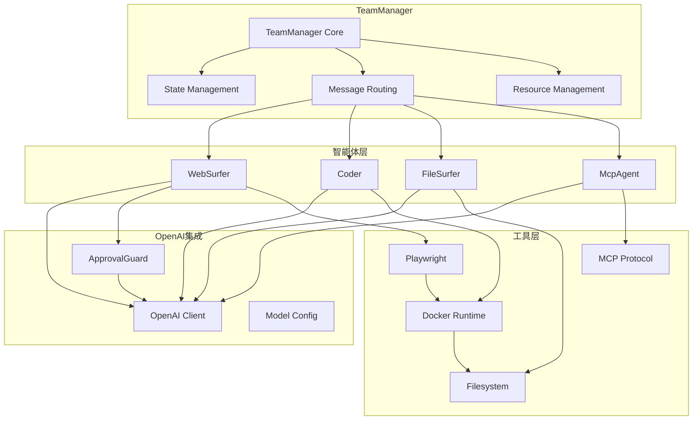

# Components

### TeamManager

**Responsibility:** 管理智能体团队的生命周期，包括团队创建、任务分配、状态监控和资源清理

**Key Interfaces:**
- create_team(config: TeamConfig): Team
- run_stream(task: Task): AsyncGenerator<Message, None]
- close(): void
- load_state(state: TeamState): void

**Dependencies:** 数据库、文件系统、Docker容器、智能体实现

**Technology Stack:** Python + asyncio + SQLModel + Docker SDK

### WebSurfer

**Responsibility:** 执行Web浏览和自动化任务，包括页面导航、元素交互、信息提取和截图

**Key Interfaces:**
- navigate_to(url: string): NavigationResult
- click_element(selector: string): ActionResult
- fill_form(formData: FormData): ActionResult
- extract_content(extractionRules: ExtractionRules): ContentResult
- take_screenshot(region?: Region): ScreenshotResult

**Dependencies:** OpenAI API、Playwright、浏览器容器、图像处理工具

**Technology Stack:** Python + Playwright + OpenAI API + asyncio

### Coder

**Responsibility:** 执行代码生成、执行和调试任务，支持多种编程语言

**Key Interfaces:**
- generate_code(requirements: CodeRequirements): CodeResult
- execute_code(code: string, environment: ExecutionEnvironment): ExecutionResult
- debug_code(code: string, error: ErrorInfo): DebugResult
- optimize_code(code: string): OptimizationResult

**Dependencies:** Python执行环境、代码分析工具、文件系统、OpenAI API

**Technology Stack:** Python + subprocess + Docker + OpenAI API

### FileSurfer

**Responsibility:** 管理文件系统操作，包括文件浏览、内容读取、编辑和搜索

**Key Interfaces:**
- list_directory(path: string): DirectoryListing
- read_file(filePath: string): FileContent
- write_file(filePath: string, content: string): WriteResult
- search_files(criteria: SearchCriteria): SearchResult
- analyze_file(filePath: string): FileAnalysis

**Dependencies:** 文件系统、Python执行环境、内容分析工具、OpenAI API

**Technology Stack:** Python + aiofiles + path handling + OpenAI API

### McpAgent

**Responsibility:** 集成Model Context Protocol服务器，提供扩展工具和服务

**Key Interfaces:**
- connect_to_server(serverConfig: McpServerConfig): ConnectionResult
- list_tools(): ToolList
- call_tool(toolName: string, parameters: object): ToolResult
- disconnect(): void

**Dependencies:** MCP服务器、WebSocket连接、工具注册表、错误处理机制

**Technology Stack:** Python + MCP protocol + asyncio + JSON-RPC

### ApprovalGuard

**Responsibility:** 实现动作审批机制，确保智能体操作的安全性和可控性

**Key Interfaces:**
- approve_action(action: Action): ApprovalResult
- set_policy(policy: ApprovalPolicy): void
- check_safety(action: Action): SafetyResult
- log_decision(action: Action, decision: ApprovalResult): void

**Dependencies:** OpenAI API (安全检查)、用户输入接口、策略配置、日志系统

**Technology Stack:** Python + OpenAI API + Rule Engine + async input handling

### Component Diagrams


