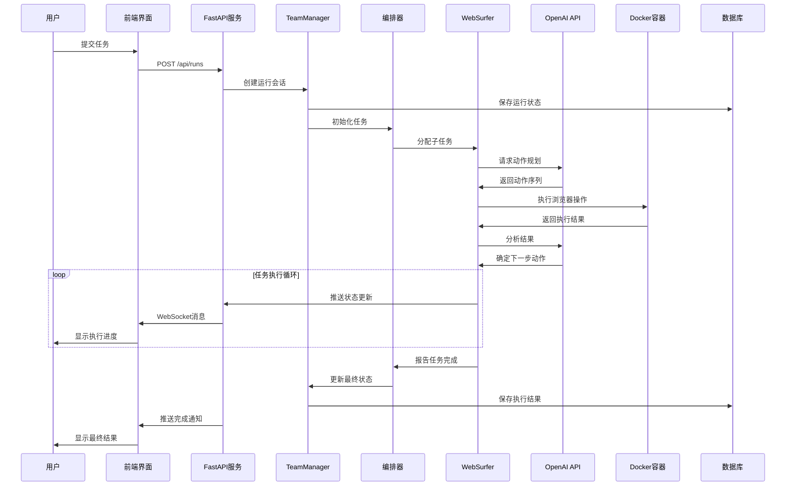
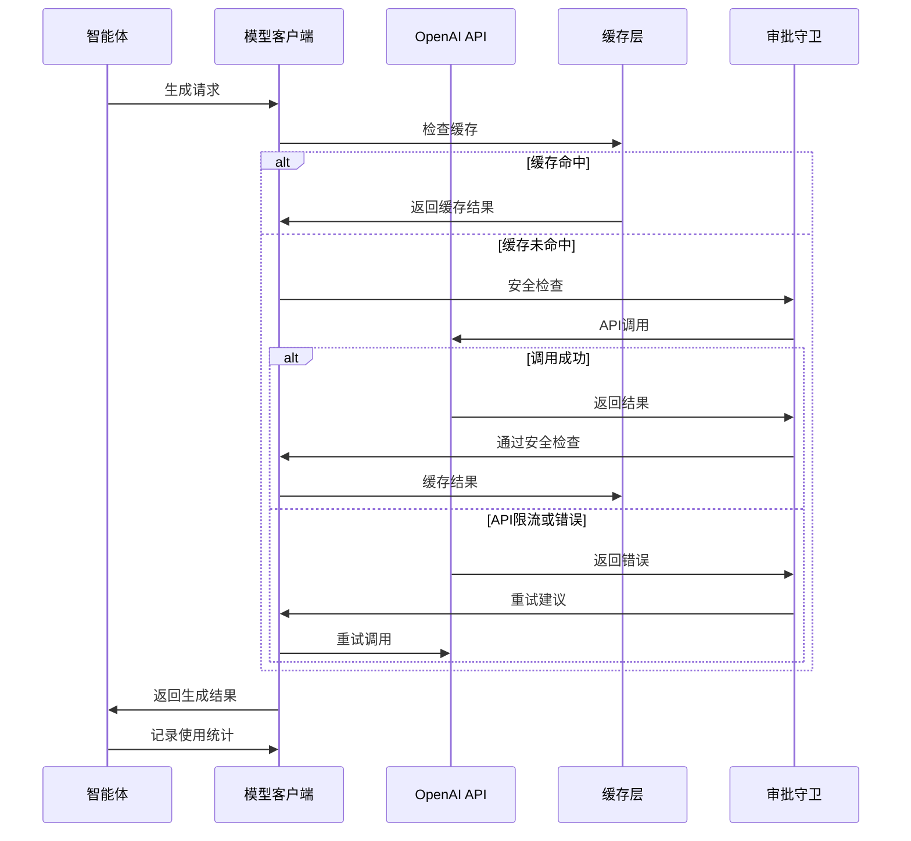
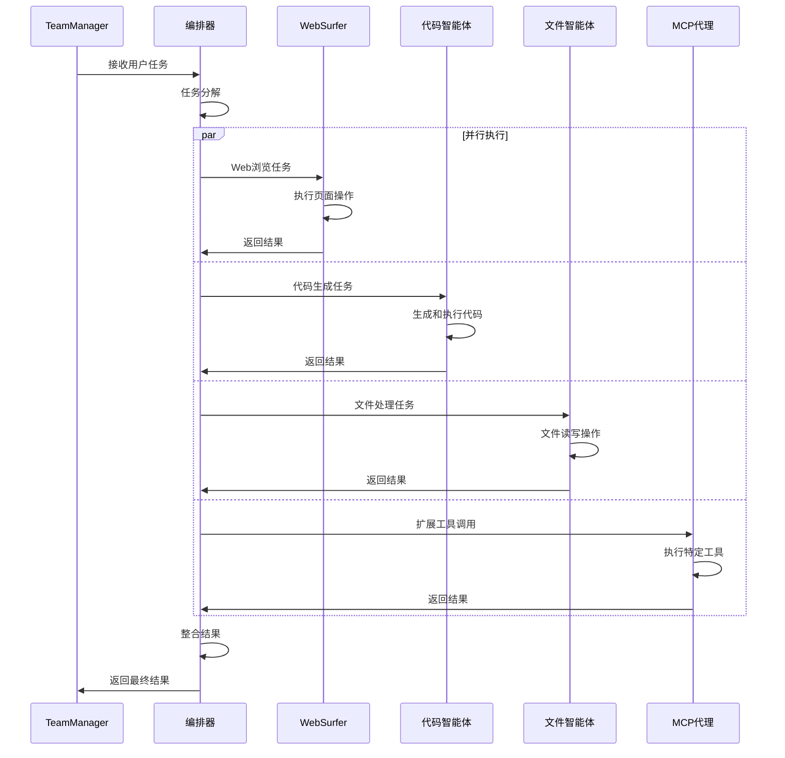

# Core Workflows

### 智能体协作执行流程

```mermaid
sequenceDiagram
    participant User as 用户
    participant Frontend as 前端界面
    participant API as FastAPI服务
    participant TM as TeamManager
    participant Orchestrator as 编排器
    participant WS as WebSurfer
    participant OAI as OpenAI API
    participant Docker as Docker容器
    participant DB as 数据库

    User->>Frontend: 提交任务
    Frontend->>API: POST /api/runs
    API->>TM: 创建运行会话
    TM->>DB: 保存运行状态

    TM->>Orchestrator: 初始化任务
    Orchestrator->>WS: 分配子任务
    WS->>OAI: 请求动作规划
    OAI->>WS: 返回动作序列
    WS->>Docker: 执行浏览器操作
    Docker->>WS: 返回执行结果
    WS->>OAI: 分析结果
    OAI->>WS: 确定下一步动作

    loop 任务执行循环
        WS->>API: 推送状态更新
        API->>Frontend: WebSocket消息
        Frontend->>User: 显示执行进度
    end

    WS->>Orchestrator: 报告任务完成
    Orchestrator->>TM: 更新最终状态
    TM->>DB: 保存执行结果
    API->>Frontend: 推送完成通知
    Frontend->>User: 显示最终结果
```

### OpenAI模型调用流程

```mermaid
sequenceDiagram
    participant Agent as 智能体
    participant ModelClient as 模型客户端
    participant OpenAI as OpenAI API
    participant Cache as 缓存层
    participant Guard as 审批守卫

    Agent->>ModelClient: 生成请求
    ModelClient->>Cache: 检查缓存

    alt 缓存命中
        Cache->>ModelClient: 返回缓存结果
    else 缓存未命中
        ModelClient->>Guard: 安全检查
        Guard->>OpenAI: API调用

        alt 调用成功
            OpenAI->>Guard: 返回结果
            Guard->>ModelClient: 通过安全检查
            ModelClient->>Cache: 缓存结果
        else API限流或错误
            OpenAI->>Guard: 返回错误
            Guard->>ModelClient: 重试建议
            ModelClient->>OpenAI: 重试调用
        end
    end

    ModelClient->>Agent: 返回生成结果
    Agent->>ModelClient: 记录使用统计
```

### 多智能体协调流程

```mermaid
sequenceDiagram
    participant TM as TeamManager
    participant Orchestrator as 编排器
    participant WS as WebSurfer
    participant Coder as 代码智能体
    participant FS as 文件智能体
    participant MCP as MCP代理

    TM->>Orchestrator: 接收用户任务
    Orchestrator->>Orchestrator: 任务分解

    par 并行执行
        Orchestrator->>WS: Web浏览任务
        WS->>WS: 执行页面操作
        WS->>Orchestrator: 返回结果
    and
        Orchestrator->>Coder: 代码生成任务
        Coder->>Coder: 生成和执行代码
        Coder->>Orchestrator: 返回结果
    and
        Orchestrator->>FS: 文件处理任务
        FS->>FS: 文件读写操作
        FS->>Orchestrator: 返回结果
    and
        Orchestrator->>MCP: 扩展工具调用
        MCP->>MCP: 执行特定工具
        MCP->>Orchestrator: 返回结果
    end

    Orchestrator->>Orchestrator: 整合结果
    Orchestrator->>TM: 返回最终结果
```

