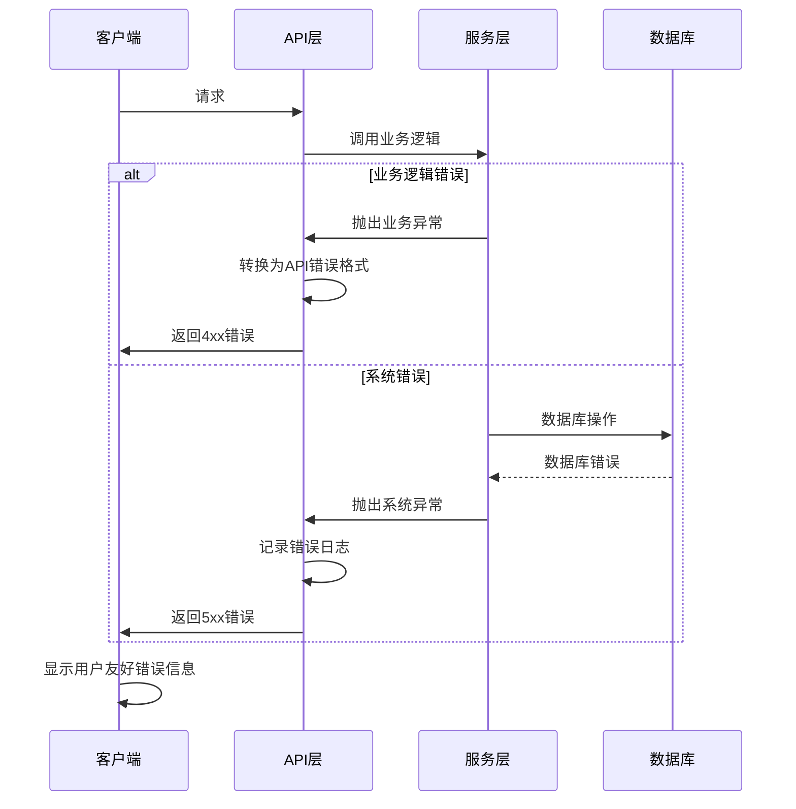

# Error Handling Strategy

### Error Flow


### Error Response Format
```typescript
interface ApiError {
  error: {
    code: string;
    message: string;
    details?: Record<string, any>;
    timestamp: string;
    requestId: string;
  };
}

// 示例错误响应
{
  "error": {
    "code": "VALIDATION_ERROR",
    "message": "请求参数验证失败",
    "details": {
      "field": "email",
      "issue": "邮箱格式不正确"
    },
    "timestamp": "2023-12-01T10:30:00Z",
    "requestId": "req_123456789"
  }
}
```

### Frontend Error Handling
```typescript
// src/utils/errorHandler.ts
import { notification } from 'antd';

export class ApiError extends Error {
  constructor(
    public code: string,
    message: string,
    public details?: Record<string, any>
  ) {
    super(message);
    this.name = 'ApiError';
  }
}

export const handleApiError = (error: any): void => {
  if (error instanceof ApiError) {
    // 处理已知API错误
    switch (error.code) {
      case 'VALIDATION_ERROR':
        notification.error({
          message: '输入错误',
          description: error.message,
        });
        break;
      case 'AUTHENTICATION_ERROR':
        notification.error({
          message: '认证失败',
          description: '请重新登录',
        });
        // 重定向到登录页
        window.location.href = '/login';
        break;
      case 'PERMISSION_ERROR':
        notification.error({
          message: '权限不足',
          description: error.message,
        });
        break;
      default:
        notification.error({
          message: '操作失败',
          description: error.message,
        });
    }
  } else if (error.response) {
    // 处理HTTP错误
    const { status, data } = error.response;

    if (status === 500) {
      notification.error({
        message: '服务器错误',
        description: '请稍后重试',
      });
    } else if (status === 404) {
      notification.error({
        message: '资源不存在',
        description: '请求的资源未找到',
      });
    } else {
      notification.error({
        message: '请求失败',
        description: data?.error?.message || '未知错误',
      });
    }
  } else {
    // 处理网络错误等
    notification.error({
      message: '网络错误',
      description: '请检查网络连接',
    });
  }
};

// API调用包装器
export const apiCall = async <T>(
  apiFunction: () => Promise<T>
): Promise<T | null> => {
  try {
    return await apiFunction();
  } catch (error) {
    handleApiError(error);
    return null;
  }
};
```

### Backend Error Handling
```python
# src/magentic_ui/backend/exceptions.py
from fastapi import HTTPException, status
from typing import Dict, Any, Optional

class MagenticUIException(Exception):
    """基础异常类"""
    def __init__(
        self,
        message: str,
        code: str = "INTERNAL_ERROR",
        details: Optional[Dict[str, Any]] = None
    ):
        self.message = message
        self.code = code
        self.details = details or {}
        super().__init__(message)

class ValidationException(MagenticUIException):
    """验证错误"""
    def __init__(self, message: str, field: str = None, **kwargs):
        details = kwargs.get('details', {})
        if field:
            details['field'] = field
        super().__init__(
            message=message,
            code="VALIDATION_ERROR",
            details=details
        )

class AuthenticationException(MagenticUIException):
    """认证错误"""
    def __init__(self, message: str = "认证失败"):
        super().__init__(
            message=message,
            code="AUTHENTICATION_ERROR"
        )

class PermissionException(MagenticUIException):
    """权限错误"""
    def __init__(self, message: str = "权限不足"):
        super().__init__(
            message=message,
            code="PERMISSION_ERROR"
        )

class ResourceNotFoundException(MagenticUIException):
    """资源未找到错误"""
    def __init__(self, resource: str, identifier: str = None):
        message = f"{resource}未找到"
        if identifier:
            message += f": {identifier}"
        super().__init__(
            message=message,
            code="RESOURCE_NOT_FOUND",
            details={"resource": resource, "identifier": identifier}
        )

# 异常处理器
from fastapi import Request
from fastapi.responses import JSONResponse
import logging
import uuid

logger = logging.getLogger(__name__)

async def magentic_ui_exception_handler(
    request: Request,
    exc: MagenticUIException
) -> JSONResponse:
    """处理自定义异常"""
    request_id = str(uuid.uuid4())

    # 记录错误日志
    logger.error(
        f"Request {request_id} failed: {exc.code} - {exc.message}",
        extra={
            "request_id": request_id,
            "code": exc.code,
            "details": exc.details,
            "path": str(request.url),
            "method": request.method
        }
    )

    # 确定HTTP状态码
    status_code_map = {
        "VALIDATION_ERROR": status.HTTP_400_BAD_REQUEST,
        "AUTHENTICATION_ERROR": status.HTTP_401_UNAUTHORIZED,
        "PERMISSION_ERROR": status.HTTP_403_FORBIDDEN,
        "RESOURCE_NOT_FOUND": status.HTTP_404_NOT_FOUND,
        "RATE_LIMIT_ERROR": status.HTTP_429_TOO_MANY_REQUESTS,
    }

    http_status = status_code_map.get(exc.code, status.HTTP_500_INTERNAL_SERVER_ERROR)

    return JSONResponse(
        status_code=http_status,
        content={
            "error": {
                "code": exc.code,
                "message": exc.message,
                "details": exc.details,
                "timestamp": datetime.utcnow().isoformat(),
                "requestId": request_id
            }
        }
    )

async def general_exception_handler(
    request: Request,
    exc: Exception
) -> JSONResponse:
    """处理未捕获的异常"""
    request_id = str(uuid.uuid4())

    # 记录严重错误
    logger.exception(
        f"Unhandled exception in request {request_id}",
        extra={
            "request_id": request_id,
            "path": str(request.url),
            "method": request.method,
            "exception_type": type(exc).__name__
        }
    )

    return JSONResponse(
        status_code=status.HTTP_500_INTERNAL_SERVER_ERROR,
        content={
            "error": {
                "code": "INTERNAL_ERROR",
                "message": "服务器内部错误",
                "timestamp": datetime.utcnow().isoformat(),
                "requestId": request_id
            }
        }
    )

# 在app.py中注册异常处理器
def setup_exception_handlers(app):
    app.add_exception_handler(MagenticUIException, magentic_ui_exception_handler)
    app.add_exception_handler(Exception, general_exception_handler)
```

