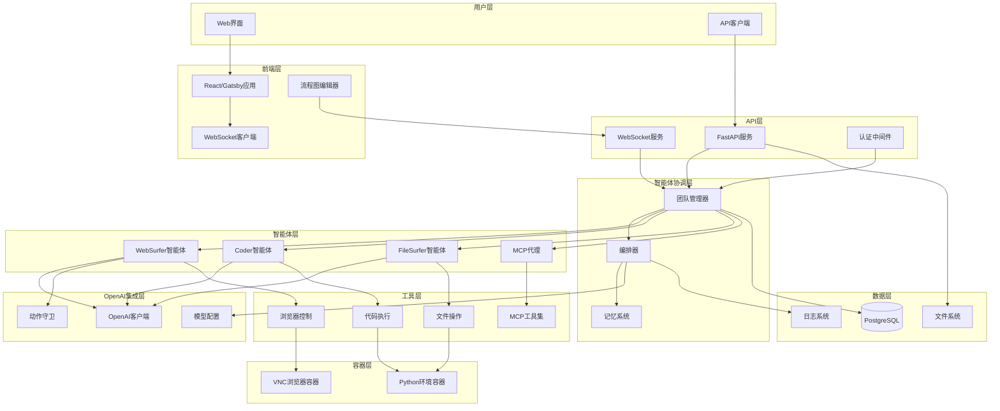

# High Level Architecture

### Technical Summary

Magentic-UI 采用现代微服务架构，基于AutoGen多智能体框架构建人机协作Web自动化平台。系统使用FastAPI作为后端API服务，React/Gatsby构建前端界面，通过WebSocket实现实时通信，并利用Docker容器化提供VNC浏览器和Python执行环境。核心集成OpenAI GPT模型为各个智能体提供推理能力，支持复杂的Web自动化任务协作执行。

### Platform and Infrastructure Choice

**平台**: 本地Docker部署 + 云服务扩展
**关键服务**: Docker容器、PostgreSQL数据库、VNC浏览器、OpenAI API
**部署主机和区域**: 本地开发环境，支持云部署扩展

### Repository Structure

**结构**: Monorepo单体仓库
**Monorepo工具**: Python包管理 + npm workspaces
**包组织**: 按功能模块组织，前后端分离但共享配置

### High Level Architecture Diagram

### Architectural Patterns

- **多智能体协作模式**: 基于AutoGen框架的智能体协作 - _Rationale_: 通过专业化智能体分工协作，高效处理复杂Web自动化任务
- **事件驱动架构**: WebSocket实时消息传递 - _Rationale_: 支持实时用户交互和状态更新，提供响应式用户体验
- **容器化部署模式**: Docker容器隔离环境 - _Rationale_: 确保一致的执行环境，简化依赖管理和部署
- **Repository模式**: 数据访问层抽象 - _Rationale_: 实现数据访问逻辑与业务逻辑分离，提高测试性和维护性
- **API网关模式**: FastAPI统一入口 - _Rationale_: 集中管理认证、路由和中间件，简化API管理
- **状态管理模式**: 前端集中状态管理 - _Rationale_: 确保前端状态一致性，支持复杂交互场景

