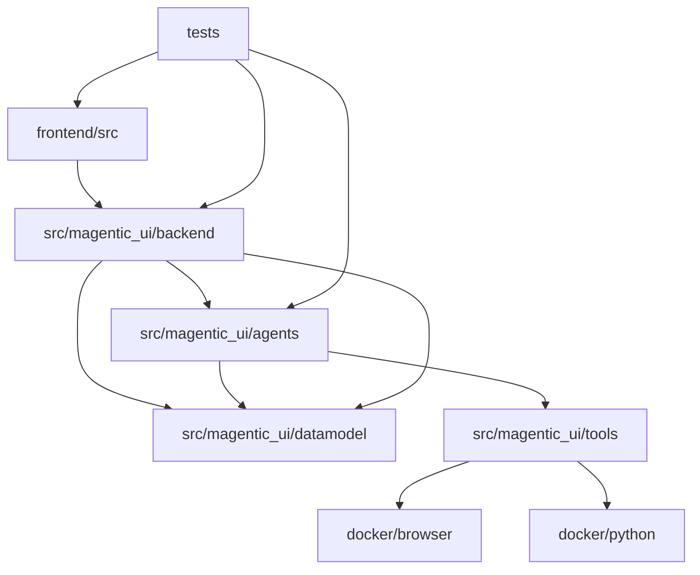

# Magentic-UI 源码目录结构

**Author**: ssiagu
**Email**: ssiagu@gmail.com
**Document Signature**: ssiagu
**最后更新**: 2025-10-21
**版本**: v1.0

## 📋 概述

本文档详细描述了Magentic-UI项目的完整源码目录结构，包括每个目录和文件的用途、组织原则和文件命名规范。这有助于开发者快速理解项目结构和找到相关代码。

## 🏗️ 项目结构图

```
magentic-ui/
├── .bmad-core/                # BMad核心配置文件
├── .github/                   # GitHub Actions工作流
├── docs/                      # 项目文档
│   ├── architecture/          # 架构文档
│   ├── prd/                   # 产品需求文档
│   └── qa/                    # 问答文档
├── frontend/                  # 前端应用
├── src/                       # 后端源码
│   └── magentic_ui/           # 主包
├── tests/                     # 测试代码
├── samples/                   # 示例代码
├── docker/                    # Docker配置
├── experiments/               # 实验代码
├── scripts/                   # 构建和部署脚本
├── .env.example               # 环境变量模板
├── .gitignore                 # Git忽略文件
├── pyproject.toml             # Python项目配置
├── docker-compose.yml         # Docker编排配置
├── README.md                  # 项目说明
└── LICENSE                    # 许可证文件
```

## 📁 详细目录结构

### .bmad-core/ - BMad核心配置
```
.bmad-core/
├── core-config.yaml           # BMad核心配置文件
├── tasks/                     # BMad任务定义
├── templates/                 # BMad模板文件
├── checklists/                # BMad检查清单
└── data/                      # BMad数据文件
```

**用途**: BMad框架的核心配置文件，包含项目结构、文档路径、工作流配置等。

### .github/ - GitHub工作流
```
.github/
├── workflows/                 # GitHub Actions工作流
│   ├── ci.yaml               # 持续集成工作流
│   ├── quality-check.yaml    # 代码质量检查
│   ├── security.yaml         # 安全扫描
│   └── deploy.yaml           # 部署工作流
├── ISSUE_TEMPLATE/           # Issue模板
│   ├── bug_report.md         # Bug报告模板
│   └── feature_request.md    # 功能请求模板
└── PULL_REQUEST_TEMPLATE.md  # PR模板
```

**用途**: GitHub自动化工作流配置，包括CI/CD、代码质量检查、安全扫描等。

### docs/ - 项目文档
```
docs/
├── architecture/              # 架构文档
│   ├── architecture.md       # 主架构文档
│   ├── coding-standards.md   # 编码标准
│   ├── tech-stack.md         # 技术栈说明
│   └── source-tree.md        # 源码结构说明
├── prd/                       # 产品需求文档
│   ├── prd.md                # 主PRD文档
│   ├── epic-*.md             # Epic文档
│   └── stories/              # User Story文档
├── qa/                        # 问答文档
│   ├── faq.md                # 常见问题
│   └── troubleshooting.md     # 故障排除
└── api/                       # API文档
    ├── openapi.yaml          # OpenAPI规范
    └── postman/              # Postman集合
```

**用途**: 项目文档的集中管理，包括架构文档、需求文档、API文档等。

### frontend/ - 前端应用
```
frontend/
├── public/                    # 静态资源
│   ├── index.html            # HTML模板
│   ├── favicon.ico           # 网站图标
│   └── manifest.json         # PWA配置
├── src/                       # 源代码
│   ├── components/           # 可复用组件
│   │   ├── common/           # 通用组件
│   │   │   ├── Button/
│   │   │   │   ├── index.tsx
│   │   │   │   ├── Button.tsx
│   │   │   │   ├── Button.module.css
│   │   │   │   └── Button.test.tsx
│   │   │   ├── Modal/
│   │   │   ├── Loading/
│   │   │   └── Layout/
│   │   ├── features/         # 功能组件
│   │   │   ├── Chat/
│   │   │   │   ├── ChatComponent.tsx
│   │   │   │   ├── MessageList.tsx
│   │   │   │   └── ChatInput.tsx
│   │   │   ├── PlanEditor/
│   │   │   │   ├── PlanEditor.tsx
│   │   │   │   ├── NodeEditor.tsx
│   │   │   │   └── FlowCanvas.tsx
│   │   │   ├── FileManager/
│   │   │   ├── Settings/
│   │   │   └── Dashboard/
│   │   └── forms/            # 表单组件
│   ├── pages/                # 页面组件
│   │   ├── Dashboard/
│   │   │   ├── index.tsx
│   │   │   ├── DashboardPage.tsx
│   │   │   └── DashboardPage.module.css
│   │   ├── Sessions/
│   │   │   ├── index.tsx
│   │   │   ├── SessionsPage.tsx
│   │   │   ├── SessionDetail.tsx
│   │   │   └── NewSession.tsx
│   │   ├── Runs/
│   │   │   ├── index.tsx
│   │   │   ├── RunsPage.tsx
│   │   │   ├── RunDetail.tsx
│   │   │   └── RunMonitor.tsx
│   │   ├── Settings/
│   │   │   ├── index.tsx
│   │   │   ├── SettingsPage.tsx
│   │   │   ├── ModelSettings.tsx
│   │   │   └── McpSettings.tsx
│   │   ├── Auth/
│   │   │   ├── index.tsx
│   │   │   ├── LoginPage.tsx
│   │   │   └── RegisterPage.tsx
│   │   └── Gallery/
│   ├── hooks/                # 自定义Hooks
│   │   ├── useWebSocket.ts   # WebSocket连接Hook
│   │   ├── useAuth.ts        # 认证Hook
│   │   ├── useApi.ts         # API调用Hook
│   │   ├── useLocalStorage.ts # 本地存储Hook
│   │   └── useDebounce.ts    # 防抖Hook
│   ├── services/             # API服务
│   │   ├── api.ts            # API客户端基础配置
│   │   ├── websocket.ts      # WebSocket服务
│   │   ├── auth.ts           # 认证服务
│   │   ├── runService.ts     # 运行服务
│   │   ├── sessionService.ts # 会话服务
│   │   └── settingsService.ts # 设置服务
│   ├── stores/               # 状态管理
│   │   ├── authStore.ts      # 认证状态
│   │   ├── sessionStore.ts   # 会话状态
│   │   ├── runStore.ts       # 运行状态
│   │   ├── settingsStore.ts  # 设置状态
│   │   └── uiStore.ts        # UI状态
│   ├── types/                # TypeScript类型定义
│   │   ├── api.ts            # API类型
│   │   ├── auth.ts           # 认证类型
│   │   ├── models.ts         # 数据模型类型
│   │   ├── websocket.ts      # WebSocket类型
│   │   └── index.ts          # 类型导出
│   ├── utils/                # 工具函数
│   │   ├── helpers.ts        # 通用助手函数
│   │   ├── constants.ts      # 常量定义
│   │   ├── validators.ts     # 验证函数
│   │   ├── formatters.ts     # 格式化函数
│   │   └── storage.ts        # 存储工具
│   ├── styles/               # 样式文件
│   │   ├── globals.css       # 全局样式
│   │   ├── variables.css     # CSS变量
│   │   ├── components.css    # 组件样式
│   │   └── themes/           # 主题样式
│   │       ├── light.css
│   │       └── dark.css
│   ├── assets/               # 静态资源
│   │   ├── images/           # 图片资源
│   │   ├── icons/            # 图标资源
│   │   └── fonts/            # 字体资源
│   ├── contexts/             # React Context
│   │   ├── AuthContext.tsx   # 认证上下文
│   │   ├── WebSocketContext.tsx # WebSocket上下文
│   │   └── ThemeContext.tsx  # 主题上下文
│   ├── App.tsx               # 主应用组件
│   ├── App.css               # 应用样式
│   ├── index.tsx             # 应用入口
│   ├── index.css             # 入口样式
│   └── setupTests.ts         # 测试配置
├── tests/                     # 前端测试
│   ├── __mocks__/            # Mock文件
│   ├── components/           # 组件测试
│   ├── hooks/                # Hook测试
│   ├── services/             # 服务测试
│   └── utils/                # 工具测试
├── .env.example              # 环境变量示例
├── .eslintrc.json           # ESLint配置
├── .prettierrc              # Prettier配置
├── package.json             # 项目配置和依赖
├── package-lock.json        # 依赖锁定文件
├── tsconfig.json            # TypeScript配置
└── README.md                # 前端说明文档
```

**用途**: React前端应用，提供用户界面和交互功能。

### src/magentic_ui/ - 后端源码
```
src/magentic_ui/
├── __init__.py               # 包初始化
├── version.py                # 版本信息
├── magentic_ui_config.py     # 主配置文件
├── input_func.py             # 输入函数定义
├── task_team.py              # 任务团队管理
├── approval_guard.py         # 审批守卫
├── guarded_action.py         # 受保护动作
├── learning/                 # 学习系统
│   ├── __init__.py
│   ├── learner.py            # 学习器
│   └── memory_provider.py    # 记忆提供者
├── agents/                   # 智能体实现
│   ├── __init__.py
│   ├── _base.py              # 基础智能体类
│   ├── _coder.py             # 代码智能体
│   ├── _user_proxy.py        # 用户代理
│   ├── _utils.py             # 智能体工具函数
│   ├── web_surfer/           # Web浏览智能体
│   │   ├── __init__.py
│   │   ├── _web_surfer.py    # WebSurfer核心实现
│   │   ├── _cua_web_surfer.py # CUA WebSurfer
│   │   ├── _events.py        # 事件定义
│   │   ├── _prompts.py       # 提示词模板
│   │   ├── _tool_definitions.py # 工具定义
│   │   ├── _set_of_mark.py   # 标记集合
│   │   └── browser.py        # 浏览器控制
│   ├── file_surfer/          # 文件操作智能体
│   │   ├── __init__.py
│   │   ├── _file_surfer.py   # FileSurfer核心实现
│   │   ├── _browser_code_helpers.py # 浏览器代码助手
│   │   ├── _code_markdown_file_browser.py # 代码Markdown浏览器
│   │   └── _tool_definitions.py # 工具定义
│   ├── mcp/                  # MCP智能体
│   │   ├── __init__.py
│   │   ├── _agent.py         # MCP代理实现
│   │   └── _config.py        # MCP配置
│   └── users/                # 用户代理
│       ├── __init__.py
│       ├── _dummy_user_proxy.py # 虚拟用户代理
│       └── _metadata_user_proxy.py # 元数据用户代理
├── backend/                  # 后端服务
│   ├── __init__.py
│   ├── cli.py                # 命令行入口
│   ├── web/                  # Web应用
│   │   ├── __init__.py
│   │   ├── app.py            # FastAPI应用主入口
│   │   ├── config.py         # Web应用配置
│   │   ├── deps.py           # 依赖注入
│   │   ├── initialization.py # 应用初始化
│   │   ├── routes/           # API路由
│   │   │   ├── __init__.py
│   │   │   ├── runs.py       # 运行相关API
│   │   │   ├── sessions.py   # 会话管理API
│   │   │   ├── settings.py   # 设置API
│   │   │   ├── teams.py      # 团队管理API
│   │   │   ├── validation.py # 配置验证API
│   │   │   ├── mcp.py        # MCP相关API
│   │   │   ├── plans.py      # 计划API
│   │   │   └── ws.py         # WebSocket端点
│   │   ├── middleware/       # 中间件
│   │   │   ├── __init__.py
│   │   │   ├── auth.py       # 认证中间件
│   │   │   ├── cors.py       # CORS中间件
│   │   │   └── logging.py    # 日志中间件
│   │   ├── managers/         # 管理器
│   │   │   ├── __init__.py
│   │   │   └── connection.py # 连接管理器
│   │   └── ui/               # Web UI资源
│   │       └── static/       # 静态文件
│   └── teammanager/          # 团队管理器
│       ├── __init__.py
│       └── teammanager.py    # 团队管理器实现
├── datamodel/                # 数据模型
│   ├── __init__.py
│   ├── db.py                 # 数据库模型定义
│   └── types.py              # 类型定义
├── tools/                    # 工具集成
│   ├── __init__.py
│   ├── playwright/           # Playwright工具
│   │   ├── __init__.py
│   │   ├── browser/          # 浏览器控制
│   │   │   ├── __init__.py
│   │   │   ├── browser.py    # 浏览器核心
│   │   │   ├── page.py       # 页面控制
│   │   │   └── utils.py      # 浏览器工具
│   │   └── playwright_controller.py # Playwright控制器
│   └── mcp/                  # MCP工具
│       ├── __init__.py
│       └── _aggregate_workbench.py # MCP工作台
├── teams/                    # 团队定义
│   ├── __init__.py
│   ├── __init__.py
│   ├── group_chat.py         # 群聊团队
│   ├── round_robin_group_chat.py # 轮询群聊
│   └── orchestrator/         # 编排器
│       ├── __init__.py
│       └── orchestrator_config.py # 编排器配置
├── eval/                     # 评估框架
│   ├── __init__.py
│   ├── benchmark.py          # 基准测试
│   ├── basesystem.py         # 基础系统
│   ├── core.py               # 核心评估
│   ├── evaluators.py         # 评估器
│   ├── models.py             # 评估模型
│   ├── utils.py              # 评估工具
│   ├── systems/              # 评估系统
│   │   ├── __init__.py
│   │   ├── example.py        # 示例系统
│   │   └── llm_system.py     # LLM系统
│   └── benchmarks/           # 基准测试集
│       ├── __init__.py
│       ├── assistantbench/   # Assistant基准
│       ├── bearchubs/        # BearCubs基准
│       ├── custom/           # 自定义基准
│       ├── gaia/             # GAIA基准
│       ├── gpqa/             # GPQA基准
│       ├── simpleqa/         # SimpleQA基准
│       ├── webgames/         # WebGames基准
│       └── webvoyager/       # WebVoyager基准
├── cli/                      # 命令行接口
│   ├── __init__.py
│   ├── pretty_console.py     # 美化控制台
│   └── _cli.py               # CLI主程序
└── _docker.py                # Docker工具
```

**用途**: Python后端服务，包含智能体实现、API服务、数据模型等核心功能。

### tests/ - 测试代码
```
tests/
├── __init__.py
├── conftest.py               # pytest配置
├── unit/                     # 单元测试
│   ├── __init__.py
│   ├── test_agents/          # 智能体单元测试
│   │   ├── __init__.py
│   │   ├── test_web_surfer.py
│   │   ├── test_coder.py
│   │   ├── test_file_surfer.py
│   │   └── test_mcp_agent.py
│   ├── test_backend/         # 后端单元测试
│   │   ├── __init__.py
│   │   ├── test_teammanager.py
│   │   ├── test_routes.py
│   │   ├── test_services.py
│   │   └── test_middleware.py
│   ├── test_tools/           # 工具单元测试
│   │   ├── __init__.py
│   │   ├── test_playwright.py
│   │   └── test_mcp_tools.py
│   └── test_utils/           # 工具函数测试
│       ├── __init__.py
│       ├── test_helpers.py
│       └── test_validators.py
├── integration/              # 集成测试
│   ├── __init__.py
│   ├── test_api_integration.py # API集成测试
│   ├── test_agent_integration.py # 智能体集成测试
│   ├── test_database_integration.py # 数据库集成测试
│   └── test_websocket_integration.py # WebSocket集成测试
├── e2e/                      # 端到端测试
│   ├── __init__.py
│   ├── test_full_workflows.py # 完整工作流测试
│   ├── test_user_scenarios.py # 用户场景测试
│   └── test_browser_automation.py # 浏览器自动化测试
├── fixtures/                 # 测试数据
│   ├── __init__.py
│   ├── sample_runs.json      # 示例运行数据
│   ├── mock_responses.json   # Mock响应数据
│   └── test_configs.json     # 测试配置
└── utils/                    # 测试工具
    ├── __init__.py
    ├── test_helpers.py       # 测试助手函数
    ├── mock_factory.py       # Mock工厂
    └── database_utils.py     # 数据库测试工具
```

**用途**: 包含单元测试、集成测试和端到端测试，确保代码质量。

### samples/ - 示例代码
```
samples/
├── __init__.py
├── basic_usage/              # 基础使用示例
│   ├── simple_chat.py        # 简单聊天示例
│   ├── web_automation.py     # Web自动化示例
│   └── file_operations.py    # 文件操作示例
├── advanced/                 # 高级使用示例
│   ├── multi_agent_coordination.py # 多智能体协调
│   ├── custom_mcp_tools.py   # 自定义MCP工具
│   └── custom_agents.py      # 自定义智能体
├── tutorials/                # 教程示例
│   ├── getting_started.py    # 入门教程
│   ├── agent_development.py  # 智能体开发
│   └── tool_integration.py   # 工具集成
└── configs/                  # 配置示例
    ├── minimal_config.py     # 最小配置
    ├── production_config.py  # 生产配置
    └── development_config.py # 开发配置
```

**用途**: 提供使用示例和教程，帮助开发者快速上手。

### docker/ - Docker配置
```
docker/
├── browser/                  # 浏览器容器
│   ├── Dockerfile            # 浏览器容器Dockerfile
│   ├── supervisord.conf      # 进程管理配置
│   ├── xstartup              # X11启动脚本
│   └── noVNC/               # noVNC配置
├── python/                   # Python容器
│   ├── Dockerfile            # Python容器Dockerfile
│   ├── requirements.txt      # Python依赖
│   └── entrypoint.sh         # 启动脚本
├── development/              # 开发环境
│   ├── docker-compose.yml   # 开发环境编排
│   └── .env.development      # 开发环境变量
└── production/               # 生产环境
    ├── docker-compose.yml   # 生产环境编排
    └── .env.production       # 生产环境变量
```

**用途**: Docker容器配置，支持开发和生产环境的容器化部署。

### experiments/ - 实验代码
```
experiments/
├── __init__.py
├── new_agents/               # 新智能体实验
│   ├── experimental_agent.py # 实验性智能体
│   └── proto_agent.py        # 原型智能体
├── tool_prototypes/          # 工具原型
│   ├── web_scraper.py        # Web抓取工具原型
│   └── code_analyzer.py      # 代码分析工具原型
├── performance_tests/        # 性能测试
│   ├── load_testing.py       # 负载测试
│   └── benchmark_comparison.py # 基准对比
└── research/                 # 研究代码
    ├── prompt_engineering.py # 提示词工程
    └── optimization_studies.py # 优化研究
```

**用途**: 实验性代码和研究，不包含在主要发布中。

### scripts/ - 构建和部署脚本
```
scripts/
├── build.sh                  # 构建脚本
├── deploy.sh                 # 部署脚本
├── setup-dev.sh              # 开发环境设置
├── run-tests.sh              # 测试运行脚本
├── generate-docs.sh          # 文档生成脚本
├── database/                 # 数据库脚本
│   ├── migrate.sh            # 数据库迁移
│   ├── backup.sh             # 数据库备份
│   └── restore.sh            # 数据库恢复
├── docker/                   # Docker脚本
│   ├── build-images.sh       # 镜像构建
│   ├── push-images.sh        # 镜像推送
│   └── cleanup.sh            # 清理脚本
└── release/                  # 发布脚本
    ├── tag.sh                # 版本标签
    ├── changelog.sh          # 变更日志生成
    └── publish.sh            # 发布脚本
```

**用途**: 自动化脚本，简化构建、部署和维护流程。

## 📝 文件命名规范

### Python文件命名
```
# 模块文件：snake_case
web_surfer.py
run_service.py
team_manager.py

# 类文件：snake_case（文件名） + PascalCase（类名）
web_surfer.py  # 包含 WebSurfer 类
team_manager.py # 包含 TeamManager 类

# 测试文件：test_前缀
test_web_surfer.py
test_api_integration.py

# 配置文件：描述性名称
magentic_ui_config.py
app_config.py

# 私有模块：下划线前缀
_internal_utils.py
_private_functions.py

# CLI文件：描述性名称
cli.py
pretty_console.py
```

### TypeScript/React文件命名
```
# 组件文件：PascalCase
ChatComponent.tsx
UserProfile.tsx
PlanEditor.tsx

# Hook文件：use前缀 + PascalCase
useWebSocket.ts
useAuth.ts
useLocalStorage.ts

# 服务文件：camelCase + Service后缀
runService.ts
apiService.ts
authService.ts

# 类型文件：描述性复数
types.ts
models.ts
interfaces.ts

# 工具文件：camelCase
helpers.ts
validators.ts
formatters.ts

# 页面文件：PascalCase + Page后缀
DashboardPage.tsx
SessionsPage.tsx
SettingsPage.tsx

# 样式文件：组件名 + .module.css
ChatComponent.module.css
Button.module.css
Layout.module.css

# 测试文件：组件名 + .test.tsx
ChatComponent.test.tsx
useAuth.test.ts
helpers.test.ts
```

### 配置文件命名
```
# 环境配置：.env.环境名
.env.development
.env.production
.env.test

# 配置文件：工具名.config
tsconfig.json
eslintrc.json
prettierrc.json

# Docker配置：描述性名称
Dockerfile
docker-compose.yml
docker-compose.override.yml

# 构建配置：工具名配置
webpack.config.js
vite.config.ts
rollup.config.js
```

## 🔗 目录间依赖关系

### 核心依赖流程


### 模块导入规范
```python
# 后端导入规范
from .agents import WebSurfer  # 相对导入
from ..datamodel import Run    # 相对导入
from magentic_ui.tools.playwright import PlaywrightController  # 绝对导入

# 前端导入规范
import { ChatComponent } from '../components/ChatComponent';  # 相对导入
import { runService } from '@/services/runService';  // 别名导入
import type { Message } from '@/types/models';  // 类型导入
```

## 🚀 目录扩展指南

### 添加新的智能体
```
src/magentic_ui/agents/
├── new_agent/                # 新智能体目录
│   ├── __init__.py
│   ├── _new_agent.py         # 智能体实现
│   ├── _prompts.py           # 提示词模板
│   ├── _tool_definitions.py  # 工具定义
│   └── _config.py            # 配置文件
```

### 添加新的API端点
```
src/magentic_ui/backend/web/routes/
├── new_feature.py            # 新功能API
├── __init__.py               # 更新导入
```

### 添加新的前端页面
```
frontend/src/pages/
├── NewFeature/               # 新功能页面
│   ├── index.tsx
│   ├── NewFeaturePage.tsx
│   ├── NewFeaturePage.module.css
│   └── components/           # 页面专属组件
```

## 📊 目录统计

### 代码分布统计
- **后端代码**: ~70% (智能体、API、数据模型)
- **前端代码**: ~20% (React组件、页面、样式)
- **测试代码**: ~8% (单元测试、集成测试)
- **配置和文档**: ~2% (配置文件、文档)

### 文件类型统计
- **Python文件**: ~150个
- **TypeScript文件**: ~80个
- **配置文件**: ~20个
- **文档文件**: ~15个
- **测试文件**: ~60个

## 🔍 快速导航指南

### 查找代码位置
- **智能体实现**: `src/magentic_ui/agents/`
- **API路由**: `src/magentic_ui/backend/web/routes/`
- **数据模型**: `src/magentic_ui/datamodel/`
- **前端组件**: `frontend/src/components/`
- **工具集成**: `src/magentic_ui/tools/`
- **测试代码**: `tests/`

### 常用开发任务
- **添加新智能体**: 参考 `src/magentic_ui/agents/web_surfer/`
- **添加新API端点**: 参考 `src/magentic_ui/backend/web/routes/runs.py`
- **添加新前端页面**: 参考 `frontend/src/pages/Dashboard/`
- **添加新测试**: 参考 `tests/unit/test_agents/`

---

**注意**: 目录结构应该保持稳定，任何重大变更都需要经过团队讨论和文档更新。

**Author**: ssiagu
**Email**: ssiagu@gmail.com
**Document Signature**: ssiagu
**最后更新**: 2025-10-21