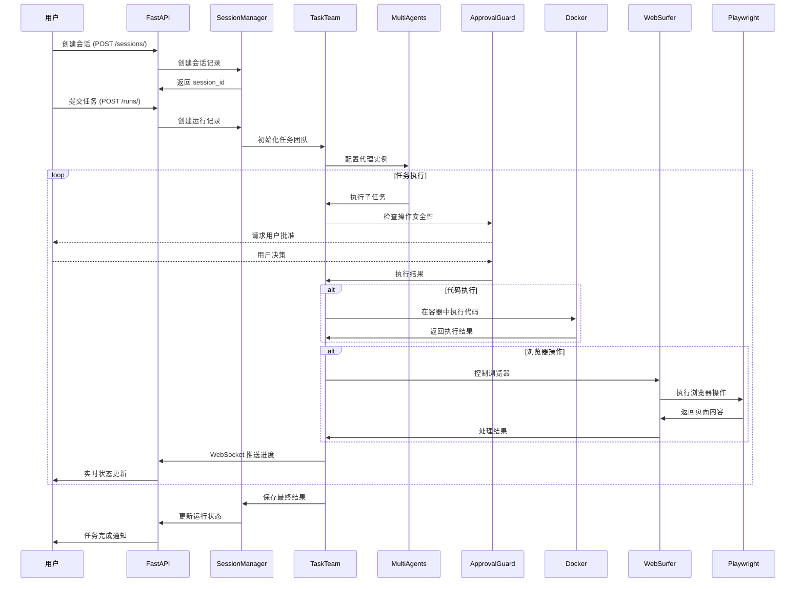
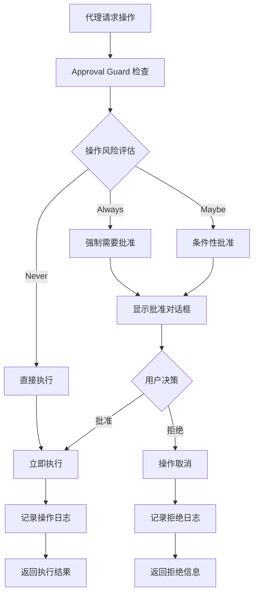
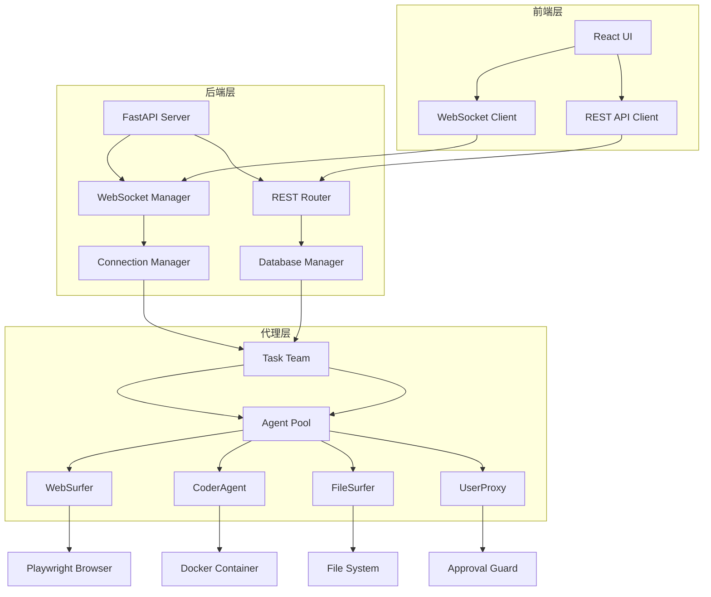
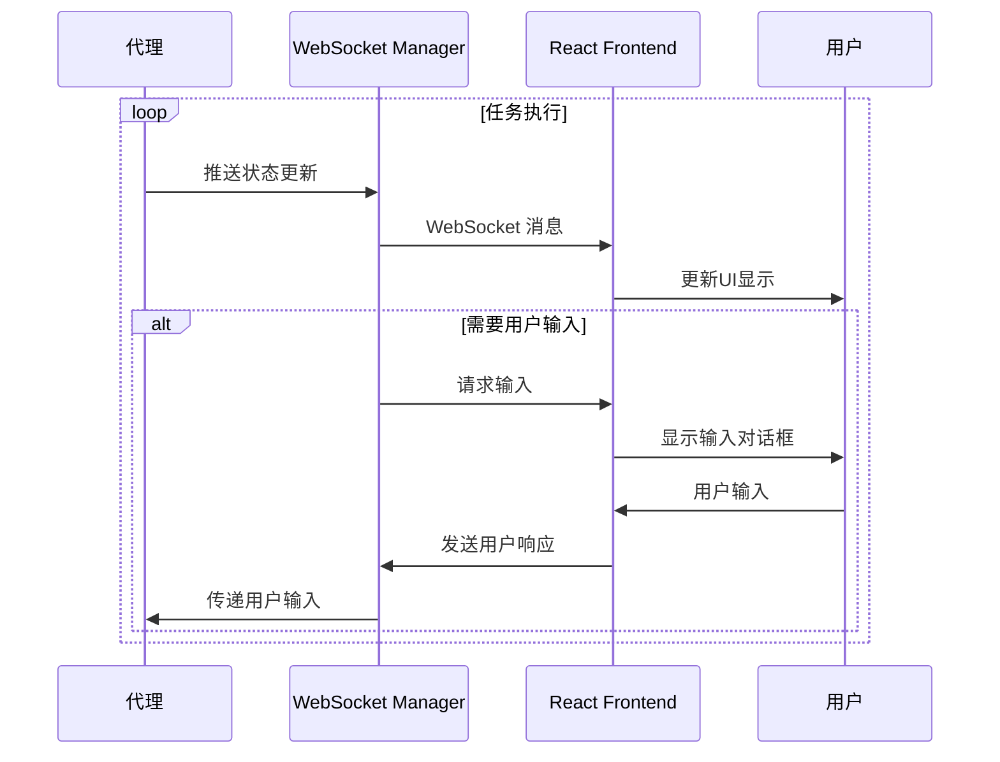
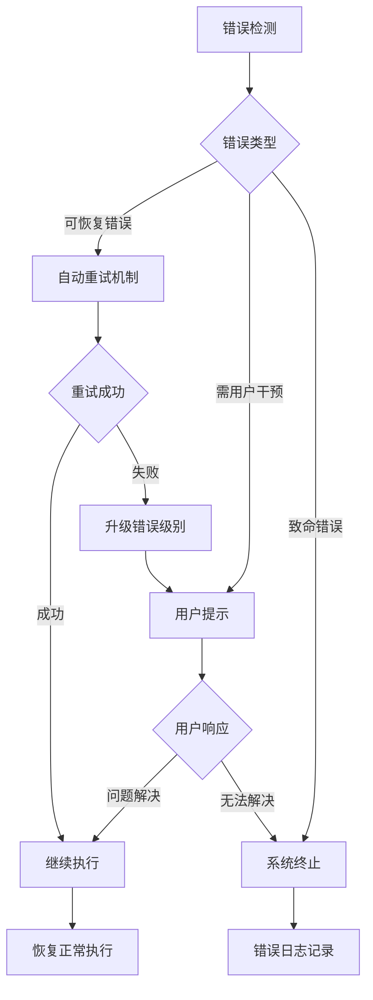

# Magentic-UI Brownfield Architecture Document

## Introduction

This document captures the CURRENT STATE of the Magentic-UI codebase, including technical debt, workarounds, and real-world patterns. It serves as a reference for AI agents working on enhancements.

### Document Scope

Comprehensive documentation of the entire Magentic-UI system, a research prototype human-centered multi-agent interface for web automation and task execution.

### Change Log

| Date       | Version | Description                   | Author |
| ---------- | ------- | ----------------------------- | ------ |
| 2025-10-08 | 1.0     | Initial brownfield analysis  | ssiagu |

## Quick Reference - Key Files and Entry Points

### Critical Files for Understanding the System

- **Main Entry**: `src/magentic_ui/backend/cli.py` - FastAPI web server entry point
- **CLI Interface**: `src/magentic_ui/_cli.py` - Command line interface
- **Configuration**: `src/magentic_ui/magentic_ui_config.py` - Main configuration system
- **Core Agents**: `src/magentic_ui/agents/` - All agent implementations
- **Web Backend**: `src/magentic_ui/backend/web/app.py` - FastAPI application
- **Frontend**: `frontend/` - React-based web interface
- **Docker Setup**: `docker/` - Container configurations
- **Team Management**: `src/magentic_ui/teams/` - Agent orchestration

## High Level Architecture

### Technical Summary

Magentic-UI is a human-in-the-loop multi-agent system that combines:
- Python backend with FastAPI web server
- React frontend with Gatsby static site generation
- Docker-based code execution isolation
- WebSocket real-time communication
- Microsoft AutoGen agent orchestration
- PostgreSQL database with SQLModel
- Playwright browser automation
- MCP (Model Context Protocol) server integration

### Actual Tech Stack (from package.json and pyproject.toml)

| Category            | Technology              | Version      | Notes                                |
| ------------------- | ---------------------- | ------------ | ------------------------------------ |
| **Backend Runtime** | Python                 | 3.10+        | Required                             |
| **Backend Framework**| FastAPI                | standard      | WebSocket support included           |
| **Agent Framework** | AutoGen                | 0.5.7        | Microsoft's agent orchestration      |
| **Database**        | PostgreSQL             | -            | SQLModel ORM, Alembic migrations     |
| **Frontend**        | React                  | 18.2.0       | With TypeScript                      |
| **Frontend Build**  | Gatsby                 | 5.14.0       | Static site generation               |
| **UI Framework**    | Ant Design             | 5.22.1       | Component library                    |
| **Styling**         | Tailwind CSS           | 3.4.14       | Utility-first CSS                    |
| **Browser Auto**    | Playwright             | 1.51         | Web automation                       |
| **Container**       | Docker                 | -            | Required for code execution          |
| **Package Mgmt**    | uv                     | -            | Python package manager               |
| **Testing**         | pytest                 | -            | Unit and integration tests          |

### Repository Structure Reality Check

- **Type**: Monorepo with clear frontend/backend separation
- **Package Manager**: uv (Python), yarn (Frontend)
- **Notable**: Complex build process with frontend compilation into backend

## Source Tree and Module Organization

### Project Structure (Actual)

```text
magentic-ui/
├── src/magentic_ui/          # Main Python source
│   ├── agents/              # Agent implementations
│   │   ├── web_surfer/      # Browser automation agents
│   │   ├── file_surfer/     # File system navigation
│   │   ├── mcp/            # MCP server integration
│   │   ├── users/          # User proxy agents
│   │   ├── _coder.py       # Code execution agent
│   │   └── _user_proxy.py  # User interaction handling
│   ├── backend/             # FastAPI backend
│   │   ├── web/            # Web application
│   │   ├── database/       # Database models and operations
│   │   ├── teammanager/    # Agent team management
│   │   └── utils/          # Backend utilities
│   ├── teams/              # Agent team configurations
│   │   └── orchestrator/   # Orchestration logic
│   ├── tools/              # Tool implementations
│   │   ├── mcp/           # MCP tools
│   │   └── playwright/     # Playwright tools
│   ├── eval/               # Evaluation and benchmarking
│   ├── learning/           # Learning and memory systems
│   ├── cli/                # CLI utilities
│   ├── approval_guard.py   # Action approval system
│   ├── guarded_action.py   # Guarded action execution
│   ├── magentic_ui_config.py # Configuration management
│   ├── task_team.py       # Task team management
│   ├── types.py           # Type definitions
│   ├── utils.py           # General utilities
│   └── version.py         # Version information
├── frontend/              # React frontend
│   ├── src/              # React source code
│   ├── static/           # Static assets
│   └── build artifacts   # Compiled to backend/web/ui/
├── docker/               # Docker configurations
├── docs/                 # Documentation
├── experiments/          # Experimental features
├── samples/             # Sample configurations
└── tests/               # Test suites
```

### Key Modules and Their Purpose

- **WebSurfer** (`src/magentic_ui/agents/web_surfer/`): Browser automation using Playwright, handles web navigation and interaction
- **FileSurfer** (`src/magentic_ui/agents/file_surfer/`): File system navigation and code analysis capabilities
- **CoderAgent** (`src/magentic_ui/agents/_coder.py`): Code generation and execution in Docker containers
- **UserProxy** (`src/magentic_ui/agents/_user_proxy.py`): Human-in-the-loop interaction handling
- **MCP Integration** (`src/magentic_ui/agents/mcp/`): Model Context Protocol server support
- **Team Management** (`src/magentic_ui/teams/`): Orchestrates multiple agents for complex tasks
- **Approval Guard** (`src/magentic_ui/approval_guard.py`): Security layer requiring user approval for sensitive actions
- **FastAPI Backend** (`src/magentic_ui/backend/web/`): REST API and WebSocket endpoints

## Data Models and APIs

### Data Models

Instead of duplicating, reference actual model files:

- **Database Models**: See `src/magentic_ui/backend/datamodel/` for SQLModel definitions
- **Type Definitions**: See `src/magentic_ui/types.py` for common type definitions
- **Configuration Models**: See `src/magentic_ui/magentic_ui_config.py` for configuration structures

### API Specifications

- **FastAPI Routes**: See `src/magentic_ui/backend/web/routes/` for API endpoints
- **WebSocket API**: Real-time communication handled in `src/magentic_ui/backend/web/managers/`
- **Frontend API**: React components communicate via REST and WebSocket

## Technical Debt and Known Issues

### Critical Technical Debt

1. **Docker Dependency**: Hard dependency on Docker for code execution, no fallback mechanism
2. **Windows Support**: Requires WSL2 for Docker functionality, not native Windows support
3. **Frontend Build Process**: Complex build process requiring compilation into backend directory
4. **Agent State Management**: Complex state management across multiple agents and sessions
5. **Error Handling**: Inconsistent error handling patterns across different agents
6. **Testing Coverage**: Limited test coverage, especially for integration scenarios

### Workarounds and Gotchas

- **Environment Variables**: Requires `OPENAI_API_KEY` to be set, no graceful degradation
- **Docker Images**: Must pull images from GHCR on first run, can fail with poor internet
- **Port Conflicts**: Default port 8081, requires manual configuration if occupied
- **Browser Automation**: Playwright browsers must be installed separately (`poe test` installs them)
- **Build Dependencies**: Frontend build requires Node.js and specific package versions

## Integration Points and External Dependencies

### External Services

| Service     | Purpose                  | Integration Type | Key Files                              |
| ----------- | ------------------------ | --------------- | -------------------------------------- |
| OpenAI      | AI model inference       | SDK             | Configuration files, agent clients     |
| Docker      | Code execution isolation | Docker SDK      | `src/magentic_ui/_docker.py`           |
| PostgreSQL  | Data persistence         | SQLModel        | Database models, migrations            |
| Playwright  | Browser automation       | PyPI package    | Web surfer agents                      |
| MCP Servers | Extensible tools        | Protocol        | MCP agent and tool implementations     |

### Internal Integration Points

- **Frontend-Backend**: REST API on port 8081, WebSocket for real-time updates
- **Agent Communication**: AutoGen framework for agent-to-agent messaging
- **Code Execution**: Docker containers with volume mounting for file access
- **Database**: SQLModel with PostgreSQL connection pooling
- **Session Management**: Server-side session persistence with browser state

## Development and Deployment

### Local Development Setup

1. **Prerequisites**: Python 3.10+, Docker, Node.js
2. **Environment Setup**:
   ```bash
   uv venv --python=3.12 .venv
   . .venv/bin/activate
   uv sync --all-extras
   ```
3. **Frontend Setup**:
   ```bash
   cd frontend
   yarn install
   yarn build  # Compiles to backend/web/ui/
   ```
4. **Database Setup**: PostgreSQL with automatic migrations via Alembic

**Known Issues with Setup**:
- Docker must be running before starting the application
- Playwright browsers must be installed: `poe test` or `playwright install`
- Frontend build can fail on Windows without proper environment

### Build and Deployment Process

- **Build Command**: `yarn build` in frontend directory
- **Deployment**: PyPI package installation or source deployment
- **Docker Images**: Pre-built images on GHCR, manual build option available
- **Environments**: Single environment with configuration-based deployment

## Testing Reality

### Current Test Coverage

- **Unit Tests**: pytest with minimal coverage, mostly utility functions
- **Integration Tests**: Limited, require complex setup with Docker and databases
- **E2E Tests**: None identified in the codebase
- **Manual Testing**: Primary QA method through UI interaction

### Running Tests

```bash
poe test           # Runs unit tests and installs Playwright
poe lint           # Code linting with ruff
poe mypy           # Type checking
poe pyright        # Alternative type checking
poe check          # Runs all checks (fmt, lint, pyright, test)
```

## Development Environment Configuration

### Code Quality Tools

- **Formatting**: ruff formatter with Python standard conventions
- **Linting**: ruff linter with custom rules
- **Type Safety**: Both mypy and pyright in strict mode
- **Testing**: pytest with coverage reporting
- **Build**: poethepoet for task automation

### Development Workflow

1. **Code Changes**: Edit in respective source directories
2. **Frontend Changes**: Requires `yarn build` to compile to backend
3. **Backend Changes**: Restart FastAPI server
4. **Testing**: Use `poe check` for comprehensive validation
5. **Deployment**: Package via PyPI or deploy from source

## Security and Approval System

### Approval Guard Implementation

- **Action Approval**: `src/magentic_ui/approval_guard.py` requires user approval for sensitive operations
- **Guarded Actions**: `src/magentic_ui/guarded_action.py` implements secure action execution
- **Web Actions**: Browser automation requires explicit user confirmation
- **Code Execution**: All code execution happens in isolated Docker containers

### Security Measures

- **Docker Isolation**: Code execution in separate containers
- **User Approval**: Human oversight for all significant actions
- **Session Management**: Secure session handling with timeouts
- **API Keys**: Environment-based configuration, no hardcoded secrets

## Performance and Scalability

### Current Performance Characteristics

- **Browser Automation**: Playwright instances can be resource-intensive
- **Docker Overhead**: Container creation/destruction adds latency
- **Database**: PostgreSQL with connection pooling
- **Frontend**: Static Gatsby build for fast serving
- **WebSocket**: Real-time communication for agent updates

### Known Bottlenecks

- **Docker Image Pulling**: First-run setup can be slow
- **Browser Startup**: Playwright browser initialization latency
- **Agent Communication**: Multi-agent coordination overhead
- **File Operations**: Large file processing can be slow

## Appendix - Useful Commands and Scripts

### Frequently Used Commands

```bash
# Development
magentic-ui --port 8081                    # Start application
magentic-ui --run-without-docker           # Limited functionality mode
magentic-ui --config config.yaml           # Custom configuration

# Code Quality
poe fmt                                     # Format code
poe lint                                    # Lint code
poe check                                   # Run all checks
poe test                                    # Run tests

# Frontend Development
cd frontend && yarn install                 # Install dependencies
cd frontend && yarn build                   # Build for production
cd frontend && npm run develop              # Development mode

# Docker
cd docker && sh build-all.sh                # Build all Docker images
```

### Debugging and Troubleshooting

- **Logs**: Check FastAPI logs and browser console
- **Docker Issues**: Ensure Docker is running and accessible
- **Port Conflicts**: Change port with `--port` flag
- **Browser Issues**: Ensure Playwright browsers are installed
- **Build Issues**: Clear node_modules and reinstall dependencies

### Configuration Files

- **Main Config**: `src/magentic_ui/magentic_ui_config.py`
- **Team Config**: `src/magentic_ui/teams/` directory
- **Environment**: `.env` files for environment variables
- **Docker**: `docker/` directory for container configurations

## 执行流程分析

### 系统启动流程

Magentic-UI 采用多层初始化架构，确保系统组件按正确顺序启动：

1. **CLI 初始化** (`src/magentic_ui/backend/cli.py`):
   - 解析命令行参数和配置文件
   - 检查 Docker 运行状态和镜像可用性
   - 验证环境变量和依赖项

2. **应用初始化** (`src/magentic_ui/backend/web/initialization.py`):
   - 创建必要的目录结构 (`~/.magentic_ui/`)
   - 设置数据库连接和初始化
   - 加载环境变量和配置文件

3. **FastAPI 启动** (`src/magentic_ui/backend/web/app.py`):
   - 配置中间件和路由
   - 初始化数据库连接池
   - 设置 WebSocket 连接管理器

### 代理执行流程

#### 任务生命周期管理



#### 代理协作模式

系统采用 **轮询组聊** (RoundRobin GroupChat) 模式进行代理协作：

1. **WebSurfer Agent**: 负责浏览器自动化和网页交互
2. **CoderAgent**: 负责代码生成和 Docker 容器执行
3. **FileSurfer Agent**: 负责文件系统导航和代码分析
4. **UserProxy Agent**: 负责人机交互和结果汇总
5. **MCP Agents**: 负责扩展工具和外部 API 集成

#### 批准系统流程

所有敏感操作都通过 **Approval Guard** 系统进行安全检查：



### 用户交互流程

#### 实时通信架构



#### 状态管理流程

1. **会话管理** (`sessions.py`):
   - 创建和管理用户会话
   - 维护会话状态和运行历史
   - 提供会话查询和删除功能

2. **运行管理** (`runs.py`):
   - 跟踪任务执行状态
   - 管理运行实例和结果
   - 处理任务取消和暂停

3. **WebSocket 通信** (`ws.py`):
   - 实时推送代理消息
   - 处理用户输入和批准
   - 维护连接状态和错误处理

### 数据流架构

#### 实时数据流



#### 数据持久化流程

1. **会话数据**: 存储在 PostgreSQL 中，包含用户信息和任务历史
2. **运行数据**: 记录任务执行状态、代理消息和最终结果
3. **配置数据**: 系统配置和用户设置存储在数据库和配置文件中
4. **临时文件**: 用户上传的文件和执行结果存储在 `~/.magentic_ui/files/`

### 错误处理和恢复机制

#### 错误分类处理

1. **Docker 相关错误**:
   - Docker 容器启动失败
   - 镜像拉取失败
   - 容器执行超时

2. **代理执行错误**:
   - 代理初始化失败
   - 任务执行异常
   - 工具调用失败

3. **网络通信错误**:
   - WebSocket 连接断开
   - API 请求失败
   - 浏览器连接问题

#### 恢复策略



### 性能优化策略

#### 资源管理

1. **Docker 容器池**: 预创建容器池以减少启动延迟
2. **数据库连接池**: 复用数据库连接以提高性能
3. **WebSocket 连接管理**: 限制并发连接数，实现连接复用

#### 缓存策略

1. **会话缓存**: 缓存活跃会话以减少数据库查询
2. **代理实例缓存**: 复用代理实例以减少初始化开销
3. **前端资源缓存**: 利用浏览器缓存优化前端加载

这些执行流程分析展示了 Magentic-UI 的完整工作原理，从系统启动到任务执行的各个环节，为 AI 代理提供了深入的系统理解。

## Notes for AI Agents

### Critical Working Knowledge

1. **Docker is Mandatory**: Code execution requires Docker, no bypass available
2. **Frontend Compilation**: Frontend must be built before backend deployment
3. **Agent Coordination**: Use existing team patterns for multi-agent tasks
4. **Approval Required**: All significant actions require user approval
5. **State Management**: Session state is complex, handle carefully

### Common Pitfalls

- **Missing Dependencies**: Always run `uv sync` after dependency changes
- **Build Order**: Frontend must be built before backend deployment
- **Docker State**: Ensure Docker daemon is running before testing
- **Environment Variables**: Required for proper functionality
- **Browser Setup**: Playwright browsers must be installed separately

### Integration Guidelines

- **New Agents**: Follow existing patterns in `src/magentic_ui/agents/`
- **New Tools**: Implement in `src/magentic_ui/tools/` with proper MCP integration
- **API Endpoints**: Add to `src/magentic_ui/backend/web/routes/`
- **Database Changes**: Use SQLModel and Alembic migrations
- **Frontend Changes**: Build process compilation required

这个 brownfield 架构文档反映了 Magentic-UI 系统的真实状态，包括其技术债务、变通方法和实际实现模式，为 AI 代理在 Magentic-UI 项目上工作提供了全面的参考。