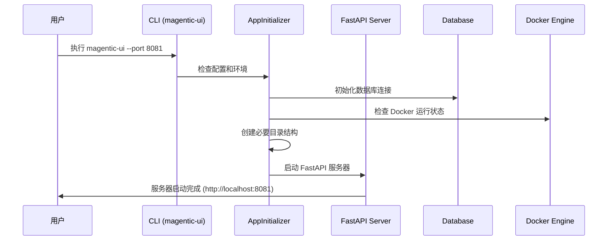
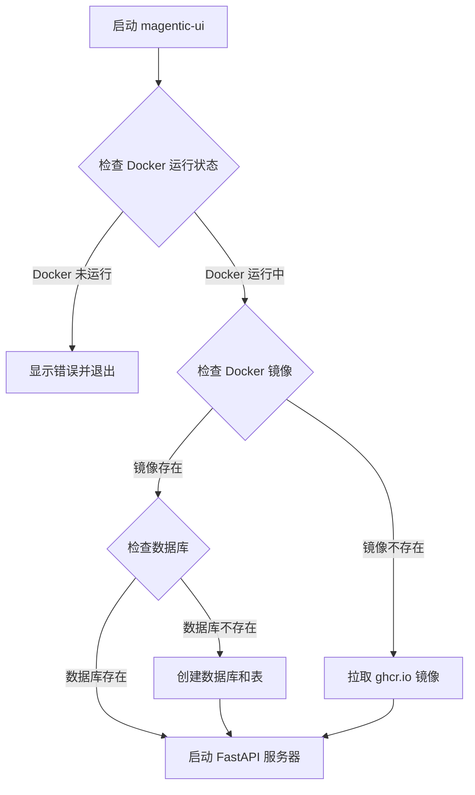
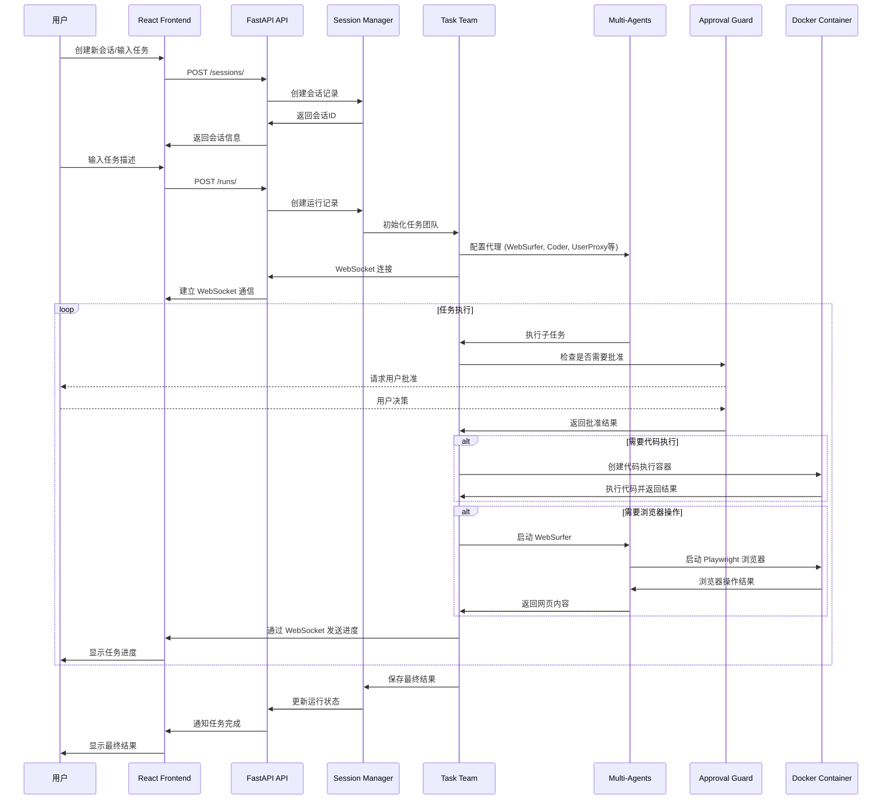
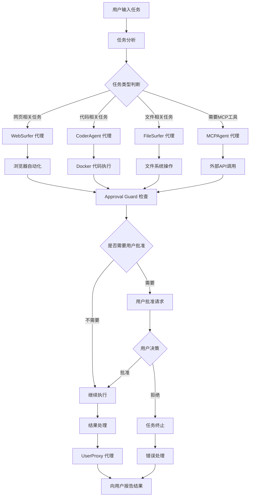
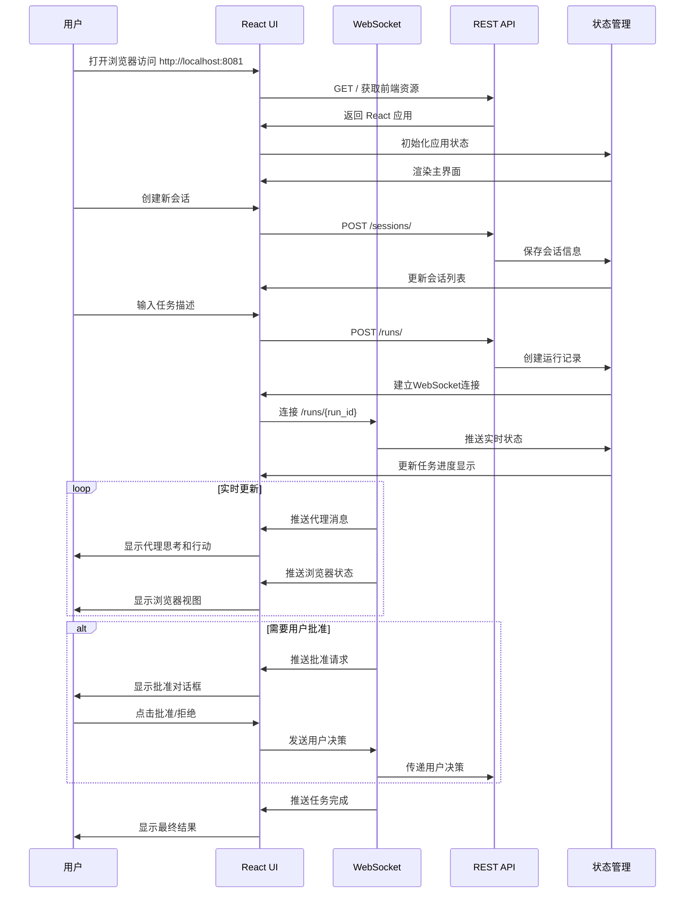
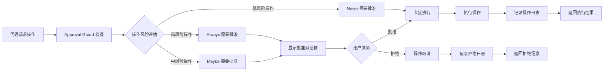
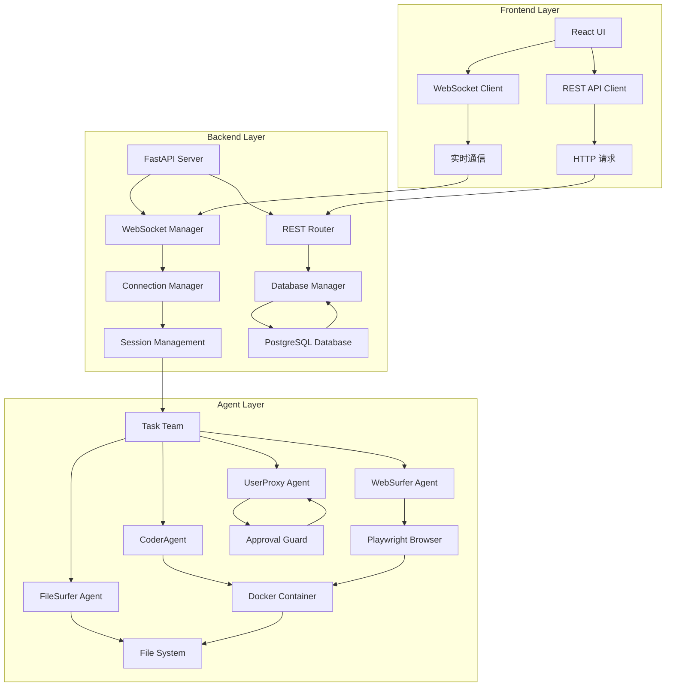
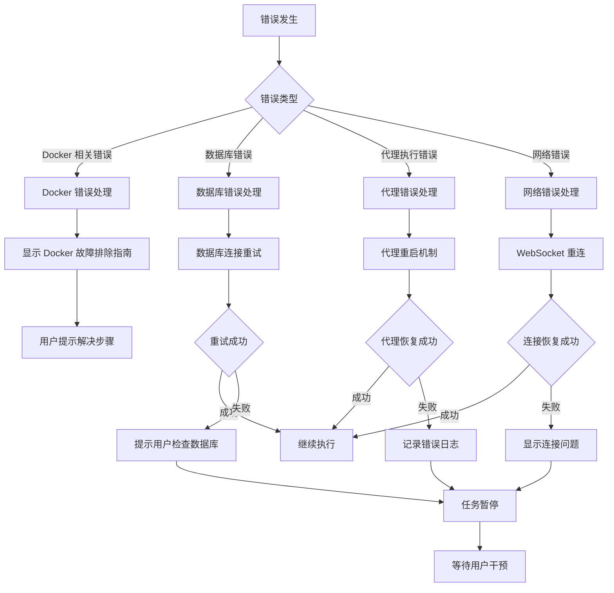

# Magentic-UI 执行流程分析

## 系统启动流程

### 1. 应用程序启动序列

### 2. 系统初始化检查流程

## 代理执行流程

### 3. 任务执行完整流程

### 4. 代理协作流程

## 用户交互流程

### 5. 用户界面交互流程

### 6. 批准系统流程

## 数据流架构

### 7. 数据流向图

### 8. 错误处理流程

这些流程图展示了 Magentic-UI 的完整执行流程，包括系统启动、代理协作、用户交互和错误处理等关键环节。每个流程都体现了系统的设计特点和架构模式。