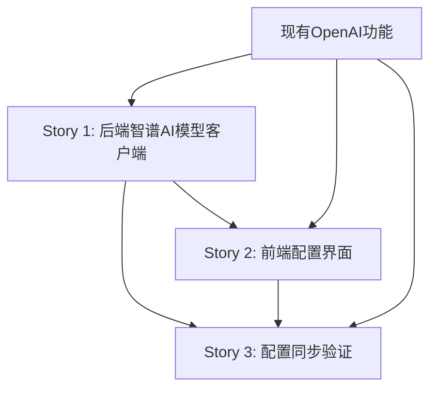

# 智谱AI集成 - 用户故事文档

**Author**: ssiagu
**Email**: ssiagu@gmail.com
**Document Signature**: ssiagu
**Epic ID**: epic-1
**创建日期**: 2025-10-21
**状态**: Ready for Review

## 史诗概述

**史诗名称**: 智谱AI集成 - Brownfield Enhancement
**目标**: 为Magentic-UI平台集成智谱AI模型提供商，实现OpenAI与智谱AI的无缝切换，提供用户前端配置base_url和模型选择的能力。

### 系统架构背景

**现有架构组件**:
- **ModelClientConfigs**: 数据模型，管理各智能体的模型配置
- **ChatCompletionClient.load_component()**: AutoGen框架的模型客户端工厂方法
- **前端ModelSelector**: React组件，支持OpenAI、Azure、Ollama提供商选择
- **后端配置API**: 通过settingsAPI管理用户配置的同步和存储

**集成策略**:
- 利用现有的ComponentModel架构，无需新增工厂类
- 扩展前端PROVIDER_FORM_MAP支持智谱AI配置
- 使用OpenAI Python SDK连接智谱AI的OpenAI兼容API
- 保持与现有OpenAI功能的完全兼容性

---

## Story 1: 扩展智谱AI模型客户端实现

**优先级**: High | **估算**: 1 Story Point | **依赖**: 无

### 用户故事

**作为** Magentic-UI系统管理员
**我希望** 在后端系统中添加对智谱AI模型的完整支持
**以便** 系统能够通过OpenAI兼容接口与智谱AI API进行通信，为用户提供更多模型选择

### 验收标准

#### 功能性需求
- [ ] **AC1.1**: 系统能够正确识别和加载`ZhipuAIModelClient`组件模型
- [ ] **AC1.2**: 支持智谱AI的标准base_url配置 (`https://open.bigmodel.cn/api/paas/v4/`)
- [ ] **AC1.3**: 支持智谱AI主要模型：glm-4.6, glm-4.5-air, glm-4-flash, glm-4.5v, glm-4-long
- [ ] **AC1.4**: 能够正确处理智谱AI API的认证机制（API Key）
- [ ] **AC1.5**: 支持智谱AI特有的模型信息配置（如token限制、能力标志）

#### 兼容性需求
- [ ] **AC1.6**: 现有OpenAI模型客户端功能保持完全不变
- [ ] **AC1.7**: 使用OpenAI Python SDK 1.0+连接智谱AI，确保API兼容性
- [ ] **AC1.8**: 不影响现有AutoGen框架的ChatCompletionClient.load_component()方法
- [ ] **AC1.9**: 数据库schema变更向后兼容，仅新增可选字段

#### 技术实现需求
- [ ] **AC1.10**: 实现ZhipuAIModelClient作为ComponentModel的子类
- [ ] **AC1.11**: 支持智谱AI API的特定headers和参数配置
- [ ] **AC1.12**: 正确处理智谱AI的错误响应格式
- [ ] **AC1.13**: 添加智谱AI连通性测试功能

#### 集成点
- **文件路径**: `src/magentic_ui/magentic_ui_config.py`
- **集成方式**: 扩展ModelClientConfigs.default_client_config
- **API兼容**: 保持ComponentModel配置格式一致

### 技术规格

#### 数据模型扩展
```python
# 新增智谱AI默认配置
zhipuai_client_config: ClassVar[Dict[str, Any]] = {
    "provider": "ZhipuAIModelClient",  # 新的提供商标识
    "config": {
        "model": "glm-4-plus",
        "base_url": "https://open.bigmodel.cn/api/paas/v4/",
        "api_key": None,  # 用户配置
    },
    "max_retries": 3,
}
```

#### ComponentModel配置格式
```python
智谱AI配置应该遵循现有ComponentModel格式：
{
    "provider": "ZhipuAIModelClient",
    "config": {
        "model": "glm-4-plus",
        "base_url": "https://open.bigmodel.cn/api/paas/v4/",
        "api_key": "user_api_key"
    },
    "max_retries": 3
}
```

### 回归测试要求

#### 现有功能验证
- [ ] **RT1.1**: OpenAI模型客户端创建和调用正常
- [ ] **RT1.2**: Azure模型客户端创建和调用正常
- [ ] **RT1.3**: Ollama模型客户端创建和调用正常
- [ ] **RT1.4**: 现有ModelClientConfigs序列化/反序列化正常
- [ ] **RT1.5**: 前端模型选择器现有功能不受影响

#### 测试用例
```python
def test_openai_compatibility_unchanged():
    """确保OpenAI现有功能完全不变"""
    config = ModelClientConfigs.get_default_client_config()
    client = ChatCompletionClient.load_component(config)
    assert client is not None

def test_zhipuai_model_client_creation():
    """测试智谱AI模型客户端创建"""
    zhipuai_config = {
        "provider": "ZhipuAIModelClient",
        "config": {
            "model": "glm-4-plus",
            "base_url": "https://open.bigmodel.cn/api/paas/v4/",
            "api_key": "test_key"
        }
    }
    client = ChatCompletionClient.load_component(zhipuai_config)
    assert client is not None
```

---

## Story 2: 前端模型提供商配置界面

**优先级**: High | **估算**: 1 Story Point | **依赖**: Story 1

### 用户故事

**作为** Magentic-UI最终用户
**我希望** 在设置界面中能够选择智谱AI作为模型提供商，并配置相应的模型和API密钥
**以便** 我可以灵活地在不同AI提供商之间切换，使用最适合我需求的模型

### 验收标准

#### UI/UX需求
- [ ] **AC2.1**: 在ModelSelector组件的提供商下拉列表中添加"智谱AI"选项
- [ ] **AC2.2**: 提供智谱AI模型预设选项（glm-4-plus, glm-4.6, glm-4.5-air等）
- [ ] **AC2.3**: 提供base_url配置字段，默认值为`https://open.bigmodel.cn/api/paas/v4/`
- [ ] **AC2.4**: 提供API Key配置字段，支持安全的密钥输入和显示
- [ ] **AC2.5**: 保持与现有OpenAI、Azure、Ollama配置界面的一致性设计

#### 功能性需求
- [ ] **AC2.6**: 智谱AI配置变更能够实时保存到用户配置中
- [ ] **AC2.7**: 支持在基础设置和高级设置模式下配置智谱AI
- [ ] **AC2.8**: 提供智谱AI模型的能力信息显示（如支持的功能特性）
- [ ] **AC2.9**: 配置验证和错误提示功能正常工作

#### 技术实现需求
- [ ] **AC2.10**: 创建ZhipuAIModelConfigForm组件
- [ ] **AC2.11**: 扩展PROVIDER_FORM_MAP包含智谱AI配置表单
- [ ] **AC2.12**: 实现智谱AI特有的配置验证逻辑
- [ ] **AC2.13**: 添加智谱AI的模型预设配置

#### 集成点
- **文件路径**: `frontend/src/components/settings/tabs/agentSettings/modelSelector/`
- **组件**: ModelSelector.tsx, 新建ZhipuAIModelConfigForm.tsx
- **类型定义**: 扩展ModelConfig类型支持智谱AI特定字段

### 技术规格

#### 新增组件结构
```typescript
// ZhipuAIModelConfigForm.tsx
interface ZhipuAIModelConfigProps extends ModelConfigFormProps {
  // 继承现有表单props
}

const DEFAULT_ZHIPUAI: ModelConfig = {
  provider: "zhipuai",
  config: {
    model: "glm-4-plus",
    base_url: "https://open.bigmodel.cn/api/paas/v4/",
    api_key: "",
  },
}
```

#### PROVIDER_FORM_MAP扩展
```typescript
// ModelSelector.tsx
export const PROVIDER_FORM_MAP = {
  // 现有providers...
  [DEFAULT_ZHIPUAI.provider]: {
    label: "智谱AI",
    defaultValue: { ...DEFAULT_ZHIPUAI },
    form: ZhipuAIModelConfigForm,
    presets: {
      "glm-4-plus": { ...DEFAULT_ZHIPUAI, config: { ...DEFAULT_ZHIPUAI.config, model: "glm-4-plus" }},
      "glm-4.6": { ...DEFAULT_ZHIPUAI, config: { ...DEFAULT_ZHIPUAI.config, model: "glm-4.6" }},
      "glm-4.5-air": { ...DEFAULT_ZHIPUAI, config: { ...DEFAULT_ZHIPUAI.config, model: "glm-4.5-air" }},
      "glm-4-flash": { ...DEFAULT_ZHIPUAI, config: { ...DEFAULT_ZHIPUAI.config, model: "glm-4-flash" }},
    }
  }
}
```

#### UI组件规范
- 遵循现有Ant Design组件设计模式
- 使用与OpenAIConfigForm相同的布局和样式
- API Key输入框支持密码类型显示/隐藏
- base_url字段提供验证和默认值

### 回归测试要求

#### 现有UI功能验证
- [ ] **RT2.1**: OpenAI提供商选择和配置功能正常
- [ ] **RT2.2**: Azure提供商选择和配置功能正常
- [ ] **RT2.3**: Ollama提供商选择和配置功能正常
- [ ] **RT2.4**: 模型预设选择功能在现有提供商中正常工作
- [ ] **RT2.5**: 基础/高级设置模式切换功能正常

#### 测试用例
```typescript
describe('ModelSelector with ZhipuAI', () => {
  test('should show ZhipuAI provider option', () => {
    const { getByText } = render(<ModelSelector onChange={jest.fn()} />);
    expect(getByText('智谱AI')).toBeInTheDocument();
  });

  test('should load ZhipuAI form when provider selected', () => {
    const onChange = jest.fn();
    const { getByText, getByLabelText } = render(<ModelSelector onChange={onChange} />);

    fireEvent.click(getByText('智谱AI'));
    expect(getByLabelText('API Key')).toBeInTheDocument();
    expect(getByLabelText('Base URL')).toBeInTheDocument();
  });
});
```

---

## Story 3: 配置同步与验证机制

**优先级**: Medium | **估算**: 1 Story Point | **依赖**: Story 1, Story 2

### 用户故事

**作为** Magentic-UI系统
**我希望** 实现前后端智谱AI配置的同步和验证机制
**以便** 用户配置能够正确保存、加载，并确保配置的智谱AI连接可用性

### 验收标准

#### 后端API需求
- [ ] **AC3.1**: 后端API能够接收和存储智谱AI配置参数
- [ ] **AC3.2**: 配置API支持智谱AI特有的字段验证
- [ ] **AC3.3**: 实现智谱AI API连通性测试端点
- [ ] **AC3.4**: 配置变更能够实时应用到新的会话创建
- [ ] **AC3.5**: 现有OpenAI、Azure、Ollama配置API保持不变

#### 前端集成需求
- [ ] **AC3.6**: 前端能够正确调用智谱AI配置验证API
- [ ] **AC3.7**: 实现智谱AI连接状态测试功能
- [ ] **AC3.8**: 提供用户友好的配置错误提示信息
- [ ] **AC3.9**: 配置保存成功后提供明确的用户反馈

#### 系统集成需求
- [ ] **AC3.10**: 智谱AI配置能够在系统重启后保持持久化
- [ ] **AC3.11**: 配置变更不影响正在运行中的会话
- [ ] **AC3.12**: 支持配置回滚到上一个可用状态
- [ ] **AC3.13**: 错误日志记录智谱AI配置相关的异常

#### 安全性需求
- [ ] **AC3.14**: API Key在传输和存储过程中加密保护
- [ ] **AC3.15**: 智谱AI配置验证不暴露敏感信息
- [ ] **AC3.16**: 配置变更操作有适当的权限验证

#### 集成点
- **后端路径**: `src/magentic_ui/backend/web/routes/validation.py`
- **API端点**: `/api/validation/test-model-config`
- **前端组件**: 扩展AgentSettingsTab的配置验证逻辑

### 技术规格

#### API端点设计
```python
# 新增智谱AI配置验证端点
@router.post("/validation/test-zhipuai-config")
async def test_zhipuai_config(
    config: ZhipuAIModelConfig,
    user_email: str = Depends(get_current_user)
):
    """
    测试智谱AI配置的连通性和有效性
    """
    try:
        # 使用OpenAI SDK测试智谱AI连接
        client = OpenAI(
            api_key=config.api_key,
            base_url=config.base_url
        )

        # 发送测试请求
        response = client.chat.completions.create(
            model=config.model,
            messages=[{"role": "user", "content": "test"}],
            max_tokens=1
        )

        return {"status": "success", "model": response.model}

    except Exception as e:
        return {"status": "error", "message": str(e)}
```

#### 前端验证集成
```typescript
// AgentSettingsTab.tsx 扩展
const handleZhipuAIValidation = async (config: ModelConfig) => {
  try {
    const response = await settingsAPI.testModelConfig(config);
    if (response.status === 'success') {
      message.success('智谱AI配置验证成功');
      return true;
    } else {
      message.error(`配置验证失败: ${response.message}`);
      return false;
    }
  } catch (error) {
    message.error('配置验证请求失败');
    return false;
  }
};
```

#### 配置持久化
- 使用现有的settingsAPI.updateSettings()端点
- 智谱AI配置存储在model_client_configs字段中
- 遵循现有的用户配置存储格式

### 回归测试要求

#### 现有配置系统验证
- [ ] **RT3.1**: OpenAI配置保存和加载功能正常
- [ ] **RT3.2**: Azure配置保存和加载功能正常
- [ ] **RT3.3**: Ollama配置保存和加载功能正常
- [ ] **RT3.4**: 现有配置验证API功能正常
- [ ] **RT3.5**: 用户配置的持久化机制不受影响

#### 测试用例
```python
@pytest.mark.asyncio
async def test_zhipuai_config_validation():
    """测试智谱AI配置验证API"""
    config = {
        "provider": "ZhipuAIModelClient",
        "config": {
            "model": "glm-4-plus",
            "base_url": "https://open.bigmodel.cn/api/paas/v4/",
            "api_key": "test_key"
        }
    }

    # 测试配置验证
    response = await client.post("/api/validation/test-zhipuai-config", json=config)
    assert response.status_code == 200
    assert "status" in response.json()

def test_existing_config_persistence():
    """确保现有配置持久化不受影响"""
    # 测试OpenAI、Azure、Ollama配置的保存和加载
    pass
```

---

## 实施计划和依赖关系

### 故事依赖图


### 实施顺序
1. **Story 1**: 后端模型客户端实现（基础架构）
2. **Story 2**: 前端配置界面开发（用户交互）
3. **Story 3**: 配置同步与验证（系统集成）

### 风险缓解策略
- **配置隔离**: 智谱AI配置独立存储，不影响现有配置
- **渐进部署**: 每个故事完成后都可独立测试和验证
- **回滚机制**: 保持OpenAI默认配置作为安全回退选项
- **充分测试**: 每个故事包含完整的回归测试用例

---

## 完成定义 (Definition of Done)

### 通用完成标准
- [ ] 代码审查通过，符合项目编码规范
- [ ] 单元测试覆盖率≥80%，所有测试通过
- [ ] 集成测试验证，与现有系统无冲突
- [ ] 文档更新，包含智谱AI集成说明
- [ ] 性能测试通过，无显著性能影响

### Story特定完成标准

#### Story 1完成标准
- [ ] 智谱AI模型客户端能够正确创建和使用
- [ ] 与现有OpenAI客户端功能测试通过
- [ ] 数据库兼容性验证通过
- [ ] 错误处理和日志记录完善

#### Story 2完成标准
- [ ] 智谱AI配置界面功能完整可用
- [ ] UI/UX测试通过，用户体验良好
- [ ] 与现有配置界面一致性验证
- [ ] 响应式设计测试通过

#### Story 3完成标准
- [ ] 配置同步机制稳定可靠
- [ ] 连通性测试功能正常工作
- [ ] 错误处理和用户反馈完善
- [ ] 安全性验证通过

---

## 验收测试计划

### 回归测试清单
1. **OpenAI功能完整性**:
   - [ ] 模型选择和配置
   - [ ] API调用和响应处理
   - [ ] 错误处理和重试机制
   - [ ] 配置保存和加载

2. **前端界面功能**:
   - [ ] 模型选择器正常工作
   - [ ] 配置表单验证
   - [ ] 设置保存和重置
   - [ ] 响应式布局适配

3. **系统稳定性**:
   - [ ] 新会话创建使用新配置
   - [ ] 运行中会话不受配置变更影响
   - [ ] 系统重启后配置持久化
   - [ ] 错误恢复机制正常

### 集成测试场景
1. **配置流程测试**: 用户从选择智谱AI到成功使用的完整流程
2. **配置切换测试**: 在OpenAI和智谱AI之间切换配置
3. **错误处理测试**: API密钥错误、网络问题等异常场景
4. **并发测试**: 多用户同时配置智谱AI的场景

---

## 文档和培训

### 技术文档
- [ ] 更新`docs/architecture.md`包含智谱AI集成架构
- [ ] 添加智谱AI配置示例到`samples/`目录
- [ ] 更新API文档包含新的配置验证端点

### 用户文档
- [ ] 创建智谱AI配置指南
- [ ] 更新故障排除文档包含智谱AI相关问题
- [ ] 添加智谱AI模型特性说明

---

**Author**: ssiagu
**Email**: ssiagu@gmail.com
**Document Signature**: ssiagu
**最后更新**: 2025-10-21