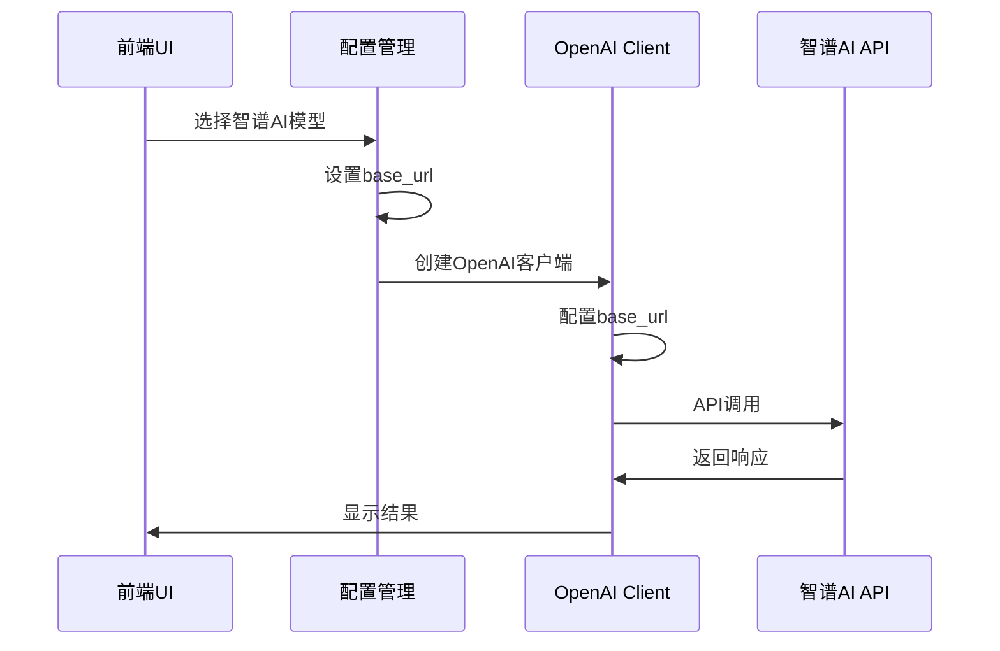

# 智谱AI集成实施计划

**项目**: Magentic-UI 智谱AI模型支持  
**文档版本**: v1.0  
**创建日期**: 2025-10-21  
**作者**: ssiagu  

## 📋 目录

1. [项目概述](#项目概述)
2. [需求分析](#需求分析)
3. [技术方案](#技术方案)
4. [实施任务](#实施任务)
5. [风险评估](#风险评估)
6. [时间计划](#时间计划)

---

## 项目概述

### 背景

Magentic-UI当前仅支持OpenAI和Azure OpenAI作为AI模型提供商。根据智谱AI官方文档,智谱AI完全兼容OpenAI API接口,这为我们集成智谱AI提供了技术基础。

### 目标

1. **扩展模型支持**: 在现有OpenAI配置基础上支持智谱AI大模型
2. **前端配置增强**: 允许用户在UI中配置智谱AI的base_url和模型
3. **配置文件支持**: 支持通过YAML配置文件配置智谱AI
4. **多模型预设**: 提供智谱AI常用模型的预设配置

### 支持的智谱AI模型

| 模型名称 | 用途 | 对应OpenAI模型 | 推荐场景 |
|---------|------|----------------|---------|
| glm-4.6 | 最强性能模型 | gpt-4 | Orchestrator, WebSurfer, Coder |
| glm-4.5-air | 平衡性价比 | gpt-4-turbo | 通用任务 |
| glm-4-flash | 快速响应 | gpt-3.5-turbo | 轻量级任务 |
| glm-4.5v | 视觉理解 | gpt-4-vision | 图像分析 |

---

## 需求分析

### 功能需求

#### FR1: 后端配置支持
- **需求描述**: 后端配置系统需要支持智谱AI的base_url和API Key配置
- **优先级**: P0 (必须)
- **接受标准**: 
  - ModelClientConfigs可以通过配置文件设置智谱AI的base_url
  - 支持通过环境变量ZHIPUAI_API_KEY配置API密钥
  - 配置验证和错误处理

#### FR2: 前端模型选择器
- **需求描述**: 前端UI提供智谱AI模型选择和配置功能
- **优先级**: P0 (必须)
- **接受标准**:
  - 在ModelSelector中添加智谱AI预设
  - 支持自定义base_url输入
  - 提供glm-4.6, glm-4.5-air, glm-4-flash, glm-4.5v预设
  - 表单验证和用户友好提示

#### FR3: 智能体级别配置
- **需求描述**: 不同智能体可以配置不同的智谱AI模型
- **优先级**: P1 (重要)
- **接受标准**:
  - orchestrator, web_surfer, coder, file_surfer, action_guard均可独立配置
  - 支持混合使用OpenAI和智谱AI模型

#### FR4: 配置文件支持
- **需求描述**: 通过YAML配置文件完整配置智谱AI
- **优先级**: P0 (必须)
- **接受标准**:
  - config.yaml支持base_url配置
  - 支持智谱AI模型名称
  - 配置示例文档

### 非功能需求

#### NFR1: 向后兼容
- **需求描述**: 新功能不影响现有OpenAI和Azure配置
- **优先级**: P0 (必须)
- **接受标准**: 所有现有配置和功能正常工作

#### NFR2: 文档完整性
- **需求描述**: 提供完整的使用文档和示例
- **优先级**: P1 (重要)
- **接受标准**: 
  - 用户指南
  - API文档
  - 配置示例
  - 故障排查指南

#### NFR3: 测试覆盖
- **需求描述**: 充分的单元测试和集成测试
- **优先级**: P1 (重要)
- **接受标准**: 核心功能测试覆盖率 > 80%

---

## 技术方案

### 架构设计

#### 1. OpenAI兼容性方案

智谱AI完全兼容OpenAI API,因此我们可以复用现有的`OpenAIChatCompletionClient`:

```yaml
# 智谱AI配置示例
model_client_configs:
  orchestrator:
    provider: OpenAIChatCompletionClient
    config:
      model: glm-4.6
      api_key: ${ZHIPUAI_API_KEY}
      base_url: https://open.bigmodel.cn/api/paas/v4/
      max_retries: 10
```

**优势**:
- ✅ 无需开发新的客户端类
- ✅ 充分利用现有代码和测试
- ✅ 降低维护成本
- ✅ 保持架构一致性

#### 2. 前端配置增强

在现有`OpenAIModelConfigForm`基础上增强:

```typescript
export const DEFAULT_ZHIPUAI: OpenAIModelConfig = {
  provider: "OpenAIChatCompletionClient",
  config: {
    model: "glm-4.6",
    api_key: null,
    base_url: "https://open.bigmodel.cn/api/paas/v4/",
    max_retries: 10,
  }
};
```

#### 3. 预设配置

在`ModelSelector.tsx`中添加智谱AI预设:

```typescript
"ZhipuAI-glm-4.6": {
  ...DEFAULT_OPENAI,
  config: {
    ...DEFAULT_OPENAI.config,
    model: "glm-4.6",
    base_url: "https://open.bigmodel.cn/api/paas/v4/"
  }
}
```

### 数据流设计



### 配置优先级

1. 环境变量 (最高优先级)
2. YAML配置文件
3. 前端UI配置
4. 默认值 (最低优先级)

---

## 实施任务

### Task 1: 需求分析与架构设计 ✅

**ID**: a8Kp2Xm9Lw4Bn5Qr  
**状态**: IN_PROGRESS  
**工作量**: 4小时  

#### 交付物:
- [x] 本文档 (zhipuai-integration-plan.md)
- [ ] 技术方案设计文档
- [ ] API变更规格说明

---

### Task 2: 文档准备

**ID**: c7Yt3Zq6Nw1Dp8Vs  
**状态**: PENDING  
**工作量**: 4小时  

#### 子任务:
1. 创建用户指南 (zhipuai-user-guide.md)
2. 创建开发者文档 (zhipuai-developer-guide.md)
3. 创建配置示例文档 (zhipuai-config-examples.md)
4. 创建测试计划 (zhipuai-test-plan.md)

#### 交付物:
- [ ] docs/qoder/zhipuai-user-guide.md
- [ ] docs/qoder/zhipuai-developer-guide.md
- [ ] docs/qoder/zhipuai-config-examples.md
- [ ] docs/qoder/zhipuai-test-plan.md

---

### Task 3: 后端实现

**ID**: e4Hj9Rm2Kp6Fx3Ws  
**状态**: PENDING  
**工作量**: 8小时  

#### 子任务:

##### 3.1 扩展配置系统
**文件**: `src/magentic_ui/magentic_ui_config.py`

**变更**:
```python
# 无需修改,现有结构已支持base_url配置
# 但需要在文档中说明如何使用
```

##### 3.2 环境变量支持
**文件**: 新建 `src/magentic_ui/providers/zhipuai_config.py`

**内容**:
```python
"""智谱AI配置辅助模块"""
import os
from typing import Dict, Any, Optional

class ZhipuAIConfig:
    """智谱AI配置管理器"""
    
    DEFAULT_BASE_URL = "https://open.bigmodel.cn/api/paas/v4/"
    
    @staticmethod
    def get_api_key() -> Optional[str]:
        """获取智谱AI API Key"""
        return os.getenv("ZHIPUAI_API_KEY") or os.getenv("OPENAI_API_KEY")
    
    @staticmethod
    def create_client_config(
        model: str = "glm-4.6",
        api_key: Optional[str] = None,
        base_url: Optional[str] = None,
        max_retries: int = 10
    ) -> Dict[str, Any]:
        """创建智谱AI客户端配置"""
        return {
            "provider": "OpenAIChatCompletionClient",
            "config": {
                "model": model,
                "api_key": api_key or ZhipuAIConfig.get_api_key(),
                "base_url": base_url or ZhipuAIConfig.DEFAULT_BASE_URL,
                "max_retries": max_retries,
            }
        }
    
    @staticmethod
    def get_model_presets() -> Dict[str, Dict[str, Any]]:
        """获取智谱AI模型预设配置"""
        return {
            "glm-4.6": {
                "description": "最强性能模型,适合复杂推理任务",
                "max_tokens": 8000,
                "temperature": 0.7,
            },
            "glm-4.5-air": {
                "description": "平衡性价比,适合通用任务",
                "max_tokens": 6000,
                "temperature": 0.7,
            },
            "glm-4-flash": {
                "description": "快速响应,适合轻量级任务",
                "max_tokens": 4000,
                "temperature": 0.9,
            },
            "glm-4.5v": {
                "description": "视觉理解模型,支持图像分析",
                "max_tokens": 6000,
                "temperature": 0.7,
            }
        }
```

##### 3.3 配置加载增强
**文件**: `src/magentic_ui/backend/web/routes/plans.py`

**变更**: 支持ZHIPUAI_API_KEY环境变量
```python
# 在配置加载部分添加智谱AI支持
if os.environ.get("ZHIPUAI_API_KEY"):
    # 自动使用智谱AI配置
    pass
```

#### 交付物:
- [ ] src/magentic_ui/providers/zhipuai_config.py (新建)
- [ ] 更新相关配置加载逻辑
- [ ] 代码审查通过

---

### Task 4: 前端实现

**ID**: g1Lm5Pn7Qr9Bv2Xs  
**状态**: PENDING  
**工作量**: 10小时  

#### 子任务:

##### 4.1 添加智谱AI预设
**文件**: `frontend/src/components/settings/tabs/agentSettings/modelSelector/ModelSelector.tsx`

**变更**: 在PROVIDER_FORM_MAP中添加智谱AI预设
```typescript
presets: {
  // ... 现有预设
  "ZhipuAI": {
    ...DEFAULT_OPENAI,
    config: {
      ...DEFAULT_OPENAI.config,
      base_url: "https://open.bigmodel.cn/api/paas/v4/"
    }
  },
  "glm-4.6": {
    ...DEFAULT_OPENAI,
    config: {
      ...DEFAULT_OPENAI.config,
      model: "glm-4.6",
      base_url: "https://open.bigmodel.cn/api/paas/v4/"
    }
  },
  "glm-4.5-air": {
    ...DEFAULT_OPENAI,
    config: {
      ...DEFAULT_OPENAI.config,
      model: "glm-4.5-air",
      base_url: "https://open.bigmodel.cn/api/paas/v4/"
    }
  },
  "glm-4-flash": {
    ...DEFAULT_OPENAI,
    config: {
      ...DEFAULT_OPENAI.config,
      model: "glm-4-flash",
      base_url: "https://open.bigmodel.cn/api/paas/v4/"
    }
  },
  "glm-4.5v": {
    ...DEFAULT_OPENAI,
    config: {
      ...DEFAULT_OPENAI.config,
      model: "glm-4.5v",
      base_url: "https://open.bigmodel.cn/api/paas/v4/",
      model_info: {
        vision: true,
        function_calling: true,
        json_output: true,
        family: "unknown",
        structured_output: false,
        multiple_system_messages: false,
      }
    }
  }
}
```

##### 4.2 增强Base URL输入提示
**文件**: `frontend/src/components/settings/tabs/agentSettings/modelSelector/modelConfigForms/OpenAIModelConfigForm.tsx`

**变更**: 添加智谱AI URL提示
```typescript
<Form.Item 
  label="Base URL" 
  name={["config", "base_url"]} 
  tooltip="OpenAI API: https://api.openai.com/v1, 智谱AI: https://open.bigmodel.cn/api/paas/v4/"
  rules={[{ required: false, message: "Please enter your Base URL" }]}
>
  <Input placeholder="https://open.bigmodel.cn/api/paas/v4/" />
</Form.Item>
```

##### 4.3 添加API Key环境变量说明
**文件**: `frontend/src/components/settings/tabs/agentSettings/modelSelector/modelConfigForms/OpenAIModelConfigForm.tsx`

**变更**: 添加帮助文本
```typescript
<Form.Item 
  label="API Key" 
  name={["config", "api_key"]}
  tooltip="支持环境变量: OPENAI_API_KEY, ZHIPUAI_API_KEY"
  rules={[{ required: false, message: "Please enter your API key" }]}
>
  <Input.Password placeholder="从环境变量读取或手动输入" />
</Form.Item>
```

#### 交付物:
- [ ] 更新ModelSelector.tsx
- [ ] 更新OpenAIModelConfigForm.tsx
- [ ] 前端代码审查通过
- [ ] UI测试通过

---

### Task 5: 测试验证

**ID**: h8Wq4Tn3Lp6Km9Zs  
**状态**: PENDING  
**工作量**: 8小时  

#### 子任务:

##### 5.1 单元测试
**文件**: `tests/test_zhipuai_config.py` (新建)

**内容**:
```python
import pytest
from magentic_ui.providers.zhipuai_config import ZhipuAIConfig

def test_zhipuai_config_creation():
    """测试智谱AI配置创建"""
    config = ZhipuAIConfig.create_client_config(
        model="glm-4.6",
        api_key="test_key"
    )
    
    assert config["provider"] == "OpenAIChatCompletionClient"
    assert config["config"]["model"] == "glm-4.6"
    assert config["config"]["base_url"] == ZhipuAIConfig.DEFAULT_BASE_URL
    
def test_model_presets():
    """测试模型预设"""
    presets = ZhipuAIConfig.get_model_presets()
    
    assert "glm-4.6" in presets
    assert "glm-4.5-air" in presets
    assert "glm-4-flash" in presets
    assert "glm-4.5v" in presets
```

##### 5.2 集成测试
**文件**: `tests/test_zhipuai_integration.py` (新建)

**内容**:
```python
import pytest
from magentic_ui.magentic_ui_config import MagenticUIConfig, ModelClientConfigs

def test_zhipuai_yaml_config():
    """测试从YAML加载智谱AI配置"""
    yaml_content = """
model_client_configs:
  orchestrator:
    provider: OpenAIChatCompletionClient
    config:
      model: glm-4.6
      base_url: https://open.bigmodel.cn/api/paas/v4/
      max_retries: 10
"""
    # 测试配置加载
    pass

def test_mixed_providers():
    """测试混合使用OpenAI和智谱AI"""
    config = MagenticUIConfig(
        model_client_configs=ModelClientConfigs(
            orchestrator={
                "provider": "OpenAIChatCompletionClient",
                "config": {
                    "model": "glm-4.6",
                    "base_url": "https://open.bigmodel.cn/api/paas/v4/"
                }
            },
            web_surfer={
                "provider": "OpenAIChatCompletionClient",
                "config": {
                    "model": "gpt-4o-2024-08-06"
                }
            }
        )
    )
    assert config is not None
```

##### 5.3 前端测试
**文件**: `frontend/src/components/settings/tabs/agentSettings/__tests__/ZhipuAIModelSelector.test.tsx` (新建)

**内容**:
```typescript
import { render, screen } from '@testing-library/react';
import ModelSelector from '../modelSelector/ModelSelector';

test('renders ZhipuAI presets', () => {
  render(<ModelSelector onChange={() => {}} />);
  
  // 验证智谱AI预设存在
  const zhipuaiPreset = screen.getByText(/glm-4.6/i);
  expect(zhipuaiPreset).toBeInTheDocument();
});
```

#### 交付物:
- [ ] tests/test_zhipuai_config.py
- [ ] tests/test_zhipuai_integration.py
- [ ] frontend测试文件
- [ ] 所有测试通过

---

### Task 6: 文档更新

**ID**: j2Cr7Vy5Mn8Pq1Xs  
**状态**: PENDING  
**工作量**: 6小时  

#### 子任务:

##### 6.1 更新主文档
**文件**: `README.md`

**变更**: 添加智谱AI配置说明
```markdown
### 智谱AI配置

Magentic-UI支持智谱AI大模型,通过OpenAI兼容接口调用。

#### 环境变量配置
```bash
export ZHIPUAI_API_KEY=your-zhipuai-api-key
```

#### YAML配置示例
```yaml
model_client_configs:
  orchestrator:
    provider: OpenAIChatCompletionClient
    config:
      model: glm-4.6
      base_url: https://open.bigmodel.cn/api/paas/v4/
      max_retries: 10
```
```

##### 6.2 更新架构文档
**文件**: `docs/architecture.md`

**变更**: 添加智谱AI集成章节 (已存在,需验证)

##### 6.3 创建配置示例
**文件**: `experiments/endpoint_configs/config_zhipuai_example.yaml` (新建)

**内容**:
```yaml
# 智谱AI配置示例
model_config_zhipuai: &client_zhipuai
  provider: OpenAIChatCompletionClient
  config:
    model: glm-4.6
    api_key: ${ZHIPUAI_API_KEY}
    base_url: https://open.bigmodel.cn/api/paas/v4/
  max_retries: 10

orchestrator_client: *client_zhipuai
web_surfer_client: *client_zhipuai
coder_client: *client_zhipuai
file_surfer_client: *client_zhipuai

# 或混合使用
action_guard_client:
  provider: OpenAIChatCompletionClient
  config:
    model: gpt-4.1-nano-2025-04-14
  max_retries: 5
```

##### 6.4 创建故障排查指南
**文件**: `docs/qoder/zhipuai-troubleshooting.md` (新建)

#### 交付物:
- [ ] 更新README.md
- [ ] 验证architecture.md
- [ ] experiments/endpoint_configs/config_zhipuai_example.yaml
- [ ] docs/qoder/zhipuai-troubleshooting.md
- [ ] 文档审查通过

---

## 风险评估

### 技术风险

| 风险 | 概率 | 影响 | 缓解措施 |
|------|------|------|---------|
| 智谱AI API兼容性问题 | 低 | 高 | 充分测试,参考官方文档 |
| 配置冲突 | 中 | 中 | 清晰的配置优先级,验证逻辑 |
| 前端兼容性 | 低 | 低 | 充分测试,向后兼容 |

### 时间风险

| 风险 | 概率 | 影响 | 缓解措施 |
|------|------|------|---------|
| 测试时间不足 | 中 | 高 | 优先核心功能测试 |
| 文档编写延迟 | 低 | 中 | 模板化文档,并行编写 |

### 质量风险

| 风险 | 概率 | 影响 | 缓解措施 |
|------|------|------|---------|
| 代码质量问题 | 低 | 高 | 代码审查,遵循现有规范 |
| 用户体验问题 | 中 | 中 | UI/UX评审,用户测试 |

---

## 时间计划

### 总工作量: 40小时

| 阶段 | 任务 | 工作量 | 开始日期 | 结束日期 |
|------|------|--------|---------|---------|
| 阶段1 | 需求分析与架构设计 | 4h | Day 1 | Day 1 |
| 阶段2 | 文档准备 | 4h | Day 1 | Day 2 |
| 阶段3 | 后端实现 | 8h | Day 2 | Day 3 |
| 阶段4 | 前端实现 | 10h | Day 3 | Day 4 |
| 阶段5 | 测试验证 | 8h | Day 4 | Day 5 |
| 阶段6 | 文档更新 | 6h | Day 5 | Day 5 |

### 里程碑

- **Day 1**: 完成需求分析和文档准备
- **Day 3**: 完成后端实现
- **Day 4**: 完成前端实现
- **Day 5**: 完成测试和文档,功能发布

---

## 验收标准

### 功能验收

- [ ] 可以通过UI配置智谱AI模型
- [ ] 可以通过YAML配置智谱AI模型
- [ ] 支持所有4个智谱AI模型预设
- [ ] 不同智能体可以配置不同模型
- [ ] 可以混合使用OpenAI和智谱AI

### 质量验收

- [ ] 单元测试覆盖率 > 80%
- [ ] 所有集成测试通过
- [ ] 代码审查通过
- [ ] 文档审查通过

### 用户验收

- [ ] 用户指南完整清晰
- [ ] 配置示例可用
- [ ] UI界面友好易用
- [ ] 错误提示有帮助

---

## 附录

### A. 智谱AI API文档

参考: `docs/glm-docs/openai-api-compatibility.md`

### B. OpenAI兼容性

智谱AI完全兼容OpenAI API v1接口,主要差异:
- Base URL不同
- 模型名称不同
- 部分高级特性可能有差异

### C. 相关资源

- 智谱AI官方文档: https://docs.bigmodel.cn
- OpenAI API文档: https://platform.openai.com/docs
- Magentic-UI架构文档: docs/architecture.md

---

**文档签名**: ssiagu  
**最后更新**: 2025-10-21
