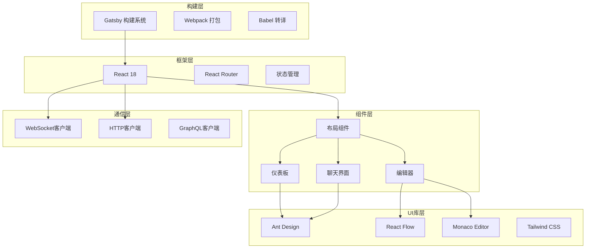

# 前端界面模块文档

> 📍 **当前位置**: `frontend` | **模块类型**: React/Gatsby前端 | **父文档**: [根级CLAUDE.md](../../CLAUDE.md)

## 📋 模块概览

前端界面模块是 Magentic-UI 系统的用户交互层，基于 Gatsby + React 构建的现代化 Web 应用。提供直观的人机协作界面，支持实时任务监控、计划编辑、消息交互和结果展示。

### 🎯 核心功能
- 实时任务监控仪表板
- 可视化计划编辑器
- 多智能体协作界面
- WebSocket 实时通信
- 响应式设计支持
- 深色/浅色主题切换

## 🏗️ 技术架构



## 📁 目录结构

```
frontend/
├── public/                   # 静态资源
│   ├── icons/               # 图标文件
│   └── index.html           # HTML模板
├── src/
│   ├── components/          # 通用组件
│   │   ├── layout/         # 布局组件
│   │   ├── ui/             # UI组件
│   │   ├── forms/          # 表单组件
│   │   └── common/         # 通用组件
│   ├── pages/              # 页面组件
│   │   ├── index.tsx       # 首页
│   │   ├── dashboard.tsx   # 仪表板
│   │   ├── teams.tsx       # 团队管理
│   │   └── settings.tsx    # 设置页面
│   ├── templates/          # 页面模板
│   ├── hooks/              # 自定义Hooks
│   ├── services/           # API服务
│   ├── utils/              # 工具函数
│   ├── types/              # TypeScript类型定义
│   ├── styles/             # 样式文件
│   └── gatsby-browser.tsx  # Gatsby浏览器API
├── gatsby-config.ts        # Gatsby配置
├── gatsby-node.ts          # Gatsby Node API
├── package.json            # 依赖配置
├── tsconfig.json           # TypeScript配置
└── tailwind.config.js      # Tailwind配置
```

## 🧩 核心组件

### 1. 布局组件 (`components/layout/`)

**主布局** (`MainLayout.tsx`):
```typescript
interface MainLayoutProps {
  children: React.ReactNode;
  title?: string;
  breadcrumb?: BreadcrumbItem[];
}

const MainLayout: React.FC<MainLayoutProps> = ({
  children,
  title,
  breadcrumb
}) => {
  return (
    <Layout className="min-h-screen">
      <Header />
      <Layout>
        <Sidebar />
        <Layout.Content className="p-6">
          {title && <PageHeader title={title} breadcrumb={breadcrumb} />}
          {children}
        </Layout.Content>
      </Layout>
      <Footer />
    </Layout>
  );
};
```

**侧边栏** (`Sidebar.tsx`):
- 导航菜单
- 团队状态显示
- 快速操作面板
- 通知中心

### 2. 仪表板组件 (`pages/dashboard.tsx`)

**功能特性**:
- 实时任务状态监控
- 团队活动概览
- 性能统计图表
- 快速操作入口

```typescript
const Dashboard: React.FC = () => {
  const { data: stats, loading } = useQuery(DASHBOARD_STATS_QUERY);
  const { data: teams } = useQuery(TEAMS_QUERY);

  return (
    <div className="grid grid-cols-1 md:grid-cols-2 lg:grid-cols-3 gap-6">
      <StatCard title="活跃团队" value={teams?.length || 0} />
      <StatCard title="运行中任务" value={stats?.runningTasks || 0} />
      <StatCard title="今日完成" value={stats?.completedToday || 0} />

      <ActivityChart data={stats?.activity} />
      <TeamStatusList teams={teams} />
      <RecentTasks tasks={stats?.recentTasks} />
    </div>
  );
};
```

### 3. 计划编辑器 (`components/editor/`)

**React Flow 集成**:
```typescript
const PlanEditor: React.FC<PlanEditorProps> = ({ planId, onSave }) => {
  const [nodes, setNodes, onNodesChange] = useNodesState([]);
  const [edges, setEdges, onEdgesChange] = useEdgesState([]);

  const onConnect = useCallback((params: Connection) => {
    setEdges((eds) => addEdge(params, eds));
  }, [setEdges]);

  return (
    <div className="h-full w-full">
      <ReactFlow
        nodes={nodes}
        edges={edges}
        onNodesChange={onNodesChange}
        onEdgesChange={onEdgesChange}
        onConnect={onConnect}
        nodeTypes={customNodeTypes}
        edgeTypes={customEdgeTypes}
      >
        <Controls />
        <MiniMap />
        <Background />
      </ReactFlow>
    </div>
  );
};
```

**自定义节点类型**:
- `TaskNode`: 任务节点
- `AgentNode`: 智能体节点
- `ToolNode`: 工具节点
- `DecisionNode`: 决策节点

### 4. 聊天界面 (`components/chat/`)

**消息组件** (`MessageItem.tsx`):
```typescript
interface MessageItemProps {
  message: Message;
  isOwn: boolean;
  showAvatar: boolean;
}

const MessageItem: React.FC<MessageItemProps> = ({
  message,
  isOwn,
  showAvatar
}) => {
  return (
    <div className={`flex ${isOwn ? 'justify-end' : 'justify-start'} mb-4`}>
      {showAvatar && !isOwn && <Avatar src={message.sender.avatar} />}
      <div className={`max-w-md ${isOwn ? 'order-1' : ''}`}>
        <div className={`px-4 py-2 rounded-lg ${
          isOwn ? 'bg-blue-500 text-white' : 'bg-gray-200'
        }`}>
          <p>{message.content}</p>
          {message.attachments && (
            <AttachmentList attachments={message.attachments} />
          )}
        </div>
        <span className="text-xs text-gray-500">
          {formatTime(message.timestamp)}
        </span>
      </div>
    </div>
  );
};
```

## 🔌 API 集成

### GraphQL 客户端配置
```typescript
// src/services/graphql.ts
import { ApolloClient, InMemoryCache, createHttpLink } from '@apollo/client';

const httpLink = createHttpLink({
  uri: process.env.GATSBY_GRAPHQL_ENDPOINT,
});

export const client = new ApolloClient({
  link: httpLink,
  cache: new InMemoryCache(),
});
```

### REST API 服务
```typescript
// src/services/api.ts
import axios from 'axios';

const apiClient = axios.create({
  baseURL: process.env.GATSBY_API_ENDPOINT,
  timeout: 10000,
});

apiClient.interceptors.request.use((config) => {
  const token = localStorage.getItem('auth_token');
  if (token) {
    config.headers.Authorization = `Bearer ${token}`;
  }
  return config;
});

export const teamsApi = {
  getTeams: () => apiClient.get('/api/teams'),
  createTeam: (data: CreateTeamData) => apiClient.post('/api/teams', data),
  updateTeam: (id: string, data: UpdateTeamData) =>
    apiClient.put(`/api/teams/${id}`, data),
};
```

### WebSocket 集成
```typescript
// src/services/websocket.ts
class WebSocketService {
  private ws: WebSocket | null = null;
  private listeners: Map<string, Function[]> = new Map();

  connect(sessionId: string) {
    const wsUrl = `${process.env.GATSBY_WS_ENDPOINT}/${sessionId}`;
    this.ws = new WebSocket(wsUrl);

    this.ws.onmessage = (event) => {
      const message = JSON.parse(event.data);
      this.emit(message.type, message.data);
    };

    this.ws.onerror = (error) => {
      console.error('WebSocket error:', error);
    };

    this.ws.onclose = () => {
      setTimeout(() => this.connect(sessionId), 5000);
    };
  }

  on(event: string, callback: Function) {
    if (!this.listeners.has(event)) {
      this.listeners.set(event, []);
    }
    this.listeners.get(event)!.push(callback);
  }

  emit(event: string, data: any) {
    const callbacks = this.listeners.get(event) || [];
    callbacks.forEach(callback => callback(data));
  }
}

export const wsService = new WebSocketService();
```

## 🎨 样式系统

### Tailwind CSS 配置
```javascript
// tailwind.config.js
module.exports = {
  content: [
    './src/pages/**/*.{js,jsx,ts,tsx}',
    './src/components/**/*.{js,jsx,ts,tsx}',
  ],
  theme: {
    extend: {
      colors: {
        primary: {
          50: '#eff6ff',
          500: '#3b82f6',
          600: '#2563eb',
          700: '#1d4ed8',
        },
      },
      animation: {
        'fade-in': 'fadeIn 0.5s ease-in-out',
        'slide-up': 'slideUp 0.3s ease-out',
      },
    },
  },
  plugins: [],
};
```

### Ant Design 主题定制
```typescript
// src/styles/theme.ts
import { theme } from 'antd';

export const customTheme = {
  algorithm: theme.defaultAlgorithm,
  token: {
    colorPrimary: '#3b82f6',
    borderRadius: 6,
    fontSize: 14,
  },
  components: {
    Layout: {
      headerBg: '#ffffff',
      siderBg: '#f8fafc',
    },
    Menu: {
      itemBg: 'transparent',
      itemSelectedBg: '#e0f2fe',
    },
  },
};
```

## 🧩 自定义 Hooks

### WebSocket Hook
```typescript
// src/hooks/useWebSocket.ts
export const useWebSocket = (sessionId: string) => {
  const [isConnected, setIsConnected] = useState(false);
  const [messages, setMessages] = useState<any[]>([]);

  useEffect(() => {
    wsService.connect(sessionId);

    wsService.on('connect', () => setIsConnected(true));
    wsService.on('disconnect', () => setIsConnected(false));
    wsService.on('message', (message) => {
      setMessages(prev => [...prev, message]);
    });

    return () => {
      wsService.disconnect();
    };
  }, [sessionId]);

  const sendMessage = useCallback((message: any) => {
    wsService.send(message);
  }, []);

  return { isConnected, messages, sendMessage };
};
```

### 实时数据 Hook
```typescript
// src/hooks/useRealTimeData.ts
export const useRealTimeData = <T>(
  query: string,
  updateEvent: string
) => {
  const { data, loading, error, refetch } = useQuery(query);
  const [realTimeData, setRealTimeData] = useState<T | null>(null);

  useEffect(() => {
    if (data) {
      setRealTimeData(data);
    }

    wsService.on(updateEvent, (newData: T) => {
      setRealTimeData(newData);
    });
  }, [data, updateEvent]);

  return { data: realTimeData, loading, error, refetch };
};
```

## 📱 响应式设计

### 断点配置
```typescript
// src/styles/breakpoints.ts
export const breakpoints = {
  xs: '480px',
  sm: '576px',
  md: '768px',
  lg: '992px',
  xl: '1200px',
  xxl: '1600px',
};

export const useResponsive = () => {
  const [screenSize, setScreenSize] = useState<string>('lg');

  useEffect(() => {
    const handleResize = () => {
      const width = window.innerWidth;
      if (width < 576) setScreenSize('xs');
      else if (width < 768) setScreenSize('sm');
      else if (width < 992) setScreenSize('md');
      else if (width < 1200) setScreenSize('lg');
      else if (width < 1600) setScreenSize('xl');
      else setScreenSize('xxl');
    };

    handleResize();
    window.addEventListener('resize', handleResize);
    return () => window.removeEventListener('resize', handleResize);
  }, []);

  return { screenSize, isMobile: ['xs', 'sm'].includes(screenSize) };
};
```

## 🚀 构建和部署

### Gatsby 配置
```typescript
// gatsby-config.ts
import type { GatsbyConfig } from 'gatsby';

const config: GatsbyConfig = {
  siteMetadata: {
    title: 'Magentic-UI',
    description: '多智能体人机协作Web自动化平台',
    author: 'ssiagu',
  },
  plugins: [
    'gatsby-plugin-image',
    'gatsby-plugin-sharp',
    'gatsby-transformer-sharp',
    'gatsby-plugin-postcss',
    {
      resolve: 'gatsby-plugin-manifest',
      options: {
        name: 'Magentic-UI',
        short_name: 'MagenticUI',
        start_url: '/',
        background_color: '#ffffff',
        theme_color: '#3b82f6',
        display: 'standalone',
      },
    },
  ],
};

export default config;
```

### 构建脚本
```json
{
  "scripts": {
    "develop": "gatsby develop -H 0.0.0.0",
    "build": "gatsby build",
    "serve": "gatsby serve",
    "clean": "gatsby clean",
    "type-check": "tsc --noEmit",
    "lint": "eslint src --ext .ts,.tsx",
    "lint:fix": "eslint src --ext .ts,.tsx --fix"
  }
}
```

### 环境变量配置
```bash
# .env.development
GATSBY_API_ENDPOINT=http://localhost:8000
GATSBY_WS_ENDPOINT=ws://localhost:8000/ws
GATSBY_GRAPHQL_ENDPOINT=http://localhost:8000/graphql

# .env.production
GATSBY_API_ENDPOINT=https://api.magentic-ui.com
GATSBY_WS_ENDPOINT=wss://api.magentic-ui.com/ws
GATSBY_GRAPHQL_ENDPOINT=https://api.magentic-ui.com/graphql
```

## 🧪 测试

### 单元测试
```bash
# 运行单元测试
npm test

# 覆盖率测试
npm run test:coverage
```

### E2E 测试
```bash
# 运行E2E测试
npm run test:e2e
```

### 组件测试示例
```typescript
// src/components/__tests__/Dashboard.test.tsx
import { render, screen } from '@testing-library/react';
import { MockedProvider } from '@apollo/client/testing';
import Dashboard from '../pages/dashboard';

const mocks = [
  {
    request: {
      query: DASHBOARD_STATS_QUERY,
    },
    result: {
      data: {
        stats: {
          runningTasks: 5,
          completedToday: 12,
        },
      },
    },
  },
];

test('renders dashboard with stats', async () => {
  render(
    <MockedProvider mocks={mocks}>
      <Dashboard />
    </MockedProvider>
  );

  expect(await screen.findByText('运行中任务')).toBeInTheDocument();
  expect(screen.getByText('5')).toBeInTheDocument();
});
```

## 📈 性能优化

### 代码分割
```typescript
// 路由级别的代码分割
const Dashboard = lazy(() => import('../pages/dashboard'));
const Teams = lazy(() => import('../pages/teams'));

const App = () => (
  <Router>
    <Suspense fallback={<div>Loading...</div>}>
      <Routes>
        <Route path="/dashboard" element={<Dashboard />} />
        <Route path="/teams" element={<Teams />} />
      </Routes>
    </Suspense>
  </Router>
);
```

### 图片优化
```typescript
import { GatsbyImage, getImage } from 'gatsby-plugin-image';

const OptimizedImage: React.FC<{ image: any }> = ({ image }) => {
  const gatsbyImage = getImage(image);
  return (
    <GatsbyImage
      image={gatsbyImage}
      alt="Optimized image"
      loading="lazy"
    />
  );
};
```

### 缓存策略
```typescript
// Apollo缓存配置
const cache = new InMemoryCache({
  typePolicies: {
    Query: {
      fields: {
        teams: {
          merge(existing = [], incoming) {
            return incoming;
          },
        },
      },
    },
  },
});
```

## 🔗 依赖模块

- **backend**: API服务和WebSocket连接
- **agents**: 智能体状态和数据
- **datamodel**: 共享的数据类型定义

## 📝 开发指南

### 添加新页面
1. 在 `src/pages/` 创建页面组件
2. 添加路由配置
3. 创建导航链接
4. 编写测试用例

### 创建新组件
1. 在 `src/components/` 创建组件
2. 定义 TypeScript 接口
3. 添加样式和主题
4. 编写 Storybook 故事

### 集成新 API
1. 定义 GraphQL 查询/变更
2. 创建服务层函数
3. 添加自定义 Hook
4. 处理错误状态

---

**Author**: ssiagu
**Email**: ssiagu@gmail.com
**Document Signature**: ssiagu
**最后更新**: 2025-10-16 23:59:01