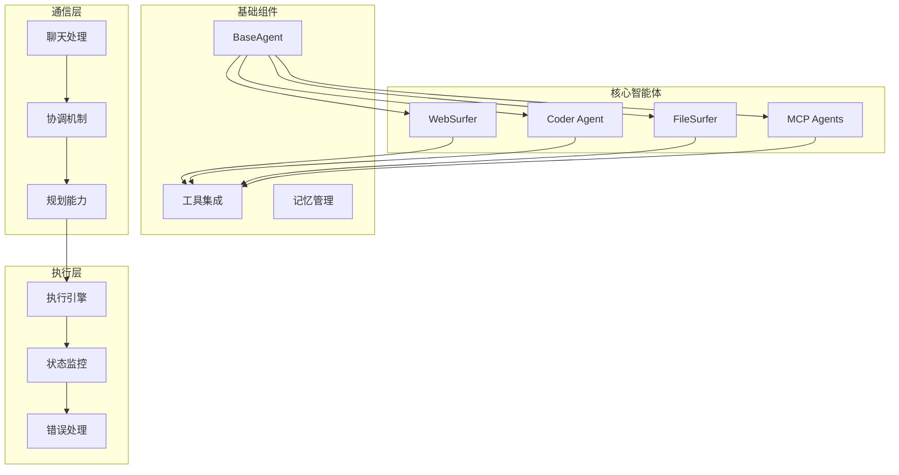
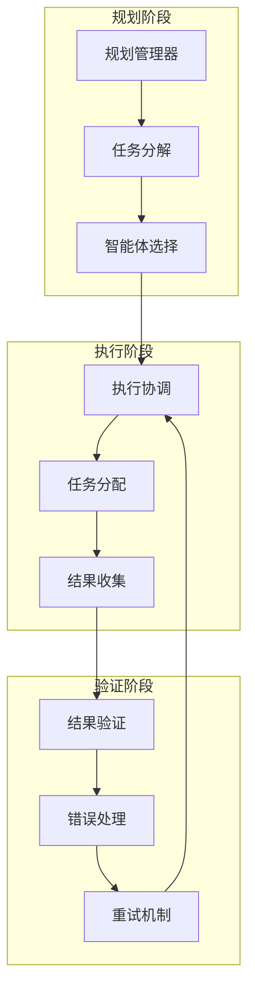

# 智能体模块文档

> 📍 **当前位置**: `src/magentic_ui/agents` | **模块类型**: Agent框架 | **父文档**: [根级CLAUDE.md](../../../CLAUDE.md)

## 📋 模块概览

智能体模块是 Magentic-UI 系统的核心智能组件，基于微软 AutoGen 框架构建，包含各种专业化智能体：Web浏览器、代码执行、文件操作、MCP代理等。每个智能体都具备特定的专业能力，能够协同完成复杂的自动化任务。

### 🎯 核心智能体
- **WebSurfer**: Web页面浏览和交互
- **Coder**: 代码生成、执行和调试
- **FileSurfer**: 文件系统操作和管理
- **MCP Agents**: Model Context Protocol 代理集成

## 🏗️ 模块架构



## 📁 目录结构

```
agents/
├── __init__.py
├── task_team.py              # 任务团队定义
├── _base.py                  # 基础智能体类
├── _coder.py                 # 代码执行智能体
├── web_surfer/               # Web浏览智能体
│   ├── __init__.py
│   ├── _web_surfer.py       # WebSurfer核心实现
│   ├── browser.py            # 浏览器控制
│   └── prompts.py            # 提示词模板
├── file_surfer/              # 文件操作智能体
│   ├── __init__.py
│   ├── _file_surfer.py      # FileSurfer核心实现
│   └── file_operations.py   # 文件操作工具
├── llm_config.py             # LLM配置管理
└── mcp/                      # MCP代理相关
    ├── __init__.py
    └── mcp_agent.py          # MCP代理实现
```

## 🤖 智能体详解

### 1. WebSurfer 智能体

**职责**: Web页面自动化浏览、信息提取、表单填写、页面交互

**核心能力**:
- 页面导航和浏览
- 元素定位和交互
- 表单填写和提交
- 信息提取和总结
- 截图和视觉分析

**主要方法**:
```python
class WebSurfer:
    async def browse_page(self, url: str) -> PageResult
    async def click_element(self, selector: str) -> ActionResult
    async def fill_form(self, form_data: Dict) -> ActionResult
    async def extract_content(self, extraction_config: ExtractionConfig) -> ContentResult
    async def take_screenshot(self, region: Optional[Region]) -> ScreenshotResult
```

**工具集成**:
- Playwright 浏览器控制
- 页面内容分析
- 视觉元素识别
- 表单数据处理

### 2. Coder 智能体

**职责**: 代码生成、执行、调试、优化

**核心能力**:
- 多语言代码生成
- 代码执行和测试
- 错误调试和修复
- 代码优化和重构
- 文档生成

**支持语言**:
- Python
- JavaScript/TypeScript
- Shell脚本
- SQL查询
- 配置文件(YAML, JSON, TOML)

**主要方法**:
```python
class Coder:
    async def generate_code(self, requirements: CodeRequirements) -> CodeResult
    async def execute_code(self, code: str, environment: ExecutionEnvironment) -> ExecutionResult
    async def debug_code(self, code: str, error: ErrorInfo) -> DebugResult
    async def optimize_code(self, code: str, optimization_goals: List[str]) -> OptimizationResult
```

### 3. FileSurfer 智能体

**职责**: 文件系统操作、内容分析、文件管理

**核心能力**:
- 文件和目录浏览
- 文件内容读取和编辑
- 文件格式转换
- 批量文件操作
- 文件搜索和过滤

**支持操作**:
- 文件读取/写入/追加
- 目录创建/删除/移动
- 文件搜索和过滤
- 内容提取和分析
- 文件备份和恢复

**主要方法**:
```python
class FileSurfer:
    async def list_directory(self, path: str, pattern: Optional[str]) -> ListResult
    async def read_file(self, file_path: str, encoding: str) -> ContentResult
    async def write_file(self, file_path: str, content: str, mode: str) -> ActionResult
    async def search_files(self, search_criteria: SearchCriteria) -> SearchResult
    async def analyze_file(self, file_path: str) -> AnalysisResult
```

### 4. MCP Agents

**职责**: Model Context Protocol 代理集成和扩展

**核心能力**:
- MCP服务器连接管理
- 动态工具发现和注册
- 协议消息处理
- 错误处理和重连
- 配置同步

**支持的MCP工具**:
- 数据库查询工具
- API调用工具
- 云服务工具
- 自定义业务工具

## 🔄 智能体协作

### 协作模式



### 消息传递协议

```json
{
  "message_type": "task_assignment",
  "from_agent": "planning_agent",
  "to_agent": "web_surfer",
  "task_id": "task_123",
  "payload": {
    "action": "browse_page",
    "parameters": {
      "url": "https://example.com",
      "extract_info": ["title", "links"]
    },
    "priority": "high",
    "deadline": "2025-10-16T24:00:00Z"
  },
  "context": {
    "session_id": "session_456",
    "conversation_history": [...]
  }
}
```

## 🛠️ 工具集成

### Playwright 集成
```python
from playwright.async_api import async_playwright

class WebBrowserTool:
    async def __init__(self):
        self.playwright = await async_playwright().start()
        self.browser = await self.playwright.chromium.launch()
        self.page = await self.browser.new_page()

    async def navigate(self, url: str):
        await self.page.goto(url)
        return await self.page.content()
```

### 文件系统工具
```python
import os
import aiofiles
from pathlib import Path

class FilesystemTool:
    async def read_file(self, path: str) -> str:
        async with aiofiles.open(path, 'r', encoding='utf-8') as f:
            return await f.read()

    async def write_file(self, path: str, content: str):
        async with aiofiles.open(path, 'w', encoding='utf-8') as f:
            await f.write(content)
```

### 代码执行工具
```python
import subprocess
import tempfile

class CodeExecutionTool:
    async def execute_python(self, code: str) -> ExecutionResult:
        with tempfile.NamedTemporaryFile(mode='w', suffix='.py', delete=False) as f:
            f.write(code)
            temp_file = f.name

        try:
            result = subprocess.run(
                ['python', temp_file],
                capture_output=True,
                text=True,
                timeout=30
            )
            return ExecutionResult(
                stdout=result.stdout,
                stderr=result.stderr,
                return_code=result.returncode
            )
        finally:
            os.unlink(temp_file)
```

## 🧪 测试框架

### 单元测试
```bash
# 运行智能体测试
pytest tests/test_agents/
```

### 集成测试
```bash
# 智能体协作测试
pytest tests/test_agent_integration/
```

### 性能测试
```bash
# 智能体性能基准测试
pytest tests/test_agent_performance/
```

## 🔧 配置管理

### LLM 配置
```python
# llm_config.py
from autogen_agentchat.models import OpenAIChatCompletionClient

class LLMConfig:
    def __init__(self):
        self.model_client = OpenAIChatCompletionClient(
            model="gpt-4",
            api_key=os.getenv("OPENAI_API_KEY"),
            temperature=0.7,
            max_tokens=2000
        )

    def get_config(self, agent_type: str):
        base_config = {
            "model_client": self.model_client,
            "system_message": self.get_system_message(agent_type)
        }
        return base_config
```

### 智能体配置
```python
# agent_config.py
AGENT_CONFIGS = {
    "web_surfer": {
        "max_concurrent_pages": 5,
        "page_timeout": 30,
        "screenshot_quality": 90,
        "user_agent": "Mozilla/5.0..."
    },
    "coder": {
        "max_execution_time": 60,
        "allowed_languages": ["python", "javascript", "bash"],
        "sandbox_enabled": True
    },
    "file_surfer": {
        "max_file_size": "10MB",
        "allowed_extensions": [".txt", ".py", ".js", ".json"],
        "read_only_paths": ["/system", "/etc"]
    }
}
```

## 📈 性能优化

### 并发执行
- 智能体异步执行
- 任务队列管理
- 资源池优化

### 缓存策略
- 页面内容缓存
- 代码执行结果缓存
- 文件内容缓存

### 资源管理
- 内存使用监控
- CPU使用优化
- 网络连接管理

## 🚀 扩展开发

### 创建新智能体

1. **继承基础类**
```python
from ._base import BaseAgent

class CustomAgent(BaseAgent):
    def __init__(self, config: AgentConfig):
        super().__init__(config)
        self.setup_tools()

    async def process_task(self, task: Task) -> TaskResult:
        # 实现任务处理逻辑
        pass
```

2. **注册智能体**
```python
# 在 __init__.py 中注册
from .custom_agent import CustomAgent

AVAILABLE_AGENTS = {
    "custom_agent": CustomAgent,
    # ... 其他智能体
}
```

3. **添加配置**
```python
# 在配置文件中添加
AGENT_CONFIGS["custom_agent"] = {
    "max_tasks": 10,
    "timeout": 30,
    # ... 其他配置
}
```

### 集成新工具

1. **实现工具接口**
```python
from abc import ABC, abstractmethod

class CustomTool(ABC):
    @abstractmethod
    async def execute(self, parameters: Dict) -> ToolResult:
        pass
```

2. **注册到智能体**
```python
class CustomAgent(BaseAgent):
    def setup_tools(self):
        self.tools["custom_tool"] = CustomTool()
```

## 🔗 依赖模块

- **backend**: 后端服务和API
- **tools**: 工具集成和Playwright控制
- **datamodel**: 数据模型和持久化

## 📝 最佳实践

### 智能体设计
- 单一职责原则
- 幂等性设计
- 错误处理完善
- 日志记录详细

### 协作机制
- 清晰的任务定义
- 标准化的消息格式
- 有效的状态同步
- 容错和重试机制

### 性能考虑
- 合理的超时设置
- 资源使用监控
- 并发控制
- 缓存策略优化

---

**Author**: ssiagu
**Email**: ssiagu@gmail.com
**Document Signature**: ssiagu
**最后更新**: 2025-10-16 23:59:01