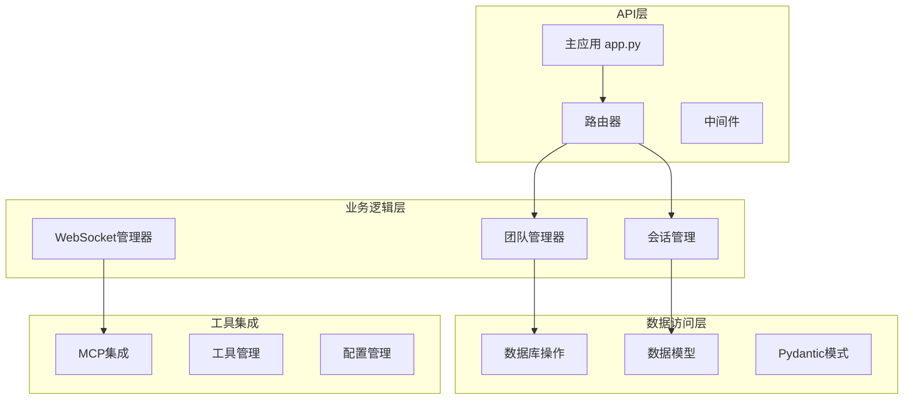
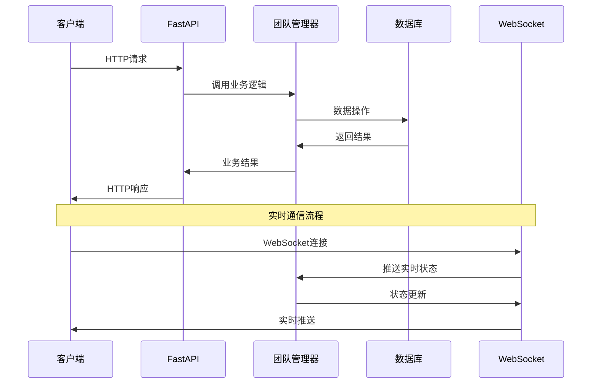

# 后端服务模块文档

> 📍 **当前位置**: `src/magentic_ui/backend` | **模块类型**: FastAPI服务 | **父文档**: [根级CLAUDE.md](../../../CLAUDE.md)

## 📋 模块概览

后端服务模块是 Magentic-UI 系统的核心组件，基于 FastAPI 框架构建，提供 RESTful API、WebSocket 实时通信、团队管理、数据库操作等核心功能。

### 🎯 主要职责
- Web API 服务提供
- WebSocket 实时通信管理
- 多智能体团队协调
- 数据库操作和持久化
- 认证与授权管理
- 文件上传下载处理

## 🏗️ 模块架构



## 📁 目录结构

```
backend/
├── web/
│   ├── app.py              # FastAPI主应用入口
│   ├── api/                # API路由定义
│   │   ├── __init__.py
│   │   ├── runs.py         # 运行相关API
│   │   ├── settings.py     # 设置API
│   │   └── teams.py        # 团队管理API
│   ├── auth/               # 认证相关
│   └── middleware/         # 中间件
├── teammanager/            # 团队管理器
│   ├── __init__.py
│   ├── teammanager.py      # 核心团队管理逻辑
│   ├── mcp_agent_config.py # MCP代理配置
│   └── mcp_workbench.py    # MCP工作台
├── cli.py                  # 命令行入口
├── config.py               # 配置管理
├── logging.py              # 日志配置
└── __init__.py
```

## 🔧 核心组件

### 1. FastAPI 主应用 (`web/app.py`)

**职责**: 应用程序入口，路由注册，中间件配置

**关键功能**:
- CORS 中间件配置
- 静态文件服务
- WebSocket 连接管理
- API 路由注册
- 异常处理器

**主要端点**:
- `/api/runs` - 运行管理
- `/api/teams` - 团队管理
- `/api/settings` - 系统设置
- `/ws` - WebSocket 连接

### 2. 团队管理器 (`teammanager/teammanager.py`)

**职责**: 多智能体团队协调，任务分配，生命周期管理

**核心类**:
```python
class TeamManager:
    def create_team(self, team_config: TeamConfig) -> Team
    def assign_task(self, team_id: str, task: Task) -> TaskResult
    def manage_session(self, session_id: str) -> SessionManager
```

**关键方法**:
- `create_team()`: 创建新团队
- `get_team()`: 获取团队实例
- `run_team()`: 启动团队执行
- `shutdown_team()`: 关闭团队

### 3. MCP 集成 (`teammanager/mcp_workbench.py`)

**职责**: Model Context Protocol 服务器集成和管理

**功能特性**:
- MCP 服务器发现和连接
- 工具注册和调用
- 配置同步管理
- 错误处理和重连

### 4. 数据模型 (`datamodel/`)

**职责**: SQLModel 数据模型定义，数据库操作

**主要实体**:
- `Team`: 团队信息
- `Session`: 会话记录
- `Run`: 执行运行
- `Message`: 消息记录
- `Settings`: 系统设置
- `Gallery`: 画廊记录

## 🔄 数据流



## 🛠️ API 接口

### 运行管理 API

**端点**: `GET /api/runs`
- **功能**: 获取运行列表
- **参数**: `limit`, `offset`, `status`
- **返回**: `List[RunSummary]`

**端点**: `POST /api/runs`
- **功能**: 创建新运行
- **请求体**: `RunCreateRequest`
- **返回**: `RunResponse`

### 团队管理 API

**端点**: `GET /api/teams`
- **功能**: 获取团队列表
- **返回**: `List[TeamInfo]`

**端点**: `POST /api/teams/{team_id}/chat`
- **功能**: 发送聊天消息
- **请求体**: `ChatMessage`
- **返回**: `ChatResponse`

### 设置管理 API

**端点**: `GET /api/settings`
- **功能**: 获取系统设置
- **返回**: `SettingsResponse`

**端点**: `PUT /api/settings`
- **功能**: 更新系统设置
- **请求体**: `SettingsUpdate`
- **返回**: `SettingsResponse`

## 🔌 WebSocket 接口

### 连接端点
`ws://localhost:8000/ws/{session_id}`

### 消息格式
```json
{
  "type": "status_update",
  "data": {
    "session_id": "uuid",
    "status": "running",
    "progress": 0.75,
    "message": "执行中..."
  },
  "timestamp": "2025-10-16T23:59:01Z"
}
```

### 消息类型
- `status_update`: 状态更新
- `chat_message`: 聊天消息
- `plan_update`: 计划更新
- `error`: 错误信息
- `completion`: 完成通知

## 🧪 测试

### 单元测试
```bash
# 运行后端测试
pytest tests/test_backend/
```

### 集成测试
```bash
# API集成测试
pytest tests/test_api_integration/
```

### 测试覆盖
- API 端点测试
- WebSocket 连接测试
- 数据库操作测试
- 团队管理器测试
- MCP 集成测试

## 🔧 配置

### 环境变量
```bash
# 数据库配置
DATABASE_URL=sqlite:///./magentic_ui.db

# 服务器配置
HOST=0.0.0.0
PORT=8000
DEBUG=false

# 日志配置
LOG_LEVEL=INFO
LOG_FILE=./logs/backend.log
```

### 配置文件 (`config.py`)
```python
class Settings:
    database_url: str = "sqlite:///./magentic_ui.db"
    host: str = "0.0.0.0"
    port: int = 8000
    debug: bool = False
    log_level: str = "INFO"
```

## 📈 性能优化

### 数据库优化
- 使用连接池
- 索引优化
- 查询优化

### API 优化
- 响应缓存
- 分页查询
- 异步处理

### WebSocket 优化
- 连接池管理
- 消息队列
- 心跳检测

## 🚀 部署

### Docker 部署
```dockerfile
FROM python:3.12-slim

WORKDIR /app
COPY requirements.txt .
RUN pip install -r requirements.txt

COPY . .
EXPOSE 8000

CMD ["uvicorn", "magentic_ui.backend.web.app:app", "--host", "0.0.0.0", "--port", "8000"]
```

### 启动命令
```bash
# 开发模式
uvicorn magentic_ui.backend.web.app:app --reload

# 生产模式
uvicorn magentic_ui.backend.web.app:app --host 0.0.0.0 --port 8000
```

## 🔗 依赖模块

- **datamodel**: 数据模型定义
- **agents**: 智能体实现
- **tools**: 工具集成
- **frontend**: 前端界面

## 📝 开发指南

### 添加新 API 端点
1. 在 `web/api/` 目录创建新路由文件
2. 定义 Pydantic 模式
3. 实现业务逻辑
4. 添加到主应用路由
5. 编写测试用例

### 扩展 WebSocket 功能
1. 定义新的消息类型
2. 实现消息处理器
3. 更新前端客户端
4. 添加连接管理逻辑

### 集成新工具
1. 实现工具接口
2. 注册到工具管理器
3. 添加配置选项
4. 编写集成测试

---

**Author**: ssiagu
**Email**: ssiagu@gmail.com
**Document Signature**: ssiagu
**最后更新**: 2025-10-16 23:59:01