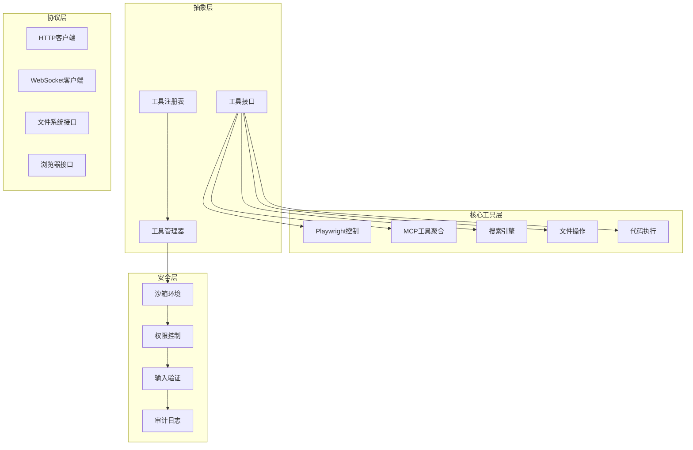

# 工具集成模块文档

> 📍 **当前位置**: `src/magentic_ui/tools` | **模块类型**: 工具集 | **父文档**: [根级CLAUDE.md](../../../CLAUDE.md)

## 📋 模块概览

工具集成模块是 Magentic-UI 系统的执行层，提供各种专业化工具供智能体调用。包括 Playwright 浏览器控制、MCP 服务器集成、Bing 搜索、文件操作等核心工具，为智能体提供强大的外部世界交互能力。

### 🎯 核心工具集
- **Playwright 浏览器控制**: Web自动化和浏览器操作
- **MCP 工具集成**: Model Context Protocol 工具聚合
- **搜索工具**: Bing、Google等搜索引擎集成
- **文件系统工具**: 文件读写、目录操作
- **代码执行工具**: 多语言代码运行环境

## 🏗️ 模块架构



## 📁 目录结构

```
tools/
├── __init__.py
├── playwright/               # Playwright浏览器控制
│   ├── __init__.py
│   ├── playwright_controller.py  # 主控制器
│   ├── browser/              # 浏览器管理
│   │   ├── __init__.py
│   │   ├── browser_manager.py
│   │   └── browser_context.py
│   ├── navigation/           # 页面导航
│   │   ├── __init__.py
│   │   ├── page_navigator.py
│   │   └── element_interactor.py
│   └── state/                # 状态管理
│       ├── __init__.py
│       ├── page_state.py
│       └── interaction_state.py
├── mcp/                      # MCP工具集成
│   ├── __init__.py
│   ├── _aggregate_workbench.py  # MCP工作台聚合
│   ├── mcp_client.py        # MCP客户端
│   └── tool_adapters/        # 工具适配器
│       ├── __init__.py
│       ├── database_adapter.py
│       └── api_adapter.py
├── search/                   # 搜索工具
│   ├── __init__.py
│   ├── bing_search.py       # Bing搜索
│   └── search_base.py       # 搜索基类
├── file_system/              # 文件系统工具
│   ├── __init__.py
│   ├── file_manager.py
│   └── directory_ops.py
└── code_execution/           # 代码执行工具
    ├── __init__.py
    ├── python_executor.py
    └── sandbox_executor.py
```

## 🛠️ 核心工具详解

### 1. Playwright 浏览器控制

**主控制器** (`playwright_controller.py`):
```python
class PlaywrightController:
    def __init__(self, config: BrowserConfig):
        self.browser_manager = BrowserManager(config)
        self.page_navigator = PageNavigator()
        self.element_interactor = ElementInteractor()
        self.state_manager = PageStateManager()

    async def start_browser(self, headless: bool = False) -> BrowserInfo:
        """启动浏览器实例"""
        browser = await self.browser_manager.launch(headless=headless)
        context = await browser.new_context()
        page = await context.new_page()

        return BrowserInfo(
            browser_id=browser.browser_id,
            context_id=context.context_id,
            page_id=page.page_id,
            status="running"
        )

    async def navigate_to_page(self, page_id: str, url: str) -> NavigationResult:
        """导航到指定页面"""
        page = await self.browser_manager.get_page(page_id)
        response = await page.goto(url, wait_until="networkidle")

        return NavigationResult(
            url=page.url,
            status=response.status,
            title=await page.title(),
            content=await page.content()
        )

    async def interact_with_element(self, page_id: str, action: ElementAction) -> InteractionResult:
        """与页面元素交互"""
        page = await self.browser_manager.get_page(page_id)

        if action.action_type == "click":
            await page.click(action.selector)
        elif action.action_type == "type":
            await page.fill(action.selector, action.text)
        elif action.action_type == "scroll":
            await page.evaluate(f"document.querySelector('{action.selector}').scrollIntoView()")

        return InteractionResult(
            action_id=action.action_id,
            status="success",
            screenshot=await page.screenshot()
        )

    async def extract_content(self, page_id: str, extraction_config: ExtractionConfig) -> ContentResult:
        """提取页面内容"""
        page = await self.browser_manager.get_page(page_id)

        if extraction_config.method == "css_selector":
            elements = await page.query_selector_all(extraction_config.selector)
            content = [await element.inner_text() for element in elements]
        elif extraction_config.method == "xpath":
            elements = await page.query_selector_all(extraction_config.selector)
            content = [await element.inner_text() for element in elements]

        return ContentResult(
            content=content,
            metadata={
                "page_url": page.url,
                "extraction_method": extraction_config.method,
                "element_count": len(content)
            }
        )
```

**浏览器管理器** (`browser/browser_manager.py`):
```python
class BrowserManager:
    def __init__(self, config: BrowserConfig):
        self.config = config
        self.browsers: Dict[str, Browser] = {}
        self.contexts: Dict[str, BrowserContext] = {}
        self.pages: Dict[str, Page] = {}

    async def launch(self, headless: bool = False) -> Browser:
        """启动新浏览器实例"""
        browser_id = str(uuid.uuid4())

        launch_options = {
            "headless": headless,
            "args": self.config.browser_args,
            "timeout": self.config.launch_timeout
        }

        browser = await playwright.chromium.launch(**launch_options)
        self.browsers[browser_id] = browser

        return browser

    async def get_page(self, page_id: str) -> Page:
        """获取页面实例"""
        if page_id not in self.pages:
            raise ValueError(f"Page {page_id} not found")
        return self.pages[page_id]

    async def close_all(self):
        """关闭所有浏览器实例"""
        for browser in self.browsers.values():
            await browser.close()
        self.browsers.clear()
        self.contexts.clear()
        self.pages.clear()
```

### 2. MCP 工具集成

**聚合工作台** (`mcp/_aggregate_workbench.py`):
```python
class AggregateWorkbench:
    def __init__(self):
        self.mcp_clients: Dict[str, MCPClient] = {}
        self.tool_registry = ToolRegistry()
        self.tool_adapters: Dict[str, ToolAdapter] = {}

    async def register_mcp_server(self, server_config: MCPServerConfig) -> bool:
        """注册MCP服务器"""
        try:
            client = MCPClient(server_config)
            await client.connect()

            # 获取服务器提供的工具
            tools = await client.list_tools()

            # 注册工具到工作台
            for tool in tools:
                adapter = self._create_tool_adapter(tool, client)
                self.tool_adapters[tool.name] = adapter
                self.tool_registry.register(tool.name, adapter)

            self.mcp_clients[server_config.server_id] = client
            return True

        except Exception as e:
            logger.error(f"Failed to register MCP server: {e}")
            return False

    async def call_tool(self, tool_name: str, parameters: Dict) -> ToolResult:
        """调用工具"""
        if tool_name not in self.tool_adapters:
            raise ValueError(f"Tool {tool_name} not found")

        adapter = self.tool_adapters[tool_name]
        return await adapter.execute(parameters)

    def _create_tool_adapter(self, tool: MCPTool, client: MCPClient) -> ToolAdapter:
        """创建工具适配器"""
        if tool.type == "database":
            return DatabaseAdapter(tool, client)
        elif tool.type == "api":
            return APIAdapter(tool, client)
        else:
            return GenericAdapter(tool, client)

    async def list_available_tools(self) -> List[ToolInfo]:
        """列出可用工具"""
        return self.tool_registry.list_tools()

    async def shutdown(self):
        """关闭工作台"""
        for client in self.mcp_clients.values():
            await client.disconnect()
        self.mcp_clients.clear()
        self.tool_adapters.clear()
```

**MCP客户端** (`mcp/mcp_client.py`):
```python
class MCPClient:
    def __init__(self, config: MCPServerConfig):
        self.config = config
        self.connection = None
        self.server_info = None

    async def connect(self):
        """连接到MCP服务器"""
        if self.config.transport == "stdio":
            self.connection = StdioConnection(self.config.command)
        elif self.config.transport == "websocket":
            self.connection = WebSocketConnection(self.config.url)

        await self.connection.connect()

        # 初始化握手
        await self._initialize_connection()

        # 获取服务器信息
        self.server_info = await self._get_server_info()

    async def list_tools(self) -> List[MCPTool]:
        """获取服务器工具列表"""
        response = await self.connection.send_request({
            "method": "tools/list",
            "params": {}
        })

        return [MCPTool(**tool) for tool in response.get("tools", [])]

    async def call_tool(self, tool_name: str, arguments: Dict) -> Any:
        """调用工具"""
        response = await self.connection.send_request({
            "method": "tools/call",
            "params": {
                "name": tool_name,
                "arguments": arguments
            }
        })

        return response.get("result")

    async def disconnect(self):
        """断开连接"""
        if self.connection:
            await self.connection.close()
```

### 3. 搜索工具

**Bing搜索** (`search/bing_search.py`):
```python
class BingSearchTool:
    def __init__(self, api_key: str):
        self.api_key = api_key
        self.base_url = "https://api.bing.microsoft.com/v7.0/search"

    async def search(self, query: str, count: int = 10, offset: int = 0) -> SearchResult:
        """执行Bing搜索"""
        headers = {
            "Ocp-Apim-Subscription-Key": self.api_key
        }

        params = {
            "q": query,
            "count": count,
            "offset": offset,
            "mkt": "en-US",
            "safesearch": "Moderate"
        }

        async with aiohttp.ClientSession() as session:
            async with session.get(self.base_url, headers=headers, params=params) as response:
                data = await response.json()

                return SearchResult(
                    query=query,
                    total_results=data.get("webPages", {}).get("totalEstimatedMatches", 0),
                    results=[self._parse_result(item) for item in data.get("webPages", {}).get("value", [])],
                    ranking_data=data.get("rankingResponse", {})
                )

    def _parse_result(self, item: Dict) -> SearchItem:
        """解析搜索结果项"""
        return SearchItem(
            title=item.get("name", ""),
            url=item.get("url", ""),
            snippet=item.get("snippet", ""),
            display_url=item.get("displayUrl", ""),
            date_published=item.get("datePublished"),
            date_last_crawled=item.get("dateLastCrawled")
        )

    async def search_news(self, query: str, count: int = 10) -> NewsResult:
        """搜索新闻"""
        headers = {
            "Ocp-Apim-Subscription-Key": self.api_key
        }

        params = {
            "q": query,
            "count": count,
            "mkt": "en-US",
            "safeSearch": "Moderate",
            "textFormat": "HTML"
        }

        url = f"{self.base_url}/news"

        async with aiohttp.ClientSession() as session:
            async with session.get(url, headers=headers, params=params) as response:
                data = await response.json()

                return NewsResult(
                    query=query,
                    total_results=data.get("totalEstimatedMatches", 0),
                    results=[self._parse_news_item(item) for item in data.get("value", [])]
                )
```

### 4. 文件系统工具

**文件管理器** (`file_system/file_manager.py`):
```python
class FileManager:
    def __init__(self, base_path: str = "/workspace"):
        self.base_path = Path(base_path).resolve()
        self.allowed_extensions = {".txt", ".py", ".js", ".json", ".yaml", ".md"}
        self.max_file_size = 10 * 1024 * 1024  # 10MB

    async def read_file(self, file_path: str, encoding: str = "utf-8") -> FileContent:
        """读取文件内容"""
        full_path = self._resolve_path(file_path)

        if not await self._is_safe_path(full_path):
            raise SecurityError(f"Access denied to path: {file_path}")

        if not full_path.exists():
            raise FileNotFoundError(f"File not found: {file_path}")

        if full_path.stat().st_size > self.max_file_size:
            raise FileSizeError(f"File too large: {file_path}")

        content = await aiofiles.open(full_path, 'r', encoding=encoding).read()

        return FileContent(
            path=str(full_path),
            content=content,
            size=len(content),
            encoding=encoding,
            mime_type=self._get_mime_type(full_path)
        )

    async def write_file(self, file_path: str, content: str, encoding: str = "utf-8") -> WriteResult:
        """写入文件内容"""
        full_path = self._resolve_path(file_path)

        if not await self._is_safe_path(full_path):
            raise SecurityError(f"Access denied to path: {file_path}")

        if len(content.encode(encoding)) > self.max_file_size:
            raise FileSizeError(f"Content too large: {len(content)} bytes")

        # 确保目录存在
        full_path.parent.mkdir(parents=True, exist_ok=True)

        async with aiofiles.open(full_path, 'w', encoding=encoding) as f:
            await f.write(content)

        return WriteResult(
            path=str(full_path),
            bytes_written=len(content.encode(encoding)),
            timestamp=datetime.now().isoformat()
        )

    async def list_directory(self, dir_path: str = ".", recursive: bool = False) -> DirectoryListing:
        """列出目录内容"""
        full_path = self._resolve_path(dir_path)

        if not await self._is_safe_path(full_path):
            raise SecurityError(f"Access denied to path: {dir_path}")

        if not full_path.is_dir():
            raise NotADirectoryError(f"Not a directory: {dir_path}")

        if recursive:
            pattern = "**/*"
        else:
            pattern = "*"

        items = []
        for item in full_path.glob(pattern):
            if item.is_file():
                items.append(FileItem(
                    name=item.name,
                    path=str(item.relative_to(self.base_path)),
                    size=item.stat().st_size,
                    modified_time=datetime.fromtimestamp(item.stat().st_mtime).isoformat(),
                    is_file=True
                ))
            elif item.is_dir() and not recursive:
                items.append(FileItem(
                    name=item.name,
                    path=str(item.relative_to(self.base_path)),
                    size=0,
                    modified_time=datetime.fromtimestamp(item.stat().st_mtime).isoformat(),
                    is_file=False
                ))

        return DirectoryListing(
            path=str(full_path),
            items=sorted(items, key=lambda x: (not x.is_file, x.name))
        )

    def _resolve_path(self, path: str) -> Path:
        """解析安全路径"""
        full_path = (self.base_path / path).resolve()
        if not str(full_path).startswith(str(self.base_path)):
            raise SecurityError(f"Path traversal attempt: {path}")
        return full_path

    async def _is_safe_path(self, path: Path) -> bool:
        """检查路径是否安全"""
        try:
            path.resolve().relative_to(self.base_path)
            return True
        except ValueError:
            return False
```

### 5. 代码执行工具

**Python执行器** (`code_execution/python_executor.py`):
```python
class PythonExecutor:
    def __init__(self, sandbox: bool = True):
        self.sandbox = sandbox
        self.execution_timeout = 30
        self.max_memory = 512 * 1024 * 1024  # 512MB

    async def execute_code(self, code: str, context: Optional[Dict] = None) -> ExecutionResult:
        """执行Python代码"""
        if self.sandbox:
            return await self._execute_in_sandbox(code, context)
        else:
            return await self._execute_directly(code, context)

    async def _execute_in_sandbox(self, code: str, context: Optional[Dict] = None) -> ExecutionResult:
        """在沙箱环境中执行代码"""
        with tempfile.TemporaryDirectory() as temp_dir:
            # 创建临时文件
            code_file = Path(temp_dir) / "script.py"
            code_file.write_text(code, encoding='utf-8')

            # 准备执行环境
            env = os.environ.copy()
            if context:
                env.update({f"CTX_{k}": json.dumps(v) for k, v in context.items()})

            # 执行代码
            try:
                process = await asyncio.create_subprocess_exec(
                    'python', str(code_file),
                    cwd=temp_dir,
                    env=env,
                    stdout=asyncio.subprocess.PIPE,
                    stderr=asyncio.subprocess.PIPE,
                    limit=self.max_memory
                )

                stdout, stderr = await asyncio.wait_for(
                    process.communicate(),
                    timeout=self.execution_timeout
                )

                return ExecutionResult(
                    exit_code=process.returncode,
                    stdout=stdout.decode('utf-8'),
                    stderr=stderr.decode('utf-8'),
                    execution_time=0,  # 实际应该记录执行时间
                    memory_usage=0     # 实际应该记录内存使用
                )

            except asyncio.TimeoutError:
                process.kill()
                await process.wait()
                raise ExecutionTimeoutError(f"Code execution timed out after {self.execution_timeout} seconds")

    async def _execute_directly(self, code: str, context: Optional[Dict] = None) -> ExecutionResult:
        """直接执行代码（不安全，仅用于测试）"""
        import io
        import sys
        from contextlib import redirect_stdout, redirect_stderr

        # 捕获输出
        stdout_capture = io.StringIO()
        stderr_capture = io.StringIO()

        # 准备执行环境
        exec_context = {}
        if context:
            exec_context.update(context)

        start_time = time.time()

        try:
            with redirect_stdout(stdout_capture), redirect_stderr(stderr_capture):
                exec(code, exec_context)

            execution_time = time.time() - start_time

            return ExecutionResult(
                exit_code=0,
                stdout=stdout_capture.getvalue(),
                stderr=stderr_capture.getvalue(),
                execution_time=execution_time,
                memory_usage=0
            )

        except Exception as e:
            execution_time = time.time() - start_time

            return ExecutionResult(
                exit_code=1,
                stdout=stdout_capture.getvalue(),
                stderr=f"{type(e).__name__}: {str(e)}",
                execution_time=execution_time,
                memory_usage=0
            )
```

## 🔧 工具注册和管理

**工具注册表**:
```python
class ToolRegistry:
    def __init__(self):
        self.tools: Dict[str, Tool] = {}
        self.categories: Dict[str, List[str]] = {}

    def register(self, name: str, tool: Tool, category: str = "general"):
        """注册工具"""
        self.tools[name] = tool
        if category not in self.categories:
            self.categories[category] = []
        self.categories[category].append(name)

    def get_tool(self, name: str) -> Optional[Tool]:
        """获取工具"""
        return self.tools.get(name)

    def list_tools(self, category: Optional[str] = None) -> List[ToolInfo]:
        """列出工具"""
        if category:
            tool_names = self.categories.get(category, [])
        else:
            tool_names = list(self.tools.keys())

        return [
            ToolInfo(name=name, tool=self.tools[name])
            for name in tool_names
        ]

    def unregister(self, name: str):
        """注销工具"""
        if name in self.tools:
            del self.tools[name]
            # 从分类中移除
            for category_tools in self.categories.values():
                if name in category_tools:
                    category_tools.remove(name)
```

**工具管理器**:
```python
class ToolManager:
    def __init__(self):
        self.registry = ToolRegistry()
        self.execution_context = ExecutionContext()
        self.audit_logger = AuditLogger()

    async def call_tool(self, tool_name: str, parameters: Dict, context: Optional[str] = None) -> ToolResult:
        """调用工具"""
        # 记录调用
        call_id = str(uuid.uuid4())
        self.audit_logger.log_call(call_id, tool_name, parameters, context)

        try:
            # 获取工具
            tool = self.registry.get_tool(tool_name)
            if not tool:
                raise ValueError(f"Tool not found: {tool_name}")

            # 验证参数
            validation_result = tool.validate_parameters(parameters)
            if not validation_result.is_valid:
                raise ValidationError(validation_result.errors)

            # 检查权限
            if not await self._check_permissions(tool_name, context):
                raise PermissionError(f"Permission denied for tool: {tool_name}")

            # 执行工具
            result = await tool.execute(parameters, self.execution_context)

            # 记录结果
            self.audit_logger.log_result(call_id, result)

            return result

        except Exception as e:
            # 记录错误
            self.audit_logger.log_error(call_id, str(e))
            raise

    async def _check_permissions(self, tool_name: str, context: Optional[str]) -> bool:
        """检查权限"""
        # 实现权限检查逻辑
        return True
```

## 🧪 测试框架

### 单元测试示例
```python
# tests/test_playwright_controller.py
import pytest
from unittest.mock import AsyncMock, patch

@pytest.mark.asyncio
async def test_playwright_navigate_to_page():
    config = BrowserConfig()
    controller = PlaywrightController(config)

    with patch.object(controller.browser_manager, 'get_page') as mock_get_page:
        mock_page = AsyncMock()
        mock_page.goto.return_value = AsyncMock(status=200)
        mock_page.title.return_value = "Test Page"
        mock_page.content.return_value = "<html>Test</html>"
        mock_page.url = "https://example.com"

        mock_get_page.return_value = mock_page

        result = await controller.navigate_to_page("page_123", "https://example.com")

        assert result.url == "https://example.com"
        assert result.status == 200
        assert result.title == "Test Page"
        assert "Test" in result.content
```

### 集成测试
```python
# tests/test_mcp_integration.py
@pytest.mark.asyncio
async def test_mcp_tool_registration():
    workbench = AggregateWorkbench()

    server_config = MCPServerConfig(
        server_id="test_server",
        transport="stdio",
        command=["python", "test_mcp_server.py"]
    )

    result = await workbench.register_mcp_server(server_config)
    assert result is True

    tools = await workbench.list_available_tools()
    assert len(tools) > 0

    # 测试工具调用
    if tools:
        tool_result = await workbench.call_tool(tools[0].name, {})
        assert tool_result is not None
```

## 🔧 配置管理

### 工具配置文件
```python
# tools_config.py
TOOL_CONFIGS = {
    "playwright": {
        "browser_args": ["--no-sandbox", "--disable-dev-shm-usage"],
        "launch_timeout": 30000,
        "default_timeout": 10000,
        "screenshot_quality": 90,
        "user_agent": "Mozilla/5.0 (Windows NT 10.0; Win64; x64) AppleWebKit/537.36"
    },
    "search": {
        "bing_api_key": os.getenv("BING_API_KEY"),
        "default_count": 10,
        "timeout": 10,
        "safe_search": "Moderate"
    },
    "file_system": {
        "base_path": "/workspace",
        "allowed_extensions": [".txt", ".py", ".js", ".json", ".yaml", ".md"],
        "max_file_size": 10485760,  # 10MB
        "forbidden_paths": ["/etc", "/proc", "/sys"]
    },
    "code_execution": {
        "sandbox_enabled": True,
        "execution_timeout": 30,
        "max_memory": 536870912,  # 512MB
        "allowed_modules": ["os", "sys", "json", "datetime", "math"]
    }
}
```

## 🔒 安全考虑

### 输入验证
- 参数类型检查
- 路径遍历防护
- 命令注入防护
- 文件大小限制

### 权限控制
- 工具访问权限
- 文件系统访问控制
- 网络访问限制
- 资源使用限制

### 沙箱隔离
- 进程隔离
- 文件系统隔离
- 网络隔离
- 内存限制

### 审计日志
- 工具调用记录
- 参数记录
- 执行结果记录
- 错误记录

## 📈 性能优化

### 并发控制
- 工具执行并发限制
- 资源池管理
- 连接复用

### 缓存策略
- 搜索结果缓存
- 文件内容缓存
- 工具调用缓存

### 资源管理
- 内存使用监控
- 临时文件清理
- 连接池管理

## 🔗 依赖模块

- **agents**: 智能体调用工具
- **backend**: 工具配置和管理
- **datamodel**: 工具数据模型

## 📝 扩展指南

### 添加新工具
1. 实现工具接口
2. 添加参数验证
3. 注册到工具管理器
4. 编写测试用例
5. 更新文档

### 集成外部服务
1. 创建服务适配器
2. 实现认证机制
3. 处理错误和重试
4. 添加监控和日志

---

**Author**: ssiagu
**Email**: ssiagu@gmail.com
**Document Signature**: ssiagu
**最后更新**: 2025-10-16 23:59:01